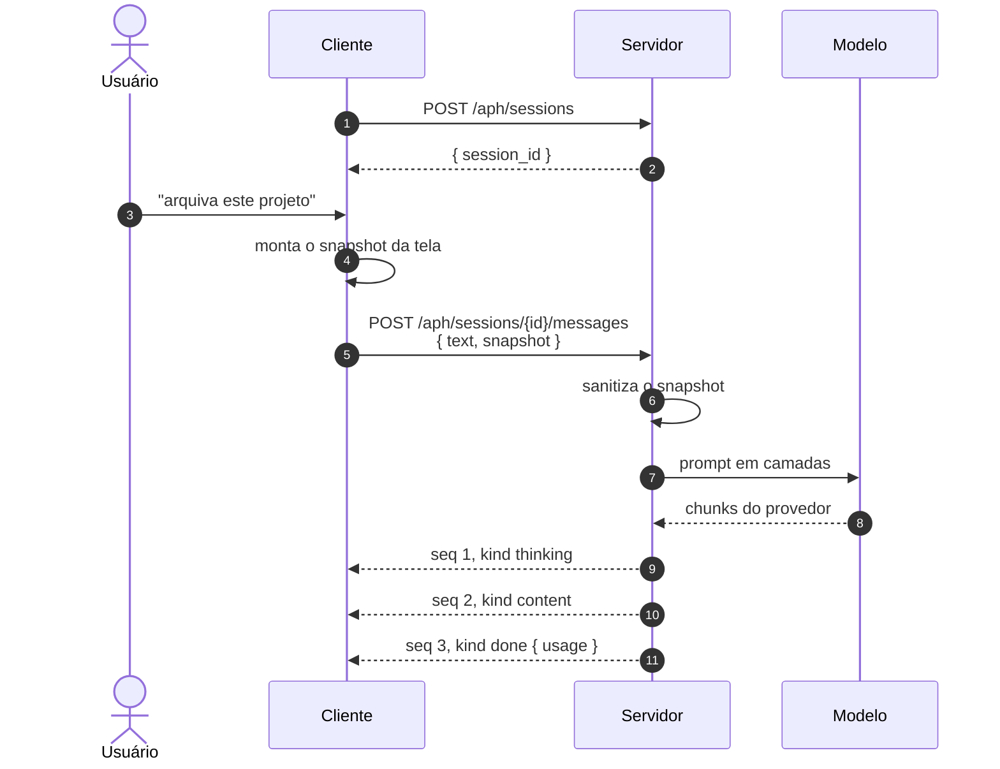
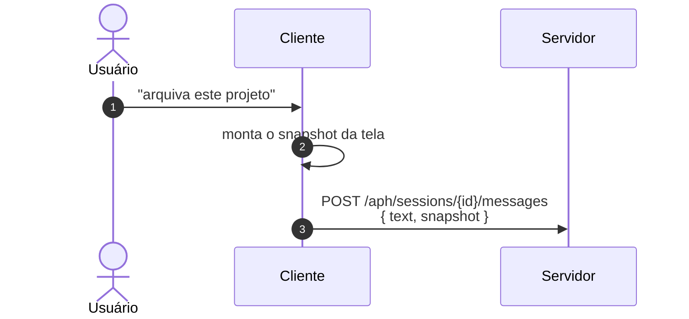
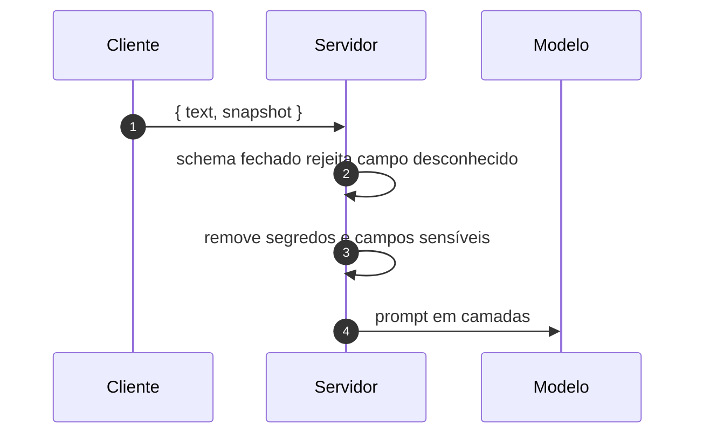
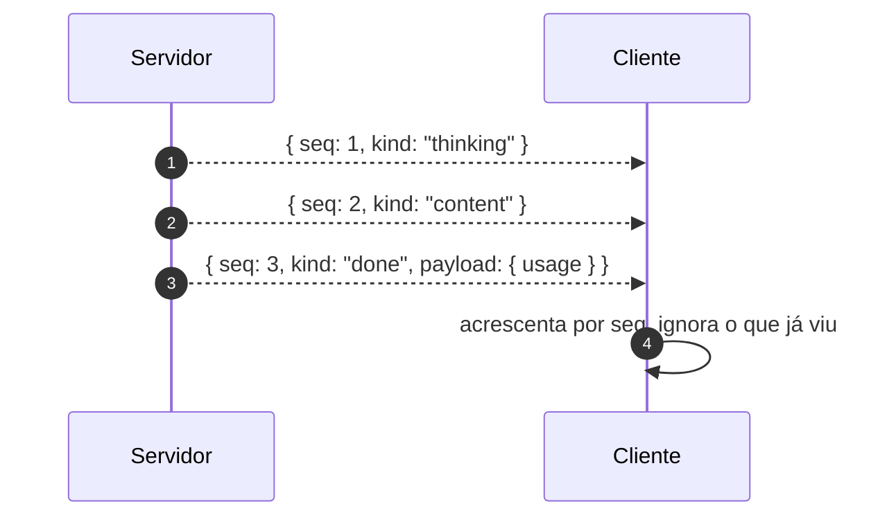

# Jornada J01 — Primeira pergunta: sessão, snapshot e resposta

> **Fio capturado em 2026-08** · última revisão 2026-08-13 · [histórico e registro de expiração](../HISTORICO.md)

**Capítulos**: [02 — Transporte e sessão](../capitulos/02-transporte-sessao.md) · [03 — Eventos tipados](../capitulos/03-eventos-tipados.md) · [04 — Contexto de tela](../capitulos/04-contexto-de-tela.md)
**Norma**: APH-1.1, 1.2 · 2.1, 2.4, 2.5 · 3.1, 3.2, 3.3, 3.5 · 7.1, 7.3 · [Anexo A §A.1–A.4](https://github.com/GHDaru/protocolos/blob/main/padrao/anexo-a-wire-format.md)
**Laboratórios**: `ghdaru` completo · `nexxussai-monorepo` completo
**Maturidade do fio**: ✅ todos os passos são comprovados; nenhum tracejado neste documento
**Formato**: [ADR 0008](../../adr/0008-jornadas-do-protocolo.md) · **Índice**: [jornadas](README.md)

## Em uma frase

A conversa mais simples que existe no Padrão APH (Aplicação ↔ Harness): o usuário pergunta alguma coisa dentro da aplicação, a aplicação conta ao harness o que está na tela, e a resposta volta em pedaços. É a espinha de todas as outras jornadas, e a única que não pressupõe nenhuma.

## O que você vai conseguir explicar

- Por que a pergunta e o contexto viajam **na mesma requisição**, e o que quebra se forem separados.
- Por que a sanitização acontece no servidor, e não no cliente que montou a tela.
- Como o cliente sabe que a resposta acabou, e por que "acabou" precisa ser uma mensagem.
- O que o número de sequência protege, mesmo quando nada dá errado.

## Quem fala com quem

| No diagrama | O que é | Quem faz esse papel |
|---|---|---|
| **Usuário** | A pessoa que digita | — |
| **Cliente** | A parte da aplicação que roda no navegador: a tela, o chat, o parser do fluxo | `apps/web` nos dois laboratórios |
| **Servidor** | O servidor da aplicação, que hospeda o harness: monta o contexto, chama o modelo, interpreta a resposta | `apps/api` no laboratório A |
| **Modelo** | O modelo de linguagem, atrás da porta única do §4.8 | detalhado em [J04](README.md) |

A norma não separa "servidor da aplicação" de "harness": o glossário define harness como quem monta contexto, chama o modelo e executa o autorizado, e o requisito de sanitização diz "no servidor". Por isso a raia é uma só aqui. A fronteira interna entre os dois aparece em J04, que é onde ela é o assunto.

## O fio

> **Figura J01-F1** — a conversa completa, do primeiro toque ao fim do fluxo.



| # | De → Para | Troca | Carga |
|---|---|---|---|
| 1 | Cliente → Servidor | `POST /aph/sessions` | corpo vazio |
| 2 | Servidor → Cliente | resposta | `{ session_id }` |
| 3 | Usuário → Cliente | digita a pergunta | texto livre |
| 4 | Cliente → Cliente | monta o snapshot | identidade da tela, rota, campos tipados, entidade selecionada |
| 5 | Cliente → Servidor | `POST /aph/sessions/{id}/messages` | `{ text, snapshot }` |
| 6 | Servidor → Servidor | sanitiza | remove segredos, campos sensíveis e o que não está no registro |
| 7 | Servidor → Modelo | monta o prompt em camadas | sistema, contexto, conteúdo do usuário |
| 8 | Modelo → Servidor | resposta em pedaços | formato do fornecedor |
| 9–11 | Servidor → Cliente | fluxo de eventos | `{seq, kind, payload}`, terminando em `done` com `usage` |

### 1. A sessão existe antes da pergunta

A primeira troca não carrega conteúdo nenhum: cria uma sessão e recebe um identificador. Parece cerimônia, e não é. A sessão é o que dá endereço à conversa, e endereço é o que torna possível voltar a ela depois de uma queda de conexão. Sem esse identificador, a jornada [J02](README.md) não teria como pedir "me mande de novo o que perdi a partir do evento 4".

Repare que a criação vem do cliente, e não do primeiro envio de mensagem. É uma escolha com consequência: a aplicação pode abrir o chat, mostrar histórico e preparar a tela antes de o usuário digitar qualquer coisa.

### 2. A tela chega junto com a pergunta

Uma pergunta de chat dentro de uma aplicação é quase sempre incompleta. "Arquiva este projeto" só significa alguma coisa para quem está olhando a tela, e o modelo não está olhando.

> **Figura J01-F2** — o recorte que resolve a ambiguidade.



A aplicação fala duas vezes antes de o servidor falar uma, e a segunda fala é consigo mesma. Nela o cliente monta o **snapshot de contexto**: identidade da tela, rota, campos tipados e entidade selecionada. O que ele não faz é inferir nada. A tela se descreve a partir de um **registro de telas** compartilhado entre frente e fundo, e não de uma leitura da árvore de elementos da página. Raspar o próprio HTML seria adivinhar a sua própria interface, o que é um jeito caro de errar em silêncio quando alguém troca um rótulo.

A ordem também não é acidental. O snapshot viaja **na mesma requisição** da mensagem, e não numa chamada anterior, porque o estado da tela envelhece em segundos. Um contexto obtido meio segundo antes já pode descrever uma tela que o usuário abandonou. Amarrar pergunta e contexto no mesmo envelope é o que permite, mais adiante, dizer com segurança de qual tela nasceu cada proposta de ação, e é a base sobre a qual [J10](README.md) constrói a defesa contra confirmar uma ação com a tela errada.

O custo é honesto: cada mensagem carrega o contexto de novo, e contexto custa tokens. É a troca que este desenho aceita, pagar contexto repetido para nunca depender da memória do modelo sobre onde o usuário está.

### 3. A sanitização acontece do lado que não é do usuário

> **Figura J01-F3** — a fronteira de confiança do desenho inteiro.



O snapshot chega e não é usado como veio. Três coisas acontecem antes de qualquer parte dele chegar ao modelo.

A primeira é a borda: o schema é **fechado**, e campo que não está declarado é rejeitado em vez de ignorado. A diferença importa. Ignorar significa que um campo inesperado atravessa silenciosamente até algum lugar onde alguém vai lê-lo; rejeitar significa que a aplicação descobre o problema onde ele nasceu.

A segunda é a lista de negação: token, senha, cookie e afins não viajam, mesmo que alguém os tenha posto num campo de tela por engano.

A terceira é o registro: o que a aplicação marcou como sensível nunca entra no snapshot, nem que o usuário esteja olhando para aquilo na tela. Ver e poder contar ao modelo são coisas diferentes.

E tudo isso acontece **no servidor**. Sanitizar no cliente seria pedir que quem pode ser controlado pelo atacante decidisse o que o atacante não pode enviar. Depois desta etapa, tudo o que existe para o modelo é o que a aplicação escolheu contar, e é por isso que este é o momento mais importante da jornada inteira.

### 4. A resposta chega em pedaços, numerados, e termina dizendo que terminou

> **Figura J01-F4** — o fluxo de eventos e o terminador.



A resposta volta por um fluxo unidirecional sobre HTTP: o servidor manda linhas conforme produz, e o cliente lê com um parser próprio. Cada evento é um objeto com três campos, `{seq, kind, payload}`, e o `kind` vem de um vocabulário fechado.

Dois detalhes fazem o trabalho pesado aqui.

O **número de sequência** é atribuído no servidor, antes da emissão, e cresce de um em um dentro da sessão. Num dia em que nada dá errado ele parece decoração. Ele existe para o dia em que algo dá errado: é a régua que permite ao cliente pedir o que faltou e descartar o que chegou duas vezes, sem precisar comparar conteúdo. J02 é inteira sobre isso.

O **terminador** é uma mensagem, não uma ausência de mensagens. O fluxo acaba com um evento `done`, que ainda carrega o consumo de tokens da chamada. Encerrar por silêncio faria o cliente ter de escolher entre esperar para sempre e desistir cedo, e as duas opções são ruins. Com terminador explícito, "acabou" e "caiu" deixam de ser a mesma coisa vista de fora, o que é a pré-condição para [J02](README.md) e [J03](README.md) existirem.

A ordem de exibição é assunto do cliente: ele pode agrupar ou omitir eventos na tela. O que ele não pode é alterar a ordem em que os acrescenta, nem o que faz com eles no reenvio.

## Quando o fio quebra

| Desvio | Bifurca em | Código | Como termina | Onde |
|---|---|---|---|---|
| A conexão cai no meio do fluxo | passo 9 em diante | — | replay a partir do último `seq` recebido | [J02](README.md) |
| O usuário manda parar | passo 9 em diante | `STREAM_CANCELLED` | evento de erro, nunca silêncio | [J03](README.md) |
| O modelo ou o provedor falha | passo 8 | `PROVIDER_FAILURE` | erro traduzido em categoria de domínio | [J04](README.md) |
| O snapshot traz campo desconhecido | passo 6 | `INVALID_CONTEXT` | recusa na borda, sem chegar ao modelo | [J15](README.md) |

## Como reconhecer no seu sistema

A assinatura observável desta jornada, se você olhar o fio de fora:

- A resposta vem com `Content-Type: text/event-stream`, e cada quadro carrega um JSON completo. Objeto partido entre quadros é defeito.
- Os `seq` são inteiros, crescem de um em um e **começam no servidor**. Se o cliente atribui, o replay de J02 não funciona.
- O último evento é `done` ou `error`. Sempre. Um fluxo que simplesmente para é não-conforme.
- Os `kind` estão no vocabulário fechado. Tipo novo é permitido ao produtor, e o consumidor o ignora em vez de rejeitar (assunto de [J06](README.md)).
- O snapshot que atravessa o fio **não** contém token, senha, cookie, nem campo marcado como sensível no registro de telas.

Uma transcrição do fio, com valores fictícios, no formato do Anexo A:

```
data: {"seq":1,"kind":"thinking","payload":{"text":"O usuário está na tela de projetos."}}
data: {"seq":2,"kind":"content","payload":{"text":"Posso arquivar o projeto Aurora."}}
data: {"seq":3,"kind":"done","payload":{"usage":{"input_tokens":1200,"output_tokens":340}}}
```

Da suíte de conformidade executável do Nível 1, esta jornada é exercitada pelos checks de transporte, de vocabulário contra os schemas, de terminador e de snapshot na borda.

## Lacunas e derivas (2026-08-13)

| Lacuna | Onde | Estado | Gatilho de revisão |
|---|---|---|---|
| O teto de tamanho do snapshot é uma referência ("menos de 32 kilobytes"), não um valor normativo, e o comportamento ao ultrapassá-lo não é dito pela norma | APH-3.5 | aberta | quando um laboratório implementar truncamento por prioridade |
| A norma admite um mecanismo equivalente ao `seq` mais replay, com fonte durável, e não especifica fio para ele | APH-1.3 | aberta | primeira implementação que escolher esse caminho |
| O registro de telas é fonte de verdade compartilhada, e a norma não diz como as duas pontas se mantêm em dia | APH-3.1 | aceita | é arquitetura interna; entra se virar interoperabilidade |

## Verificação

1. A aplicação envia o snapshot numa chamada separada, logo antes da mensagem. Que garantia da jornada isso quebra, e qual jornada posterior deixa de funcionar? *(Dica: o que envelhece em segundos.)*
2. Um cliente atribui o `seq` no momento em que recebe cada evento, em vez de usar o que veio do servidor. O que continua funcionando, e o que passa a falhar em silêncio? *(Dica: nada falha enquanto a rede for perfeita.)*
3. Por que sanitizar no cliente não é uma otimização aceitável, mesmo que o cliente seja código da própria empresa?
4. O fluxo acaba sem `done`, simplesmente parando. Descreva as duas escolhas ruins que sobram para o cliente.

---

## Apêndice — evidência por fonte

### `ghdaru`

| Momento | Onde |
|---|---|
| Sessão e fluxo | `apps/api/src/ghdaru_api/http/chat_router.py` |
| Snapshot e sanitização | `apps/api/src/ghdaru_api/conversation/` (montagem no servidor) |
| Montagem do prompt em camadas | `apps/api/src/ghdaru_api/harness/domain/context.py` |
| Vocabulário de eventos | `apps/api/src/ghdaru_api/conversation/domain/wire.py` |

### `nexxussai-monorepo`

| Momento | Onde |
|---|---|
| Registro de telas e snapshot | `ScreenRegistry`, `ScreenContextSnapshot` |
| Vocabulário do fluxo | eventos canônicos do chat |

### Divergências entre as fontes

O laboratório A tem `seq` e replay; o laboratório B tem cancelamento. A composição dos dois é a recomendação normativa, e cada requisito herda o grau da metade verificada. A tradução de nomes entre os laboratórios e o vocabulário canônico está no §A.8 do Anexo A.

### Onde isto está na norma

| Momento | Requisito |
|---|---|
| 1. Sessão | §A.2 (superfície de referência) |
| 2. Tela junto da pergunta | APH-3.1, 3.2 |
| 3. Sanitização | APH-3.3, 3.5, 7.1, 7.3 |
| 4. Fluxo, numeração, terminador | APH-1.1, 1.2, 2.1, 2.4, 2.5 |
