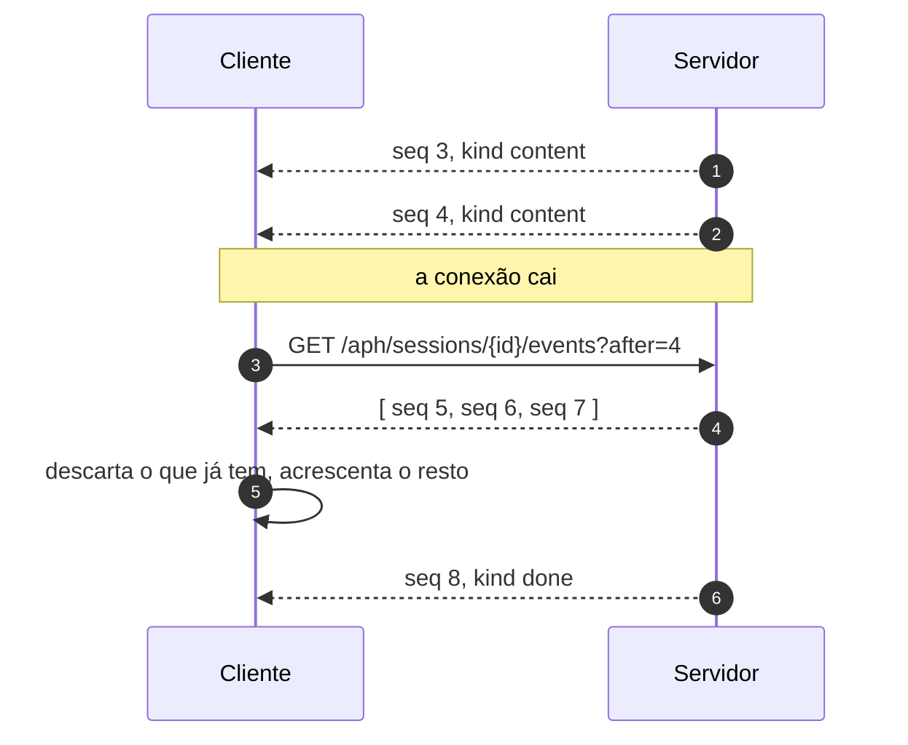
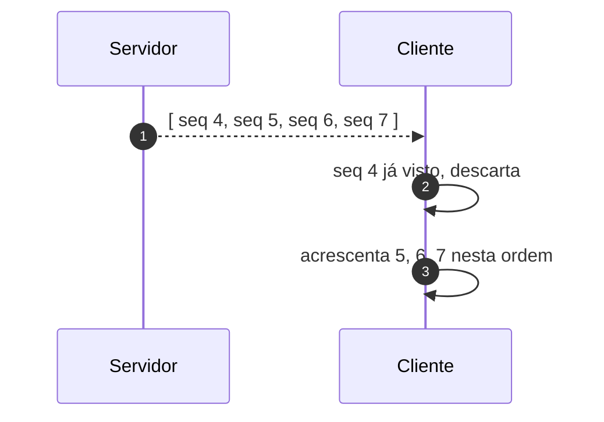

# Jornada J02 — A conexão cai: replay sem perda nem duplicação

> **Fio capturado em 2026-08** · última revisão 2026-08-13 · [histórico e registro de expiração](../HISTORICO.md)

**Capítulos**: [02 — Transporte e sessão](../capitulos/02-transporte-sessao.md)
**Norma**: APH-1.2, 1.3 · 2.5 · [Anexo A §A.2](https://github.com/GHDaru/protocolos/blob/main/padrao/anexo-a-wire-format.md)
**Laboratórios**: `ghdaru` completo · `nexxussai-monorepo` não implementa replay
**Maturidade do fio**: ✅ comprovado num laboratório; o mecanismo alternativo do APH-1.3 é 🧪 e não tem fio especificado
**Pressupõe**: [J01](j01-primeira-pergunta.md) · **Índice**: [jornadas](README.md)

## Em uma frase

O túnel entra, o sinal cai, o navegador recarrega. Esta jornada mostra o que impede que a conversa se perca junto, e por que a solução é mais simples do que parece.

## O que você vai conseguir explicar

- Por que o número de sequência precisa vir do servidor, e não do cliente.
- Por que "sem perda" e "sem duplicação" são dois problemas, e como um único mecanismo resolve os dois.
- Por que num chat isso é obrigatório, enquanto num protocolo de ferramentas pode não ser.

## Quem fala com quem

| No diagrama | O que é |
|---|---|
| **Cliente** | A parte da aplicação no navegador, que guarda o maior `seq` que viu |
| **Servidor** | Quem atribui o `seq` antes de emitir e guarda os eventos da sessão |

## O fio

> **Figura J02-F1** — a queda e a retomada, do último evento recebido em diante.

| # | De → Para | Troca | Carga |
|---|---|---|---|
| 1–2 | Servidor → Cliente | eventos do fluxo | `{seq, kind, payload}` |
| — | — | a conexão cai | o cliente guarda o maior `seq` que recebeu |
| 3 | Cliente → Servidor | `GET /aph/sessions/{id}/events?after=4` | nenhuma |
| 4 | Servidor → Cliente | resposta | array com os eventos de `seq` maior que 4 |
| 5 | Cliente → Cliente | reconciliação | descarta por `seq` o que já tem |
| 6 | Servidor → Cliente | o fluxo continua | até o terminador |

### 1. O cliente lembra de um número, não do conteúdo

Quando a conexão cai, o cliente precisa saber onde parou. A tentação é comparar o texto que já recebeu com o que chegar depois, e é uma tentação cara: texto se repete, um "sim" pode aparecer duas vezes legitimamente, e comparar conteúdo obriga a guardar conteúdo.

O padrão faz o barato: guardar um inteiro. O maior `seq` recebido é tudo o que o cliente precisa lembrar, e é ele que vai no pedido de retomada.

Isso só funciona por causa de uma regra que na J01 parecia decoração: o `seq` é atribuído **no servidor, antes da emissão**. Se cada cliente numerasse o que recebe, dois clientes na mesma sessão teriam réguas diferentes, e o servidor não teria como saber o que "depois do 4" quer dizer para cada um.

### 2. O mesmo número resolve os dois problemas

"Não perder" e "não duplicar" parecem exigir mecanismos diferentes, e não exigem.

> **Figura J02-F2** — a reconciliação no cliente.

Não perder é papel do servidor: ele guarda os eventos da sessão e sabe responder "do 4 em diante". Não duplicar é papel do cliente: ele ignora qualquer `seq` que já tenha acrescentado.

A divisão importa porque nenhum dos dois lados precisa confiar no outro para acertar. O servidor pode reenviar de mais por segurança, inclusive um evento que o cliente já tem, e nada quebra. Essa tolerância é o que torna a retomada implementável sem coordenação fina, e é o motivo de a regra do cliente ser **deduplicar**, e não "pedir exatamente o que falta".

### 3. Agrupar na tela é livre; mexer na ordem, não

O cliente pode fazer o que quiser na exibição: juntar três eventos de conteúdo num parágrafo só, esconder o raciocínio, mostrar reticências enquanto espera. O que ele não pode é deixar essa decisão de tela vazar para a estrutura.

A ordem em que os eventos são acrescentados, e o que acontece no reenvio, seguem a régua do `seq`. Quando um cliente reordena por conveniência de render, o replay para de funcionar de um jeito difícil de diagnosticar: a conversa parece certa até o dia em que alguém entra num elevador.

### 4. Por que isto é obrigatório aqui, e opcional em outros protocolos

Vale entender o contraste, porque ele explica a escolha. Num protocolo de chamada de ferramentas, uma requisição perdida pode ser simplesmente refeita: a operação é recomputável, e reemitir a requisição inteira é aceitável.

Num chat, o que trafega **é a conversa**. Ela não é recomputável: o modelo não vai gerar exatamente o mesmo texto de novo, e mesmo que gerasse, o que o usuário leu antes da queda continua sendo parte do histórico. Perder eventos aqui não é perder desempenho, é perder o produto. Por isso o requisito é DEVE, e não DEVERIA.

## Quando o fio quebra

| Desvio | Bifurca em | Como termina | Onde |
|---|---|---|---|
| O cliente reconecta sem `after` | passo 3 | recebe a sessão inteira; correto, porém caro | — |
| A sessão não existe mais | passo 3 | `SESSION_NOT_FOUND` | [J01](j01-primeira-pergunta.md) |
| O cliente caiu e o servidor parou de emitir | passo 3 | eventos perdidos para sempre: o servidor DEVE continuar produzindo | abaixo |

O terceiro merece nota. O laboratório A tem um caso de sabotagem exatamente para ele: um servidor que interrompe a produção quando percebe que o cliente sumiu passa a parecer conforme enquanto a rede estiver boa, e perde eventos justamente quando o replay seria necessário. A suíte de conformidade o derruba com o check de reconexão.

## Como reconhecer no seu sistema

- Há um endpoint de retomada que aceita um marcador do último evento visto, e ele devolve **os posteriores**, não a sessão inteira.
- Os `seq` são contínuos dentro da sessão. Buraco na numeração é perda; número repetido com conteúdo diferente é defeito grave.
- O cliente deduplica. Teste barato: reenvie propositalmente o último evento e veja se ele aparece duas vezes na tela.
- O servidor continua produzindo depois que o cliente some, até o terminador.

Da suíte de conformidade do Nível 1, esta jornada é exercitada pelos checks de replay íntegro, de monotonicidade do `seq` e de reconexão após queda.

## Lacunas e derivas (2026-08-13)

| Lacuna | Onde | Estado | Gatilho |
|---|---|---|---|
| A norma admite substituir `seq` mais replay por um mecanismo equivalente com fonte durável, e **não especifica fio** para ele: só obriga a registrar a escolha | APH-1.3 | aberta | primeira implementação que escolher esse caminho |
| Só um laboratório implementa replay | APH-1.3 | conhecida | o requisito herda o grau da metade verificada |
| Por quanto tempo o servidor guarda os eventos de uma sessão não é dito | §A.2 | aberta | quando alguém medir o custo de memória em produção |

## Verificação

1. Dois clientes acompanham a mesma sessão e um deles cai. Por que a régua do `seq` continua fazendo sentido para os dois?
2. Um servidor decide reenviar sempre os últimos dez eventos em qualquer retomada, por segurança. Isso é conforme? O que precisa ser verdade no cliente para não virar problema?
3. Por que um protocolo de ferramentas pode se dar ao luxo de não ter replay, e um chat não pode?

---

## Apêndice — evidência por fonte

### `ghdaru`

| Momento | Onde |
|---|---|
| Atribuição de `seq` e emissão | `apps/api/src/ghdaru_api/http/chat_router.py` |
| Endpoint de replay | rota de eventos da sessão, com filtro por `seq` |

### `nexxussai-monorepo`

Não implementa replay. A metade verificada aqui vem do laboratório A, e a composição das duas bases é a recomendação normativa do capítulo 02.

### Onde isto está na norma

| Momento | Requisito |
|---|---|
| 1. O número vem do servidor | APH-1.2 |
| 2. Retomada e deduplicação | APH-1.3, §A.2 |
| 3. Render não altera a ordem | APH-2.5 |
| 4. Por que é DEVE | APH-1.3, racional |
