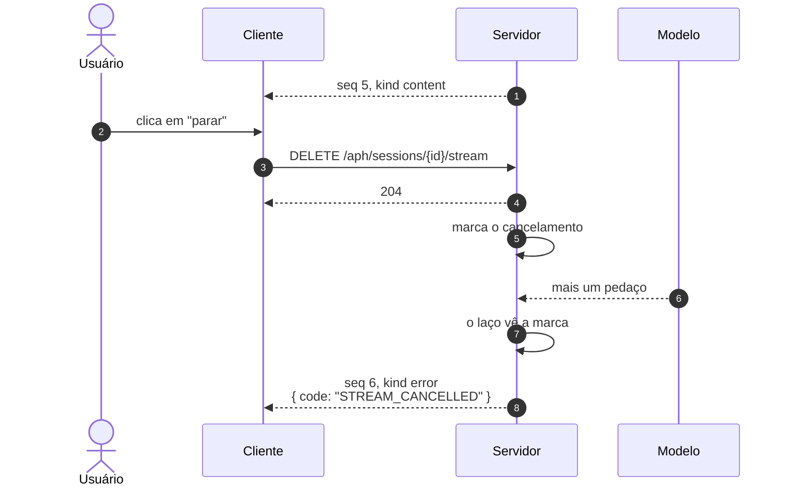
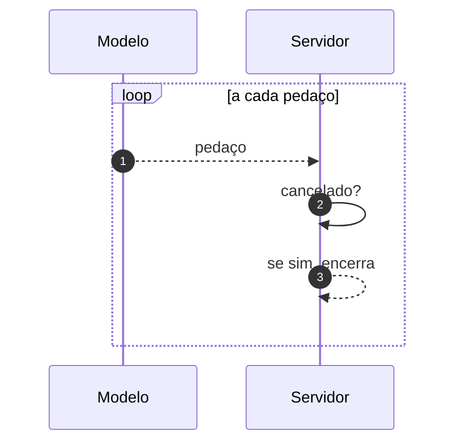

# Jornada J03 — O usuário manda parar: cancelamento cooperativo

> **Fio capturado em 2026-08** · última revisão 2026-08-13 · [histórico e registro de expiração](../HISTORICO.md)

**Capítulos**: [02 — Transporte e sessão](../capitulos/02-transporte-sessao.md)
**Norma**: APH-1.4, 1.5 · [Anexo A §A.2, §A.7](https://github.com/GHDaru/protocolos/blob/main/padrao/anexo-a-wire-format.md)
**Laboratórios**: `nexxussai-monorepo` completo · `ghdaru` não implementa cancelamento
**Maturidade do fio**: ✅ comprovado num laboratório
**Pressupõe**: [J01](j01-primeira-pergunta.md) · **Índice**: [jornadas](README.md)

## Em uma frase

O usuário se arrependeu no meio da resposta. Esta jornada mostra por que parar é uma conversa entre dois lados, e não um botão que fecha uma janela.

## O que você vai conseguir explicar

- Por que fechar a conexão não é cancelar.
- Por que o fluxo cancelado termina com um erro, e por que isso é bom.
- O que "cooperativo" quer dizer na prática, e onde a verificação precisa ficar.

## Quem fala com quem

| No diagrama | O que é |
|---|---|
| **Usuário** | Quem clica em parar |
| **Cliente** | A aplicação no navegador |
| **Servidor** | Quem está produzindo o fluxo, num laço de emissão |
| **Modelo** | Continua gerando até alguém avisar |

## O fio

> **Figura J03-F1** — o pedido de parada e o encerramento explícito.

| # | De → Para | Troca | Carga |
|---|---|---|---|
| 1 | Servidor → Cliente | evento em andamento | `{seq, kind: "content"}` |
| 2 | Usuário → Cliente | pede para parar | — |
| 3 | Cliente → Servidor | `DELETE /aph/sessions/{id}/stream` | nenhuma |
| 4 | Servidor → Cliente | resposta | `204`, sem corpo |
| 5 | Servidor → Servidor | marca o cancelamento | estado da sessão |
| 6–7 | Modelo → Servidor → laço | o modelo ainda produz; o laço verifica | — |
| 8 | Servidor → Cliente | encerramento | `{seq, kind: "error", payload: {code: "STREAM_CANCELLED"}}` |

### 1. Fechar a conexão não é cancelar

A saída óbvia seria o cliente simplesmente fechar a conexão. Ela funciona da perspectiva de quem olha a tela: o texto para de crescer.

Do outro lado, nada parou. O modelo continua gerando, os tokens continuam sendo cobrados, e o servidor continua trabalhando para ninguém. Pior: fechar a conexão é indistinguível de uma queda de rede, e a J02 acabou de estabelecer que queda de rede significa "retome de onde parou". Um cliente que cancela fechando a conexão está dizendo ao servidor exatamente a coisa errada.

Por isso o cancelamento tem endpoint próprio. É um pedido explícito, com significado diferente de silêncio.

### 2. Cooperativo quer dizer que alguém precisa olhar

> **Figura J03-F2** — onde a verificação precisa estar.

A marca de cancelamento não interrompe nada sozinha. Ela é um sinalizador, e alguém precisa lê-lo.

Esse alguém é o laço de emissão, que verifica **a cada volta**, antes de emitir o próximo evento. É daí que vem a palavra cooperativo: o cancelamento depende da colaboração de quem está produzindo, e não de uma interrupção violenta.

A consequência prática é que o cancelamento não é instantâneo, e não precisa ser. Entre o pedido e o encerramento pode passar mais um evento, o tempo de o laço dar uma volta. Um desenho que prometesse parada imediata teria de matar a tarefa no meio, deixando estado pela metade em lugares difíceis de prever.

### 3. Terminar com erro é o que torna o fim legível

O fluxo cancelado não acaba com `done`. Acaba com um evento de erro, de código estável, e é uma escolha deliberada.

`done` significa "a resposta terminou de ser produzida". Um fluxo cancelado não terminou: foi interrompido. Usar o mesmo terminador para as duas coisas faria o cliente perder a única informação que importa para decidir o que mostrar, o que registrar e se cabe oferecer "continuar".

O código é fixo e documentado, e o cliente discrimina por ele, nunca pela mensagem. Mensagem é para humano, e muda quando alguém melhora o texto.

E há uma regra que vale para tudo neste padrão, não só aqui: falha nunca é silêncio. Um fluxo que simplesmente para deixa o cliente entre esperar para sempre e desistir cedo, e as duas opções produzem interfaces que mentem.

## Quando o fio quebra

| Desvio | Bifurca em | Código | Como termina |
|---|---|---|---|
| O cancelamento chega depois do `done` | passo 3 | — | sem efeito; a resposta já terminou |
| A sessão não existe | passo 3 | `SESSION_NOT_FOUND` | `404`, sem fluxo a cancelar |
| O servidor cancela e não emite nada | passo 8 | — | **não-conforme**: é a sabotagem "cancelamento silencioso" |

O terceiro é o defeito que este requisito existe para impedir, e a suíte de conformidade o derruba: um servidor que para de emitir sem mandar o erro passa em qualquer teste de caminho feliz e engana o cliente exatamente quando o usuário está prestando atenção.

## Como reconhecer no seu sistema

- Existe um endpoint dedicado ao cancelamento, e ele não é o mesmo que encerra a sessão.
- Depois do pedido, o fluxo emite **mais um evento**, de erro, com código estável, e só então acaba.
- O código é o mesmo sempre, e o cliente decide o que fazer olhando para ele.
- Cancelar duas vezes não produz dois erros nem uma falha: o segundo pedido é inócuo.

Da suíte de conformidade do Nível 1, o check de cancelamento cobre esta jornada inteira, e a sabotagem correspondente prova que ele morde.

## Lacunas e derivas (2026-08-13)

| Lacuna | Onde | Estado | Gatilho |
|---|---|---|---|
| Só um laboratório implementa cancelamento | APH-1.4 | conhecida | o requisito herda o grau da metade verificada |
| A norma não diz o que acontece com o custo já incorrido: o `usage` parcial não tem lugar no evento de erro | APH-1.4, §A.7 | aberta | quando a medição de consumo virar assunto normativo |
| Retomar uma resposta cancelada não é previsto pela norma | APH-1.4 | aceita | não há evidência de demanda |

## Verificação

1. Um cliente cancela fechando a conexão. Descreva o que o servidor entende, e por que isso é pior do que não cancelar.
2. Por que o fluxo cancelado não pode terminar com `done`? Dê a consequência concreta para o cliente.
3. O cancelamento não é instantâneo. Explique por que a alternativa, parada imediata, seria pior.

---

## Apêndice — evidência por fonte

### `nexxussai-monorepo`

| Momento | Onde |
|---|---|
| Endpoint de cancelamento e marca | rota dedicada da sessão |
| Verificação no laço de emissão | laço de streaming do chat |

### `ghdaru`

Não implementa cancelamento. A metade verificada vem do laboratório B, e a composição das duas bases é a recomendação normativa do capítulo 02.

### Onde isto está na norma

| Momento | Requisito |
|---|---|
| 1. Endpoint dedicado | APH-1.4, §A.2 |
| 2. Verificação no laço | APH-1.4 |
| 3. Encerramento por erro com código estável | APH-1.4, APH-1.5, §A.7 |
