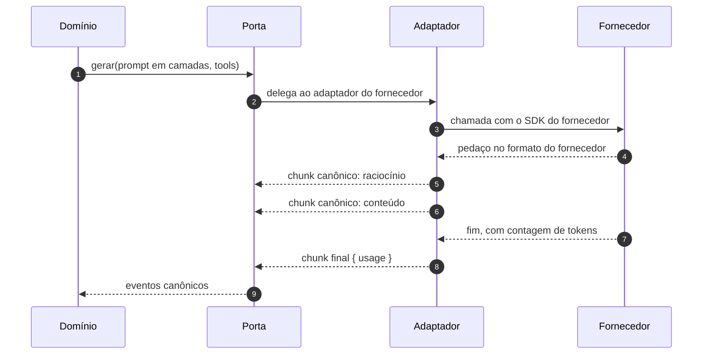
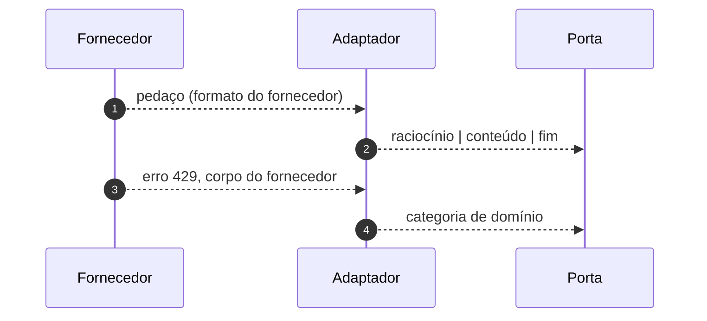
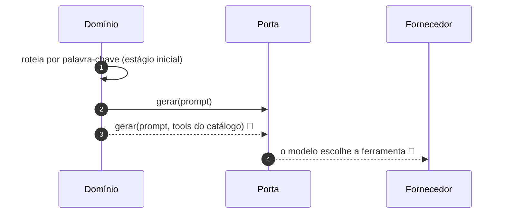

# Jornada J04 — Por trás da porta: chunk de provedor vira evento canônico

> **Fio capturado em 2026-08** · última revisão 2026-08-13 · [histórico e registro de expiração](../HISTORICO.md)

**Capítulos**: [08 — Porta do modelo](../capitulos/08-porta-do-modelo.md) · [03 — Eventos tipados](../capitulos/03-eventos-tipados.md)
**Norma**: APH-2.3 · 8.1, 8.2🧪 · 1.5 · [Anexo A §A.3, §A.7](https://github.com/GHDaru/protocolos/blob/main/padrao/anexo-a-wire-format.md)
**Laboratórios**: `ghdaru` completo, incluindo o consumo de tokens no evento final · `nexxussai-monorepo` porta única sem medição
**Maturidade do fio**: ✅ para a normalização e a porta única; 🧪 para a intenção nascer de chamada de ferramenta (traço tracejado)
**Pressupõe**: [J01](j01-primeira-pergunta.md) · **Índice**: [jornadas](README.md)

## Em uma frase

Esta é a única jornada que olha para dentro do servidor. Ela mostra onde o formato do fornecedor morre, e por que essa fronteira é o que permite trocar de modelo sem reescrever a aplicação.

## O que você vai conseguir explicar

- Por que o domínio da aplicação nunca vê o formato bruto de um fornecedor.
- Por que a medição de consumo pertence ao evento final, e não a um endpoint à parte.
- O que muda quando a intenção nasce de chamada de ferramenta em vez de palavra-chave.

## Quem fala com quem

| No diagrama | O que é |
|---|---|
| **Domínio** | A parte do servidor que decide o que fazer: monta o contexto, governa a ação, escreve o traço |
| **Porta** | A porta única do §4.8: a fronteira onde qualquer fornecedor vira vocabulário canônico |
| **Adaptador** | O tradutor de um fornecedor específico, o único lugar onde o kit de desenvolvimento (SDK) dele aparece |
| **Fornecedor** | O serviço de modelo, do outro lado da rede |

## O fio

> **Figura J04-F1** — a travessia de fora para dentro, e a tradução no meio.

| # | De → Para | Troca | Carga |
|---|---|---|---|
| 1 | Domínio → Porta | pedido de geração | prompt em camadas, catálogo projetado em tools |
| 2 | Porta → Adaptador | delegação | escolha do fornecedor |
| 3 | Adaptador → Fornecedor | chamada | formato do fornecedor |
| 4 | Fornecedor → Adaptador | pedaços | formato do fornecedor |
| 5–6 | Adaptador → Porta | pedaços traduzidos | raciocínio, conteúdo |
| 7–8 | Fornecedor → Adaptador → Porta | encerramento | `usage` com tokens de entrada e saída |
| 9 | Porta → Domínio | fluxo canônico | vocabulário do §A.3 |

### 1. O adaptador é o único lugar que sabe o nome do fornecedor

O requisito é curto e a consequência é grande: **nenhum kit de desenvolvimento de fornecedor circula fora dos adaptadores**. O domínio não importa a biblioteca, não conhece o nome dos campos, não trata os códigos de erro específicos.

O motivo prático aparece na primeira troca de modelo. Se o formato do fornecedor vazou para o domínio, trocar de fornecedor vira uma refatoração que atravessa o sistema inteiro, e a decisão passa a ser tomada por custo de migração em vez de por mérito. Com a fronteira, trocar é escrever um adaptador.

Há um segundo motivo, menos citado e mais sério: chave de fornecedor **nunca vai para o cliente**. Se a chamada ao modelo acontecesse no navegador, a chave estaria lá, e não existe jeito de escondê-la. A porta única não é só arrumação: é o que mantém a credencial de um lado só.

### 2. Traduzir é classificar, não repassar

> **Figura J04-F2** — a tradução, incluindo a do erro.

Cada fornecedor tem o seu jeito de dizer as mesmas três coisas: o modelo está pensando, o modelo está escrevendo, o modelo terminou. O adaptador classifica, e é essa classificação que sobe para o vocabulário fechado que o cliente vê na [J01](j01-primeira-pergunta.md).

O mesmo vale para o erro, e aqui está o ponto que costuma ser esquecido. Um limite de taxa estourado, uma janela de contexto excedida e uma chave inválida são três situações diferentes para quem opera, e chegam do fornecedor como códigos e mensagens que mudam entre fornecedores e entre versões. Repassar o erro cru significa que o domínio passaria a depender de texto de terceiro para decidir o que fazer.

Traduzir em categoria de domínio é o que permite ao servidor decidir se tenta de novo, se pede ao usuário para encurtar, ou se avisa que a configuração está errada. E é o que faz o requisito de erro do transporte funcionar: falha de fornecedor não é silêncio, vira um erro com código estável no fio.

### 3. O consumo viaja no último evento, e isso é um desenho

O evento final carrega o `usage`: tokens de entrada e de saída daquela chamada. Poderia ser um endpoint separado, consultado depois. A escolha de pôr no fluxo tem duas razões.

A primeira é que o dado existe naturalmente ali. O fornecedor informa o consumo no encerramento, e qualquer outro caminho exigiria guardar e correlacionar.

A segunda é que medição que depende de alguém lembrar de consultar não é medição. Com o consumo no terminador, toda resposta que chega ao fim traz o seu custo, e a base de cobrança nasce do mesmo fio que entrega o texto.

### 4. Como a intenção nasce, e o que ainda é desenho

> **Figura J04-F3** — o estágio inicial e o alvo, lado a lado. O traço tracejado é o que a norma desenha e nenhum laboratório verificou.

Hoje, no que está verificado, a intenção pode nascer de um roteamento determinístico por palavra-chave, desde que **atrás da mesma porta**. A norma admite isso explicitamente como estágio inicial.

O alvo é outro: a intenção nasce de chamada de ferramenta, com as ferramentas derivadas do catálogo, uma fonte com duas projeções. Isso é 🧪, e o tracejado no diagrama existe para lembrar disso. A [J07](README.md) mostra a projeção do catálogo em detalhe.

A diferença não é de elegância. Com palavra-chave, o conjunto de intenções reconhecíveis é escrito à mão e envelhece; com ferramenta derivada do catálogo, ele acompanha o catálogo automaticamente, e o que a aplicação sabe fazer e o que o modelo sabe pedir param de divergir.

## Quando o fio quebra

| Desvio | Bifurca em | Código | Como termina |
|---|---|---|---|
| O fornecedor falha | passo 4 | `PROVIDER_FAILURE` | erro traduzido em categoria, emitido no fio |
| O fornecedor devolve formato inesperado | passo 5 | — | o adaptador é quem lida; o domínio não vê |
| A chave é inválida | passo 3 | categoria de configuração | falha explícita, não silêncio |

Nenhum deles vira jornada própria: o fio é o mesmo, o decisor é o mesmo e o terminal é o mesmo. O que muda é a categoria, e a categoria é justamente o assunto desta jornada.

## Como reconhecer no seu sistema

- Procure o nome do fornecedor no código do domínio. Se aparecer, a fronteira vazou.
- O vocabulário que sai da porta é o mesmo para todos os fornecedores. Dois adaptadores, um vocabulário.
- O último chunk traz consumo. Se a medição vive num endpoint separado, ela vai divergir do que foi realmente cobrado.
- Erro de fornecedor chega ao domínio como categoria, não como texto.

## Lacunas e derivas (2026-08-13)

| Lacuna | Onde | Estado | Gatilho |
|---|---|---|---|
| A norma não fixa o conjunto de categorias de erro de fornecedor: cada implementação escolhe as suas | APH-8.1 | aberta | quando houver convergência de três ecossistemas |
| A intenção nascer de chamada de ferramenta segue 🧪 | APH-8.2 | aberta | primeira verificação em laboratório |
| Só um laboratório mede consumo no chunk final | APH-8.1 | conhecida | o requisito herda o grau da metade verificada |

## Verificação

1. Um desenvolvedor importa a biblioteca do fornecedor num caso de uso para "só ler um campo". Qual requisito isso quebra, e qual custo aparece meses depois?
2. Por que traduzir erro de fornecedor em categoria de domínio é diferente de repassar a mensagem dele com um código genérico?
3. Se a medição de consumo virasse um endpoint consultado depois, que problema apareceria primeiro?

---

## Apêndice — evidência por fonte

### `ghdaru`

| Momento | Onde |
|---|---|
| Porta única e adaptadores | `apps/api/src/ghdaru_api/harness/` |
| Ferramentas entregues ao modelo | `agent_tools.py` |
| Montagem do prompt em camadas | `harness/domain/context.py` |

### `nexxussai-monorepo`

Porta única presente; a medição de consumo no chunk final não está implementada.

### Onde isto está na norma

| Momento | Requisito |
|---|---|
| 1. Adaptador isolado, chave fora do cliente | APH-8.1 |
| 2. Normalização e erro categorizado | APH-2.3, APH-8.1, APH-1.5 |
| 3. Consumo no chunk final | APH-8.1 |
| 4. Intenção por ferramenta | APH-8.2 🧪, APH-4.4 🧪 |
