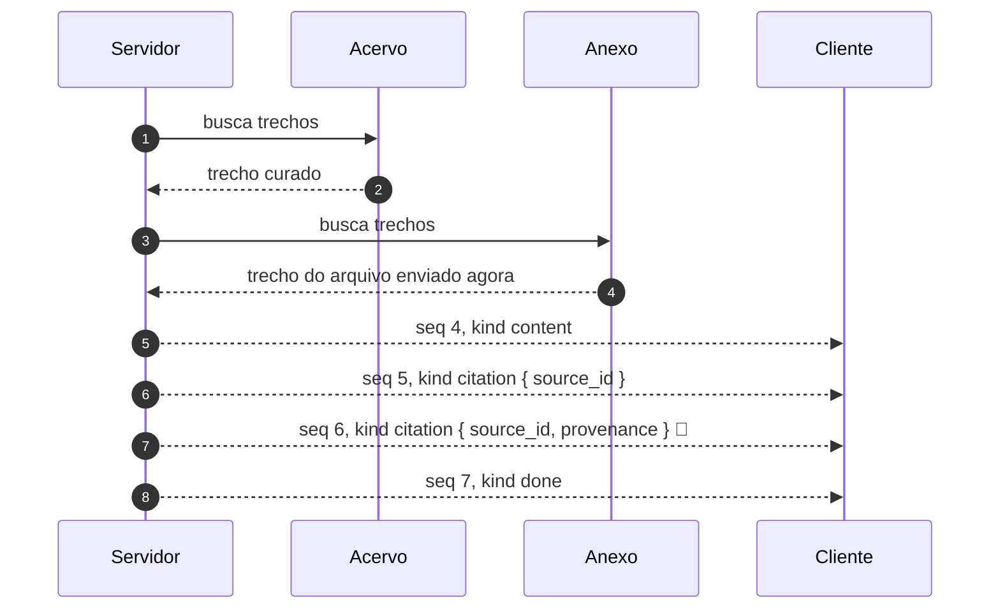
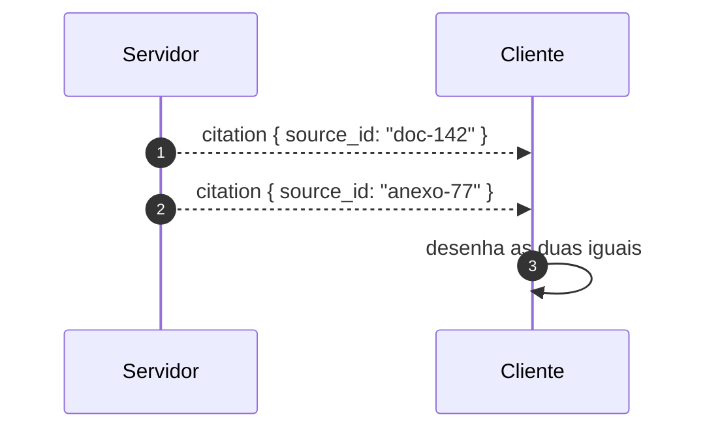

# Jornada J05 — Resposta com fontes: citação e proveniência

> **Fio capturado em 2026-08** · última revisão 2026-08-13 · [histórico e registro de expiração](../HISTORICO.md)

**Capítulos**: [03 — Eventos tipados](../capitulos/03-eventos-tipados.md) · [07 — Segurança](../capitulos/07-seguranca.md)
**Norma**: APH-2.1 (família citação) · 2.6🧪 · 7.1 (reforço 🧪) · [Anexo A §A.3](https://github.com/GHDaru/protocolos/blob/main/padrao/anexo-a-wire-format.md)
**Laboratórios**: `ghdaru` emite citação; **o campo de proveniência está declarado no contrato e não é emitido**
**Maturidade do fio**: ✅ para o evento de citação; 🧪 para a proveniência (traço tracejado)
**Pressupõe**: [J01](j01-primeira-pergunta.md) · **Índice**: [jornadas](README.md)

## Em uma frase

Quando a resposta vem de documentos, o fio carrega de onde ela veio. Esta jornada mostra a diferença entre citar e citar com procedência, e por que ela é uma questão de segurança e não de estilo.

## O que você vai conseguir explicar

- Por que a citação é uma família de evento própria, e não texto formatado dentro do conteúdo.
- Por que a origem de um trecho precisa viajar junto, e o que se perde na tela sem ela.
- Como uma falha de rótulo vira uma falha de confiança.

## Quem fala com quem

| No diagrama | O que é |
|---|---|
| **Servidor** | Quem recupera os trechos e monta o prompt em camadas |
| **Acervo** | A base de documentos curada pela organização |
| **Anexo** | O arquivo que o usuário acabou de subir na conversa |
| **Cliente** | Quem desenha a resposta e as fontes |

## O fio

> **Figura J05-F1** — a resposta com fontes, e a origem de cada uma.

| # | De → Para | Troca | Carga |
|---|---|---|---|
| 1–2 | Servidor → Acervo | recuperação | trecho, identificador da fonte |
| 3–4 | Servidor → Anexo | recuperação | trecho, identificador da fonte |
| 5 | Servidor → Cliente | conteúdo | texto da resposta |
| 6 | Servidor → Cliente | citação | `{ source_id }`, mais título, endereço e trecho, opcionais |
| 7 | Servidor → Cliente | citação com procedência 🧪 | `{ source_id, provenance }` |
| 8 | Servidor → Cliente | terminador | `{ usage }` |

### 1. Citar é um tipo de evento, não um jeito de escrever

A saída fácil seria o modelo escrever as fontes no meio do texto, entre colchetes. Ela funciona até o cliente querer fazer qualquer coisa com aquilo: abrir o documento, mostrar o trecho ao passar o cursor, contar quantas fontes sustentam a resposta.

Com a citação como família própria do vocabulário, o cliente recebe dado estruturado: um identificador de fonte, e opcionalmente título, endereço e trecho. O que ele desenha com isso é decisão dele.

A norma trata essa família com cuidado: ela **deveria** existir quando há recuperação de documentos, e ficou fora do mínimo obrigatório porque só um laboratório a implementa. É a régua de maturidade funcionando, e não uma opinião sobre a importância dela.

### 2. Sem procedência, a tela mente por igualdade

> **Figura J05-F2** — duas fontes, dois níveis de confiança, um único formato.

Aqui está o ponto da jornada. Um documento curado do acervo da organização e um arquivo que alguém acabou de arrastar para a conversa não têm o mesmo grau de confiança. O primeiro passou por quem decide o que entra no acervo; o segundo pode ter sido escrito há trinta segundos, por qualquer pessoa, com qualquer intenção.

Sem um discriminador de origem, os dois chegam ao cliente com a mesma forma, e a tela dá aos dois a mesma autoridade visual. O leitor vê duas fontes citadas e conclui que a resposta está bem fundamentada.

O detalhe que fecha o argumento: a separação de camadas de confiança já é exigida **no prompt**. O reforço da norma pede que conteúdo enviado pelo usuário entre demarcado como não-confiável, para o modelo tratar como dado e nunca como instrução. Só que essa distinção, cuidadosamente construída na montagem do contexto, **se perde na tela** se a citação não a carregar. É trabalho de segurança desfeito na última etapa.

Por isso o campo de procedência, com vocabulário fechado: documento do inquilino, anexo da sessão, web, ferramenta. E ausência significa origem legada ou desconhecida, o que também é informação.

### 3. Onde a norma está, e onde o laboratório está

O campo é 🧪, e o motivo é preciso o suficiente para valer a pena registrar.

O laboratório A **declara o campo no contrato** e no schema de referência. Ele simplesmente não o emite: o comentário no próprio código diz que está "pronto para quando o anexo virar citável". Além disso, o campo lá é texto livre, sem o vocabulário fechado que a norma recomenda.

Declarar e não emitir é a situação mais fácil de confundir com conformidade, porque o contrato passa em qualquer inspeção estática. É o tipo de coisa que só aparece quando alguém pergunta "e onde isso é preenchido?".

O campo é aditivo: entrou como opcional, e por isso subiu o fio numa versão compatível. Quem consome a versão anterior continua funcionando, porque ignora o que não conhece. A [J06](README.md) é sobre exatamente esse mecanismo.

## Quando o fio quebra

| Desvio | Bifurca em | Como termina |
|---|---|---|
| A recuperação não acha nada | passo 1 | a resposta vem sem citação; não é erro |
| O trecho citado sumiu do acervo depois | passo 6 | o cliente lida com fonte que não abre; a norma não especifica |
| A citação vem sem procedência | passo 7 | conforme hoje: o campo é opcional |

## Como reconhecer no seu sistema

- A citação é um evento de tipo próprio, e o cliente consegue listá-las sem analisar o texto da resposta.
- O identificador de fonte resolve: existe algum jeito de ir do identificador ao documento.
- Se o campo de procedência existir, ele está **preenchido** em pelo menos um caminho real. Campo declarado e nunca emitido não é conformidade.
- Anexo recém-enviado e documento curado são distinguíveis na tela por algo que não seja o nome do arquivo.

## Lacunas e derivas (2026-08-13)

| Lacuna | Onde | Estado | Gatilho |
|---|---|---|---|
| A proveniência é declarada e não emitida no único laboratório que tem citação; e o campo lá é texto livre, sem vocabulário fechado | APH-2.6 | aberta | primeira emissão real |
| A norma recomenda um vocabulário de referência para a procedência e não o fecha | APH-2.6 | aberta | quando houver convergência |
| O que o cliente faz quando a fonte citada não existe mais não é dito | §A.3 | aberta | quando alguém medir o caso em produção |

## Verificação

1. Um cliente resolve mostrar as citações extraindo colchetes do texto da resposta. Cite dois recursos de interface que ficam impossíveis, e um risco que aparece quando o modelo muda de estilo.
2. Explique como a ausência do campo de procedência desfaz, na tela, um trabalho de segurança feito na montagem do prompt.
3. O campo existe no contrato do laboratório e nunca é preenchido. Por que isso não conta como conformidade, e que pergunta revela o problema?

---

## Apêndice — evidência por fonte

### `ghdaru`

| Momento | Onde |
|---|---|
| Família citação no vocabulário | `apps/api/src/ghdaru_api/conversation/domain/wire.py:77` |
| Contrato de referência da citação | `contracts/aph/citation.schema.json` |
| Campo de procedência | declarado nos dois acima; **não emitido** |

### `nexxussai-monorepo`

Não tem a família citação. Por isso ela é DEVERIA, e não DEVE, no vocabulário mínimo.

### Onde isto está na norma

| Momento | Requisito |
|---|---|
| 1. Citação como família própria | APH-2.1 |
| 2. Procedência e a camada não-confiável | APH-2.6 🧪, APH-7.1 (reforço 🧪) |
| 3. Campo aditivo e versão do fio | APH-2.2, §A.9 |
