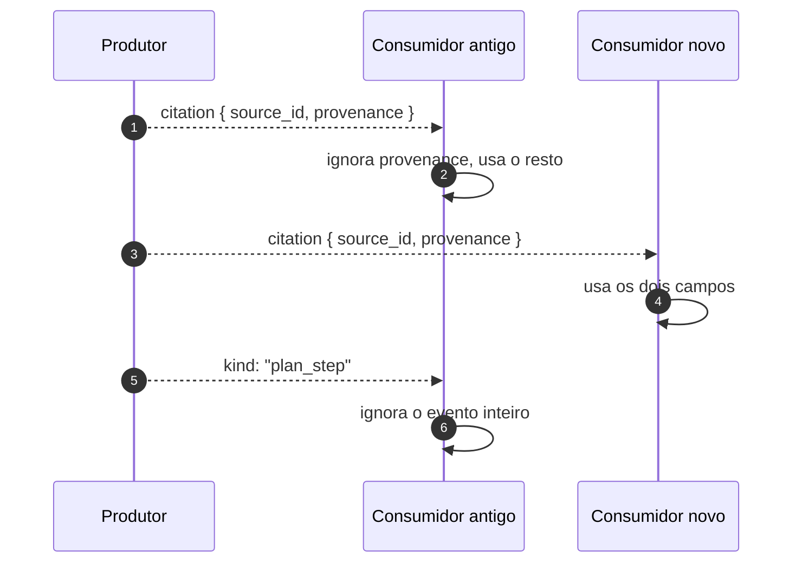
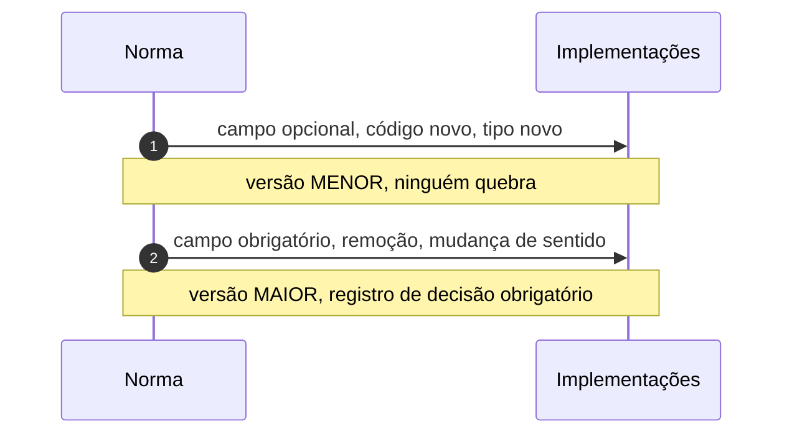

# Jornada J06 — O fio evolui: tipo desconhecido, campo novo, versão

> **Fio capturado em 2026-08** · última revisão 2026-08-13 · [histórico e registro de expiração](../HISTORICO.md)

**Capítulos**: [03 — Eventos tipados](../capitulos/03-eventos-tipados.md)
**Norma**: APH-2.2 · [Anexo A §A.9](https://github.com/GHDaru/protocolos/blob/main/padrao/anexo-a-wire-format.md) · espelho na junta: §B.2.5, §B.11.1
**Laboratórios**: os dois seguem a regra; o versionamento do fio é exercitado pelo próprio histórico da norma
**Maturidade do fio**: ✅ para a tolerância do consumidor; o regime alternativo, negociado por método, é reconhecido pela norma e **não tem fio especificado**
**Pressupõe**: [J01](j01-primeira-pergunta.md) · **Índice**: [jornadas](README.md)

## Em uma frase

Um protocolo vivo muda, e quem já implementou não pode quebrar. Esta jornada mostra a regra de duas linhas que sustenta isso, e o regime alternativo que resolve o mesmo problema pelo caminho oposto.

## O que você vai conseguir explicar

- Por que a tolerância fica no consumidor e a disciplina no produtor.
- Quando uma mudança é compatível, e quando ela obriga a subir a versão maior.
- Por que dois regimes válidos não podem se misturar no mesmo canal.

## Quem fala com quem

| No diagrama | O que é |
|---|---|
| **Produtor** | Quem emite: o servidor no fio do chat, ou qualquer um dos dois lados na junta federada |
| **Consumidor antigo** | Uma implementação escrita contra uma versão anterior do fio, que ninguém atualizou |
| **Consumidor novo** | Uma implementação que conhece a versão corrente |

## O fio

> **Figura J06-F1** — a mesma mensagem chegando a dois consumidores de versões diferentes.

| # | De → Para | Troca | Carga |
|---|---|---|---|
| 1 | Produtor → Consumidor antigo | evento com campo novo | `{ source_id, provenance }` |
| 2 | Consumidor antigo → si | tolerância | ignora o campo que não conhece |
| 3–4 | Produtor → Consumidor novo | o mesmo evento | usa os dois campos |
| 5 | Produtor → Consumidor antigo | evento de tipo desconhecido | `kind` fora do vocabulário que ele conhece |
| 6 | Consumidor antigo → si | tolerância | ignora o evento, sem falhar |

### 1. A regra cabe em uma frase, e é assimétrica

**O consumidor ignora o que não conhece; o produtor documenta antes de emitir.**

A assimetria é o desenho inteiro. Se a tolerância estivesse no produtor ("não emita nada que alguém possa não entender"), o protocolo nunca evoluiria: qualquer acréscimo dependeria de todo mundo atualizar antes. Se a disciplina estivesse no consumidor ("aceite qualquer coisa e adivinhe"), o vocabulário deixaria de ser fechado e o fio viraria terra de ninguém.

Com a divisão, o produtor pode acrescentar sem coordenar, e o consumidor pode ficar para trás sem quebrar. É o que permite que uma aplicação escrita contra uma versão antiga continue funcionando quando o servidor sobe de versão.

Há um detalhe fácil de errar: o schema do evento é o **check de conformidade do produtor**. Ele não vale como validação em runtime no consumidor. Um consumidor que rejeitasse tudo que não casa com o seu schema estaria implementando o oposto da regra, e o Anexo A diz isso com todas as letras.

### 2. O que é compatível, e o que não é

> **Figura J06-F2** — as duas classes de mudança.

Acrescentar campo opcional, código de erro ou tipo de evento é compatível, e sobe a versão menor. Foi assim que a citação ganhou procedência ([J05](j05-citacao-e-proveniencia.md)) e o resultado de ação ganhou desfecho por alvo ([J11](README.md)): quem consumia a versão anterior continuou funcionando sem tocar em nada.

Tornar um campo obrigatório, remover um campo ou mudar o significado de um existente é incompatível, sobe a versão maior e exige registro de decisão. A terceira é a mais traiçoeira, porque não aparece no schema: se um campo que significava uma coisa passa a significar outra, todo consumidor continua analisando e passa a entender errado, em silêncio.

Vale registrar um caso concreto: o único evento de **correção** de texto normativo publicado no padrão até hoje aconteceu porque um requisito de segurança prescrevia algo autocontraditório. Quem tinha implementado ao pé da letra precisou reler o requisito. Correção não é a mesma coisa que evolução, e o aviso ficou no documento em vez de escondido numa nota de rodapé.

### 3. O outro regime, que resolve o mesmo problema ao contrário

A norma reconhece um segundo caminho válido, observado em transporte bidirecional de desktop: **versionamento negociado por método**. Cada método declara uma versão no aperto de mão inicial, o conjunto de nomes é fechado e os schemas são congelados.

A troca é exatamente oposta. Onde o regime tolerante prefere continuar funcionando com entendimento parcial, o negociado prefere **falhar explicitamente** a seguir com incompatibilidade silenciosa. Nenhum dos dois é melhor em abstrato: um serve melhor a um fio que atravessa organizações e versiona devagar; o outro, a um canal entre duas peças que se atualizam juntas.

O que a norma não deixa passar é a mistura. Os dois regimes no mesmo canal, sem regra explícita, produzem o pior dos dois: uma ponta que ignora o desconhecido e outra que recusa, e ninguém sabe qual comportamento esperar. Quem adota o negociado **DEVE registrar a escolha**.

E aqui há uma lacuna honesta: a norma reconhece o regime negociado e **não especifica handshake nenhum** para ele. Quem for por esse caminho está fora do Anexo A, e o documento diz isso em vez de fingir cobertura.

### 4. A junta federada repete a regra, com uma diferença

O fio da junta segue o mesmo princípio: tipo desconhecido é ignorado sem efeito, campo novo no corpo é compatível. Mas ali o envelope é **fechado** e o corpo é **aberto**, e a assimetria é deliberada.

O envelope tem exatamente quatro campos, e mensagem que não case no protocolo e na versão é ignorada sem resposta, porque responder já confirmaria presença. O corpo aceita campo novo, porque foi o que permitiu aos dois lados evoluírem sem renegociar o canal.

Acrescentar um **tipo** novo lá, porém, exige revisão do anexo, já que o vocabulário é um conjunto fechado no schema. É assim de propósito: tipo novo na junta passa por acordo, em vez de aparecer no fio.

## Quando o fio quebra

| Desvio | Bifurca em | Como termina |
|---|---|---|
| O consumidor rejeita tipo desconhecido | passo 5 | **não-conforme**: o schema é check do produtor, não validação do consumidor |
| O produtor emite tipo não documentado | passo 5 | funciona por acaso; quebra o contrato e a rastreabilidade |
| Um campo muda de significado sem subir a versão maior | — | pior caso: ninguém falha, todos entendem errado |

## Como reconhecer no seu sistema

- Mande um evento de tipo inventado ao seu cliente. Ele deve ignorá-lo e continuar. Se ele lança exceção, a regra não está implementada.
- Acrescente um campo desconhecido a um evento conhecido. Mesmo teste.
- Procure o registro da versão do fio no seu código. Se não existir, você não sabe contra o que foi escrito.
- Se você adotou o regime negociado, procure onde a escolha está registrada.

## Lacunas e derivas (2026-08-13)

| Lacuna | Onde | Estado | Gatilho |
|---|---|---|---|
| O regime negociado por método é reconhecido e **não tem fio especificado** na norma | APH-2.2 | aberta | primeira implementação que o adote e queira interoperar |
| A norma não diz como um consumidor descobre a versão do fio que o produtor fala | §A.9 | aberta | quando a negociação virar necessidade real |
| Mudança de significado sem mudança de forma não é detectável por nenhum gate | §A.9 | aceita | é trabalho de revisão humana |

## Verificação

1. Explique por que a tolerância precisa estar no consumidor e a disciplina no produtor, e o que aconteceria com cada troca invertida.
2. Das três mudanças incompatíveis, qual é a mais perigosa e por quê? *(Dica: qual delas nenhum validador percebe.)*
3. Por que os dois regimes de evolução não podem coexistir no mesmo canal sem regra explícita?

---

## Apêndice — evidência por fonte

### `ghdaru` e `nexxussai-monorepo`

Os dois seguem a regra de tolerância no consumidor. O versionamento do fio é exercitado pelo próprio histórico da norma: a subida para a versão com procedência e a subida para a versão com desfecho por alvo foram as duas compatíveis, e estão registradas no §A.9.

### Onde isto está na norma

| Momento | Requisito |
|---|---|
| 1. A regra assimétrica | APH-2.2 |
| 2. Compatível × incompatível | §A.9 |
| 3. Regime negociado | APH-2.2, nota da versão 0.3 |
| 4. A junta federada | §B.2.5, §B.11.1 |
