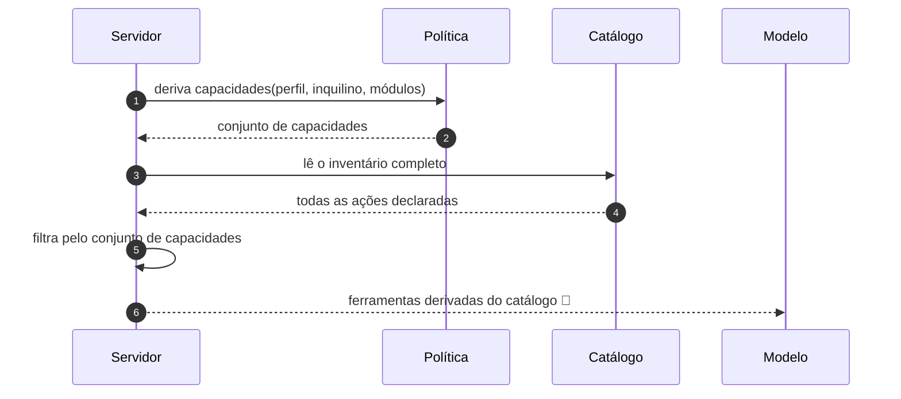
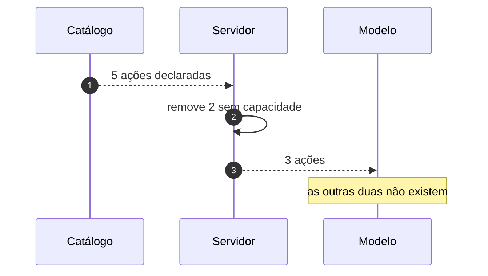

# Jornada J07 — O que a aplicação sabe fazer: catálogo, risco e tools

> **Fio capturado em 2026-08** · última revisão 2026-08-13 · [histórico e registro de expiração](../HISTORICO.md)

**Capítulos**: [05 — Ações governadas](../capitulos/05-acoes-governadas.md) · [08 — Porta do modelo](../capitulos/08-porta-do-modelo.md)
**Norma**: APH-4.1, 4.2, 4.3, 4.4🧪 · 7.2 · 8.2🧪 · [Anexo A §A.5](https://github.com/GHDaru/protocolos/blob/main/padrao/anexo-a-wire-format.md)
**Laboratórios**: `ghdaru` catálogo derivado de permissões, completo · `nexxussai-monorepo` catálogo presente, derivação parcial
**Maturidade do fio**: ✅ para o catálogo e a derivação; 🧪 para a projeção em ferramenta (traço tracejado)
**Pressupõe**: [J01](j01-primeira-pergunta.md), [J04](j04-porta-do-modelo.md) · **Índice**: [jornadas](README.md)

## Em uma frase

Antes de qualquer ação existir, existe a lista do que pode ser feito. Esta jornada mostra como essa lista é montada, por que ela é diferente para cada pessoa, e por que o que não está nela simplesmente não acontece.

## O que você vai conseguir explicar

- Por que o catálogo é a única superfície executável, e o que isso exclui.
- Por que a filtragem por permissão acontece na **composição**, e não na execução.
- Por que uma fonte com duas projeções vale mais que duas definições sincronizadas.

## Quem fala com quem

| No diagrama | O que é |
|---|---|
| **Servidor** | Quem compõe o catálogo para aquele pedido |
| **Política** | A derivação pura que transforma perfil, inquilino e módulos em capacidades |
| **Catálogo** | A declaração de todas as ações que a aplicação sabe fazer |
| **Modelo** | Quem recebe a lista já filtrada, projetada como ferramentas |

## O fio

> **Figura J07-F1** — a composição do catálogo, do inventário completo ao que o modelo vê.

| # | De → Para | Troca | Carga |
|---|---|---|---|
| 1 | Servidor → Política | derivação | perfil, inquilino, módulos habilitados |
| 2 | Política → Servidor | resposta | conjunto de capacidades, na forma `recurso:verbo` |
| 3–4 | Servidor → Catálogo | leitura | todas as ações, com identificador, título, risco e schema de entrada |
| 5 | Servidor → Servidor | filtragem | remove o que o principal não pode |
| 6 | Servidor → Modelo | projeção 🧪 | o mesmo schema de entrada, agora como ferramenta |

### 1. O que não está declarado, não acontece

O catálogo é a **única superfície executável**. Não é a principal, nem a recomendada: é a única. Nenhum endpoint fora dele é alcançável pelo modelo, e não existe caminho lateral.

Isso é mais restritivo do que parece à primeira vista, e é a restrição que faz o resto do padrão funcionar. Se houvesse um segundo caminho — um endpoint genérico, uma execução de consulta, uma ferramenta de propósito geral —, todas as garantias construídas nas jornadas seguintes teriam uma porta dos fundos: a classe de risco, o gate humano, o traço, a autorização.

Cada ação declara quatro coisas: identificador, título, schema de entrada e **classe de risco**. As três primeiras são óbvias; a quarta é o que permite ao servidor decidir, sem perguntar ao modelo, se aquilo executa direto ou para num gate humano ([J08](README.md) e [J09](README.md)).

### 2. Ausência é melhor fronteira que recusa

> **Figura J07-F2** — a filtragem que acontece antes de o modelo ver qualquer coisa.

Um desenho ingênuo entregaria o catálogo inteiro ao modelo e recusaria na hora da execução. Funciona, e é pior por três motivos.

O primeiro é que o modelo passa a propor coisas que serão negadas, e o usuário vê promessas que não se cumprem. Uma interface que oferece e depois nega ensina desconfiança.

O segundo é que o catálogo completo é informação: ele conta ao modelo, e por consequência a quem conversa com ele, o que existe na aplicação. Numa aplicação com módulos por contrato, isso vaza a lista de módulos que o cliente não assinou.

O terceiro é o que importa para segurança: a recusa passa a ser o único controle, e controle único é ponto único de falha. Com filtragem na composição, a ação indisponível **não existe** no inventário, e a recusa vira a segunda camada, não a primeira.

A derivação é **política pura**, verificada nos casos de uso, e o modelo nunca decide permissão. Uma política que devolve verdadeiro para tudo é não-conformidade declarada, e é um contraexemplo que a norma registra porque ele acontece.

Há uma armadilha de leitura que vale mencionar: auditar autorização olhando a camada de rota, num código que verifica nos casos de uso, produz falso positivo sistemático. Três equipes independentes caíram nela numa mesma investigação, inclusive sobre o próprio código.

### 3. Uma fonte, duas projeções

O schema de entrada de cada ação é um schema completo dos argumentos. Ele faz dois trabalhos ao mesmo tempo: valida os argumentos da proposta que o modelo enviar, e **vira a ferramenta** entregue ao modelo.

A alternativa seria manter duas definições, uma para validar e outra para descrever ao modelo, e mantê-las sincronizadas. Quem já tentou sabe como termina: elas divergem no primeiro campo acrescentado com pressa, e a divergência aparece como um modelo propondo argumentos que a validação recusa, o que é um bug difícil de ler.

Isso é 🧪, e o tracejado no diagrama diz por quê: a projeção existe como desenho na norma e não foi verificada nos laboratórios. O laboratório A entrega ferramentas reais ao modelo, o que é meio caminho; o que falta é elas serem derivadas do catálogo em vez de escritas ao lado.

## Quando o fio quebra

| Desvio | Bifurca em | Código | Como termina |
|---|---|---|---|
| O modelo propõe ação fora do catálogo | passo 6 | — | recusa; a ação não existe. Detalhado em [J14](README.md) |
| O principal perde a capacidade entre a composição e a execução | passo 5 | `UNAUTHORIZED` | recusa com traço, na execução |
| A política devolve verdadeiro para tudo | passo 1 | — | **não-conforme**, e passa em todos os testes de caminho feliz |

## Como reconhecer no seu sistema

- Existe um endereço onde se lê o catálogo, e ele responde **diferente para pessoas diferentes**. Se responde igual, a filtragem não está na composição.
- Cada entrada tem classe de risco. Sem ela, a decisão de gate humano vira código espalhado.
- O schema que valida os argumentos é o mesmo objeto que descreve a ferramenta. Se são dois arquivos, eles vão divergir.
- Procure um caminho de execução que não passe pelo catálogo. Se existir, ele é a fronteira real do seu sistema, e não o catálogo.

Da suíte de conformidade, o catálogo aparece na lista de itens de autodeclaração do Nível 1 e é verificado de fora no perfil de Nível 2, que ainda não existe.

## Lacunas e derivas (2026-08-13)

| Lacuna | Onde | Estado | Gatilho |
|---|---|---|---|
| A taxonomia de classes de risco **não é padronizada** entre aplicações: a norma fixa o mínimo comprovado, leitura e confirmação, e deixa o resto para cada uma | §8 do padrão | aberta | convergência de três ecossistemas |
| A projeção do catálogo em ferramenta segue 🧪 | APH-4.4, 8.2 | aberta | primeira verificação em laboratório |
| Não há suíte executável de Nível 2 | §8 do padrão | aberta | quando o Nível 2 ganhar perfil de conformidade |

## Verificação

1. Uma aplicação entrega o catálogo completo ao modelo e recusa na execução. Cite as três consequências, e diga qual delas é de segurança.
2. Por que "ausência é melhor fronteira que recusa" não dispensa a recusa?
3. Duas definições sincronizadas à mão, uma para validar e outra para descrever ao modelo. Descreva o bug que aparece primeiro, e como ele se manifesta para o usuário.

---

## Apêndice — evidência por fonte

### `ghdaru`

| Momento | Onde |
|---|---|
| Catálogo declarado, com risco | `catalog.py` |
| Derivação de capacidades por política | camada de identidade, verificada nos casos de uso |
| Ferramentas entregues ao modelo | `agent_tools.py` |

### `nexxussai-monorepo`

Catálogo presente; a derivação por permissões é parcial. O requisito herda o grau da metade verificada, que é a do laboratório A.

### Onde isto está na norma

| Momento | Requisito |
|---|---|
| 1. Única superfície, quatro campos | APH-4.1, 4.2 |
| 2. Derivação na composição | APH-4.3, 7.2 |
| 3. Uma fonte, duas projeções | APH-4.4 🧪, 8.2 🧪, §A.5 |
