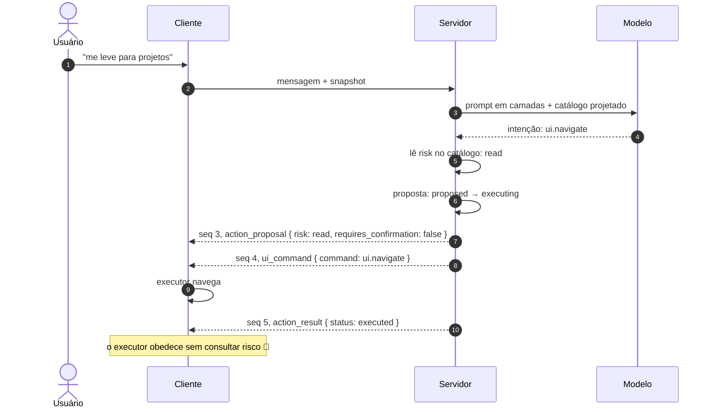
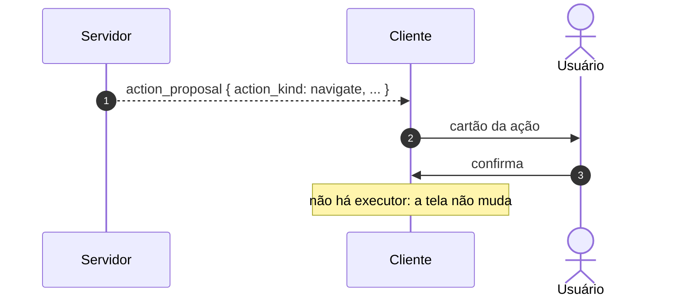

# Jornada J08 — Ação de leitura: a proposta que executa direto

> **Fio capturado em 2026-08** · última revisão 2026-08-13 · [histórico e registro de expiração](../HISTORICO.md)

**Capítulos**: [05 — Ações governadas](../capitulos/05-acoes-governadas.md) · [06 — Comandos de UI](../capitulos/06-comandos-de-ui.md)
**Norma**: APH-5.1, 5.2, 5.5 · 6.1, 6.2, 6.3, 6.6⚗️ · [Anexo A §A.3, §A.5](https://github.com/GHDaru/protocolos/blob/main/padrao/anexo-a-wire-format.md)
**Laboratórios**: `ghdaru` fio completo, com teste verde asserindo a ordem dos eventos · `nexxussai-monorepo` política e taxonomia, **sem executor**
**Maturidade do fio**: ✅ nas três pernas desenhadas. O APH-6.6 é ⚗️ e aparece **só em prosa**: a metade que falta é um check ausente, e ausência não vira seta
**Pressupõe**: [J01](j01-primeira-pergunta.md), [J07](j07-catalogo.md) · **Decisão de forma**: [ADR 0009](../../adr/0009-ui-command-e-perna-de-efeito.md) · **Índice**: [jornadas](README.md)

## Em uma frase

A ação mais barata que existe no Nível 2: o usuário pede para ir a uma tela, e a aplicação vai, sem perguntar nada. Esta jornada mostra que "direto" quer dizer **sem gate humano**, e nunca **sem proposta** — e é essa distinção que faz a navegação das 14h32 ter um responsável.

## O que você vai conseguir explicar

- Por que `requires_confirmation: false` tira a pessoa do caminho, e não a proposta.
- Por onde passa a linha entre executar e confirmar, e por que ela é traçada antes da conversa.
- Por que um comando declarativo sem executor termina em cartão morto.
- Por que uma classe de risco escrita no catálogo e nunca lida em tempo de execução não é política.

## Quem fala com quem

| No diagrama | O que é |
|---|---|
| **Usuário** | A pessoa que pede |
| **Cliente** | A tela, e dentro dela o **executor no host**: o pedaço de código que traduz comando em efeito real |
| **Servidor** | Quem consulta o catálogo, cria a proposta, move a máquina de estados e escreve o traço |
| **Modelo** | Quem reconhece a intenção; nunca decide risco |

Uma nota antes do fio: a máquina de estados da proposta tem **dez estados** na referência do APH-5.1. Esta jornada percorre quatro deles. Os outros seis — inclusive o gate humano e os terminais de recusa — são o assunto da [J09](README.md), e não estão desenhados aqui de propósito.

## O fio

> **Figura J08-F1** — a ação de leitura, do pedido ao efeito na tela. Três pernas, todas comprovadas.

| # | De → Para | Troca | Carga |
|---|---|---|---|
| 1–2 | Usuário → Cliente → Servidor | pedido | texto, mais o snapshot da tela (J01) |
| 3–4 | Servidor → Modelo | geração | prompt em camadas, catálogo projetado (J04, J07) |
| 5 | Servidor → si | consulta | a classe de risco declarada da ação: `read` |
| 6 | Servidor → si | transição | `proposed → executing`, **sem** passar por `awaiting_approval` |
| 7 | Servidor → Cliente | proposta | `{proposal_id, action_id, risk, requires_confirmation: false}` |
| 8 | Servidor → Cliente | comando | `{command}` e argumentos — **e nada mais** |
| 9 | Cliente → si | efeito | o executor traduz o comando em navegação real |
| 10 | Servidor → Cliente | resultado | `{proposal_id, status: "executed"}`: o traço |

### 1. A linha é traçada antes da conversa, e não pelo modelo

Duas ações do mesmo catálogo tomam caminhos diferentes, e o que decide não é o modelo nem o usuário: é a **classe de risco declarada**, lida pelo servidor.

O critério tem nome, e é a **reversibilidade**. Navegar, focar um campo, preencher um rascunho: se der errado, a pessoa volta. Submeter, encerrar a sessão, abrir um recurso: alguma coisa persistiu. O primeiro grupo dispensa o gate; o segundo, não.

Vale ser preciso sobre onde essa decisão mora, porque é o ponto que mais escorrega na implementação. Ela mora **no catálogo, em política do servidor, por tipo de ação** — não num `if` dentro do tratador da mensagem, não numa heurística do modelo, não numa configuração do cliente. A pergunta de auditoria correspondente é curta: *onde está escrito que esta ação é de leitura?* Se a resposta for "no código que a executa", a política e a execução são a mesma coisa, e não há política.

A fricção é proporcional à consequência. Pedir confirmação para navegar não protege ninguém: ensina a clicar em "sim" sem ler, e essa dívida é cobrada exatamente na ação que importava.

### 2. Sem gate, mas com proposta — e é aqui que mora a jornada

Esta é a única ideia que você precisa levar daqui: **o que executa direto também nasce proposta**.

A intuição de quem implementa diz o contrário. Sem gate, sem cerimônia; sem cerimônia, sem registro; e a navegação vira uma chamada de função que não deixa rastro. A norma corta esse caminho: nenhuma ação executa no momento em que o modelo a menciona, e toda ação nasce proposta com identidade própria. Não há exceção para leitura.

O atalho é outro, e é preciso: a proposta vai de `proposed` direto para `executing`, **pulando** `awaiting_approval`. É uma aresta da máquina de estados, não um desvio em volta dela. E é por isso que os três eventos saem na ordem que saem — proposta, comando, resultado —, com o `action_result` fazendo o trabalho que o APH-5.5 exige de toda ação executada: deixar traço visível na conversa e auditável no servidor.

O teste da coisa é uma pergunta operacional. Alguém pergunta quem mandou navegar para `/projetos` às 14h32. Com proposta, existe um identificador, um estado terminal e um traço. Sem proposta, existe uma linha de log — se alguém tiver lembrado de escrevê-la.

O laboratório A implementa isso literalmente, e tem **teste verde asserindo a ordem canônica** dos eventos. O mesmo laboratório prova a regra pelo avesso no caminho mutador: `session.logout`, declarado `confirm`, para em `awaiting_approval` e **não emite comando nenhum** até a confirmação chegar.

Um detalhe que a norma permite e que vale registrar: a máquina implementada lá tem sete estados, não dez. O APH-5.1 admite subconjuntos, desde que as transições fora da tabela falhem — o que muda entre uma implementação e outra é quantos terminais ela distingue, nunca se a proposta existe.

### 3. Do comando ao efeito: sem executor, cartão morto

> **Figura J08-F2** — a mesma ação, na forma do laboratório B. O verbo de interface viaja dentro da proposta, e não existe perna de efeito.

O padrão não obriga a chamar essa perna de `ui_command`. A norma diz "comando de interface **ou ação equivalente no frontend**", e o laboratório B escolheu a outra forma: o verbo viaja como campo dentro da própria proposta, e o tipo de evento não existe lá. É variação legítima, registrada na tabela de mapeamento de nomes.

O que **não** é opcional é a perna. Um vocabulário declarado e uma política de reversibilidade não mudam tela nenhuma sozinhos: falta o código do host que recebe o comando e o traduz em efeito real. No laboratório A ele existe e é minúsculo — filtra o evento, e para navegação chama o roteador do aplicativo. No laboratório B toda a cadeia existe, taxonomia rica, política, entidade com máquina de estados, endpoints de confirmação e um cartão que renderiza a proposta com cor por risco — e **não existe o tradutor**. O usuário confirma e a tela não muda.

O nome disso é **cartão morto**, e a lição é estrutural: o executor não é detalhe de interface, é a metade do protocolo sem a qual a outra metade é decorativa. Quem especifica um vocabulário de comandos especifica, no mesmo ato, quem os executa.

Vale notar o que o executor **não** faz: ele nunca opera a interface por clique simulado, coordenada ou manipulação da árvore do documento. O modelo produz um evento tipado; quem navega é o roteador do próprio aplicativo, com as guardas de rota e as permissões que ele já tinha. O executor executa *em nome* do modelo, dentro das regras da casa.

### 4. Política escrita não é política aplicada

Aqui está o desconforto desta jornada, e ele é o requisito ⚗️ da lista.

A perna 2 do fio carrega `{command}` e argumentos. **Não carrega classe de risco, nem identificador de proposta, nem identificador de ação.** O executor, do outro lado, é um desvio por nome de comando: obedece ao que chegar. A garantia de que só chega verbo de leitura é inteiramente **a montante** — a política do servidor —, e não é verificada a jusante em laboratório nenhum.

O contraexemplo é vivo e está no mesmo executor do laboratório A: `session.logout` está declarado `confirm` no catálogo, e o executor tem um ramo que o despacha assim que o comando aparece. Ali o gate está a montante e funciona, então nada quebra hoje; mas o cliente obedeceria igual se não estivesse. É a diferença entre política escrita no catálogo e política aplicada em tempo de execução, e é exatamente o que o APH-6.6 quer fechar ao pedir que o executor consulte a classe de risco e **recuse fail-closed** o que não for de leitura.

E a norma pede esse check **sem fornecer o insumo dele**: o comando não tem correlação nenhuma com a proposta que o autorizou, e o cliente não tem o catálogo em mãos. É a lacuna mais acionável que esta jornada produziu, e está registrada abaixo em vez de contornada.

Há um agravante mensurável. O executor do laboratório A é chamado em todos os caminhos por onde um evento chega, inclusive na **repetição pós-reconexão**. Para navegação isso é inócuo, porque navegar de novo para a mesma rota não faz nada. Para um verbo mutador, seria reexecução sem novo gate.

## Quando o fio quebra

| Desvio | Bifurca em | Código | Como termina |
|---|---|---|---|
| A ação de leitura executa sem nascer proposta | passo 6 | — | **não-conforme** (APH-5.1): sem identidade, sem estado, sem traço |
| Chega ao executor um comando de verbo mutador | passo 8 | — | executa; o executor é cego a risco. **Não-conforme** pelo APH-6.6, e passa em todo teste de caminho feliz |
| Não há executor no host | passo 9 | — | cartão morto: o servidor registra `executed` e a tela não muda |
| A ação pedida não está no catálogo | passo 5 | — | recusa; a ação não existe. É a [J14](README.md) |
| O modelo decide sozinho que a ação é de leitura | passo 5 | — | **não-conforme** (APH-5.2): a proporção é decidida fora do modelo |

## Como reconhecer no seu sistema

- Procure o identificador de proposta de uma navegação já ocorrida. Se não houver, suas ações de leitura executam fora da governança, mesmo que tudo funcione.
- A classe de risco vem do catálogo, e o tratador da mensagem a **lê**. Se ela está codificada no tratador, política e execução são a mesma coisa.
- Cruze o risco declarado de cada entrada do catálogo com o que o executor do frontend despacha sem passar pelo servidor. Se o executor não lê risco, a sua fronteira real é o código do cliente, não o catálogo.
- Confirme uma proposta e olhe a tela. Se nada muda, você tem cartão morto e vai descobrir isso pelo usuário.
- Verifique o que acontece com os comandos na reconexão. Repetir navegação é inócuo; repetir qualquer outra coisa não é.

Da suíte de conformidade, nada disto é verificado de fora: **não existe perfil executável de Nível 2**. Tudo nesta jornada é hoje autodeclaração apoiada em leitura de código.

## Lacunas e derivas (2026-08-13)

| Lacuna | Onde | Estado | Gatilho |
|---|---|---|---|
| O comando de interface **não tem correlação no fio** com a proposta que o autorizou: o payload exige só o comando, sem identificador de proposta, de ação ou classe de risco. O check fail-closed do APH-6.6 fica sem insumo | §A.3, APH-6.6 | **aberta**, candidata a spec na norma | campo de correlação no fio, ou o cliente consultando o catálogo |
| A metade 🧪 do APH-6.6 — executor que consulta risco e recusa — não existe em laboratório nenhum | APH-6.6 | aberta | a primeira implementação; ela precisa da lacuna acima resolvida antes |
| O bloco de exemplo do §A.3 imprime dois eventos com o mesmo número de sequência, contra o APH-1.2. O JSON de referência está correto, então nenhum gate pega | §A.3 | **deriva editorial**, reportada à norma | correção no repositório do padrão |
| A taxonomia de classes de risco não é padronizada: o mínimo comprovado é leitura e confirmação | §A.5 | aberta | convergência de três ecossistemas |
| Um laboratório tem executor e dois comandos; o outro tem taxonomia rica e nenhum executor | APH-6.2 | conhecida | juntos contêm o desenho que nenhum contém sozinho |

**O que promoveria o APH-6.6 a ✅**: um executor, em qualquer laboratório, que leia a classe de risco da ação antes de despachar e recuse o que não for de leitura — e, antes disso, um fio que lhe diga qual é a ação.

## Verificação

1. Uma equipe implementa a busca de projetos como leitura e emite o resultado direto no fluxo, sem criar proposta nenhuma: "não tem gate, não precisa de estado". Diga qual requisito isso quebra, e o que se perde primeiro quando alguém perguntar quem mandou navegar para `/projetos` às 14h32.
2. Duas aplicações classificam a mesma ação de forma diferente: exportar relatório é leitura numa e confirmação na outra. Qual das duas está errada, e quem decide isso?
3. O catálogo declara `session.logout` como confirmação, e o executor do frontend o despacha assim que o comando chega à tela. Aponte qual metade do requisito está cumprida e qual não está, e explique por que auditar só o catálogo devolveria "conforme".

---

## Apêndice — evidência por fonte

### `ghdaru`

| Momento | Onde |
|---|---|
| Pipeline mensagem → catálogo → risco → eventos | `apps/api/src/ghdaru_api/conversation/application/handle_message.py:41-55` |
| Catálogo com classe de risco por ação | `apps/api/src/ghdaru_api/conversation/domain/catalog.py:22-25` (`session.logout`, `risk="confirm"`) |
| Máquina de estados e transições válidas | `apps/api/src/ghdaru_api/conversation/domain/models.py:23-30` (`proposed → executing` é aresta declarada) |
| Ordem canônica dos eventos, com teste verde | `apps/api/tests/conversation/test_conversation.py:74` (commit `a02cb12`) |
| Caminho mutador não emite comando antes do gate | mesmo arquivo, asserção de ausência |
| Executor no host | `apps/web/src/features/conversation/ui/ChatPanel.tsx:53-60` |
| Executor cego a risco, e reaplicado na repetição | mesmo arquivo, chamada no fluxo e na repetição pós-reconexão |

### `nexxussai-monorepo`

| Momento | Onde |
|---|---|
| Verbo de interface como campo da proposta | `apps/api/app/ai_chat/domain/value_objects/action_kind.py` |
| Política de reversibilidade, server-side, por tipo | `apps/api/app/ai_chat/domain/services/action_proposal_policy_service.py` |
| Cartão da proposta, com cor por risco | `apps/web/src/components/chat/lateral/ActionCard.tsx` |
| Executor | **não existe**: o cartão morto |

### Onde isto está na norma

| Momento | Requisito |
|---|---|
| 1. A linha antes da conversa | APH-5.2, APH-6.3 |
| 2. Sem gate, com proposta e traço | APH-5.1, APH-5.5, §A.3 |
| 3. Vocabulário declarativo e executor no host | APH-6.1, APH-6.2, §A.8 |
| 4. Política aplicada em tempo de execução | APH-6.6 ⚗️ |
