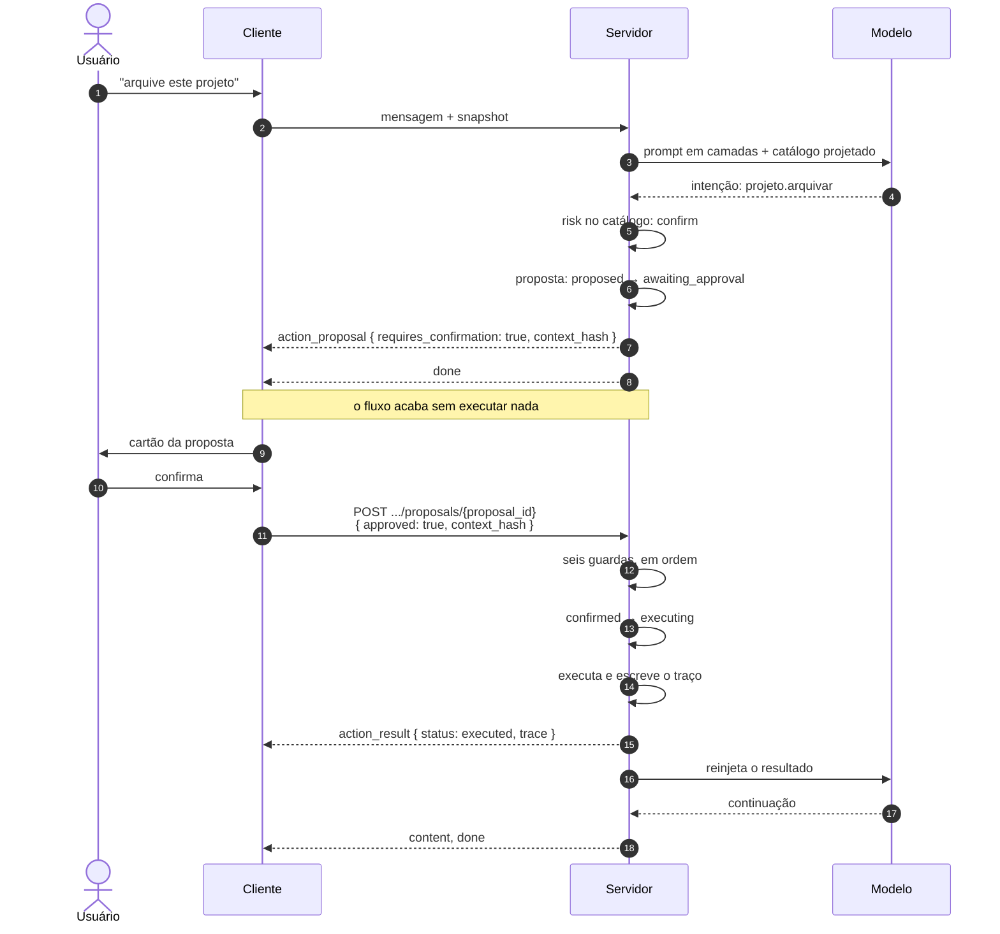
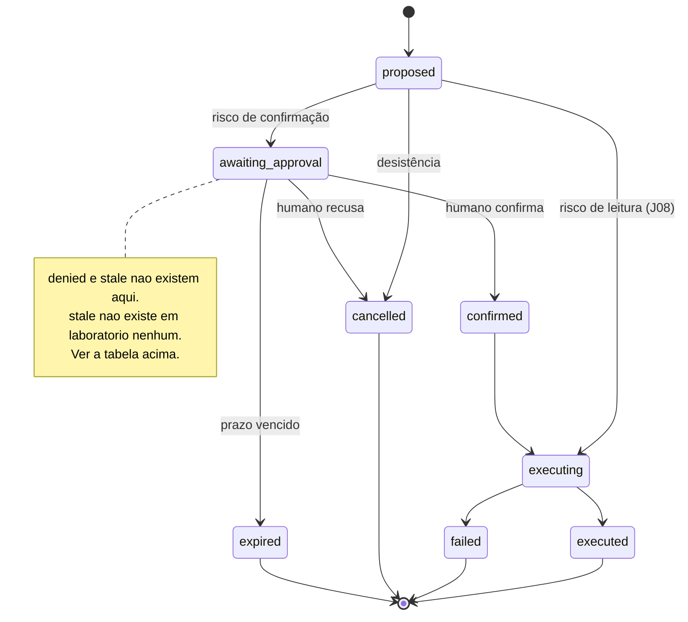

# Jornada J09 — Ação mutadora: proposta, gate humano, execução, traço

> **Fio capturado em 2026-08** · última revisão 2026-08-13 · [histórico e registro de expiração](../HISTORICO.md)

**Capítulos**: [05 — Ações governadas](../capitulos/05-acoes-governadas.md) · [07 — Segurança](../capitulos/07-seguranca.md)
**Norma**: APH-5.1, 5.2, 5.3🧪, 5.5, 5.8🧪 · 7.2, 7.4 · [Anexo A §A.2, §A.3, §A.6, §A.7](https://github.com/GHDaru/protocolos/blob/main/padrao/anexo-a-wire-format.md)
**Laboratórios**: `ghdaru` caminho completo, com seis guardas em ordem · `nexxussai-monorepo` máquina de estados própria, com dois terminais que o outro não tem, e **porta de autorização em stub**
**Maturidade do fio**: ✅ no fio, no gate e no traço; 🧪 na deduplicação por chave (APH-5.3) e no valor server-authoritative como requisito **geral** (APH-5.8), que está verificado para uma classe de ação só
**Pressupõe**: [J07](j07-catalogo.md), [J08](j08-acao-de-leitura.md) · **Decisões de forma**: [ADR 0009](../../adr/0009-ui-command-e-perna-de-efeito.md), [ADR 0010](../../adr/0010-diagrama-de-estados-so-com-lastro.md) · **Índice**: [jornadas](README.md)

## Em uma frase

O eixo do Nível 2: a ação que muda alguma coisa **para**, espera uma pessoa decidir, e só então executa. Esta jornada percorre a máquina de estados inteira, e mostra que o gate não é uma pergunta na tela — é um estado do protocolo, com endereço, prazo e traço.

## O que você vai conseguir explicar

- Por que o gate precisa ser um **estado**, e o que se perde quando ele é só um diálogo modal.
- Por que a ordem das guardas na confirmação é o desenho, e não detalhe de implementação.
- Por que os valores que a ação grava vêm do servidor, e nunca do modelo nem do cliente.
- Por que confirmar duas vezes não executa duas vezes — e o que ainda não está protegido.
- Por que o traço é pré-condição de execução, e não subproduto dela.

## Quem fala com quem

| No diagrama | O que é |
|---|---|
| **Usuário** | Quem decide. Não é quem propõe |
| **Cliente** | A tela: renderiza o cartão da proposta e manda a decisão |
| **Servidor** | Quem cria a proposta, guarda o estado, aplica as guardas, executa e escreve o traço |
| **Modelo** | Quem propõe. Nunca decide risco, nunca decide permissão, nunca fornece os valores gravados |

## O fio

> **Figura J09-F1** — a ação mutadora, do pedido ao traço. A decisão humana chega por uma requisição própria, e não pelo mesmo fluxo que trouxe a proposta.

| # | De → Para | Troca | Carga |
|---|---|---|---|
| 1–2 | Usuário → Cliente → Servidor | pedido | texto, mais o snapshot da tela |
| 3–4 | Servidor → Modelo | geração | prompt em camadas, catálogo projetado |
| 5–6 | Servidor → si | classificação e transição | classe de risco `confirm`; `proposed → awaiting_approval` |
| 7 | Servidor → Cliente | proposta | `{proposal_id, action_id, risk, requires_confirmation: true}`, mais `args`, `title`, `rationale` e 🧪`context_hash` |
| 8 | Servidor → Cliente | terminador | o fluxo acaba **sem** `action_result` |
| 9–10 | Cliente → Usuário → Cliente | decisão | o cartão, e o clique |
| 11 | Cliente → Servidor | confirmação | `{approved}`, mais 🧪`idempotency_key` e 🧪`context_hash` |
| 12–14 | Servidor → si | guardas, transição e execução | seis verificações em ordem; `confirmed → executing` |
| 15 | Servidor → Cliente | resultado | `{proposal_id, status: "executed"}` e o traço |
| 16–18 | Servidor → Modelo → Cliente | reinjeção | o resultado volta ao modelo, e a conversa continua |

Repare no passo 8, que é o que separa esta jornada da anterior: **o fluxo termina sem executar**. A proposta fica viva no servidor, aguardando, e a decisão chega por uma requisição própria, em outro momento, possivelmente em outra conexão. É por isso que a reconexão com aprovação pendente é um problema de verdade, e tem jornada própria ([J13](README.md)).

### 1. O gate é um estado, e é por isso que ele é observável

A tentação é implementar o gate como diálogo modal: o cliente mostra a pergunta, guarda a resposta e só então chama a interface de programação. Funciona na demonstração e falha em tudo o mais.

Um gate que existe só na tela não sobrevive à recarga da página, não aparece na auditoria, não pode ser respondido por outra pessoa, não expira, e não tem como ser consultado por quem quer saber o que está pendente. Um gate que é **estado no servidor** tem endereço, prazo, dono e histórico. A diferença aparece na primeira pergunta operacional séria: *o que está esperando decisão agora?*

A norma exige que toda ação nasça proposta, com identidade própria e uma máquina de estados validada em código, e que **transições fora da tabela falhem**. A tabela abaixo é essa máquina, com o que cada aresta significa e onde ela existe.

| Estado | Alcançáveis | Gatilho | Decisor | Terminal? | Grau | Onde |
|---|---|---|---|---|---|---|
| `proposed` | `awaiting_approval` | classe de risco de confirmação | servidor | não | ✅ | A |
| `proposed` | `executing` | classe de risco de leitura ([J08](j08-acao-de-leitura.md)) | servidor | não | ✅ | A |
| `proposed` | `cancelled` | desistência antes do gate | usuário | não | ✅ | A |
| `proposed` | `confirmed` | confirmação (o `proposed` de B faz o papel do gate) | usuário | não | ✅ | B |
| `proposed` | `denied` | política nega | servidor | não | ✅ | B |
| `proposed` | `expired` | prazo vencido | servidor | não | ✅ | B |
| `awaiting_approval` | `confirmed` | confirmação humana | usuário | não | ✅ | A |
| `awaiting_approval` | `cancelled` | recusa humana | usuário | não | ✅ | A |
| `awaiting_approval` | `expired` | prazo vencido, descoberto na tentativa de confirmar | servidor | não | ✅ | A |
| `confirmed` | `executing` | — | servidor | não | ✅ | A |
| `confirmed` | `executed` \| `failed` | execução | servidor | não | ✅ | B |
| `confirmed` | `denied` | política nega **depois** da confirmação | servidor | não | ✅ | B |
| `executing` | `executed` \| `failed` | desfecho da execução | servidor | não | ✅ | A |
| `executed`, `failed`, `cancelled`, `expired`, `denied` | — | — | — | **sim** | ✅ | A, B |
| `stale` | — | a tela mudou entre propor e confirmar | servidor | sim | 🧪 | **nenhum** |

Esta tabela é a fonte normativa da máquina nesta jornada, e o diagrama abaixo é a mesma informação em forma visual, com uma restrição declarada no [ADR 0010](../../adr/0010-diagrama-de-estados-so-com-lastro.md): **só entra no desenho o que tem path**.

> **Figura J09-F2** — a máquina como o laboratório A a implementa. Oito estados, todos com código. O `[*]` é a notação padrão de início e fim do gênero, e não uma mensagem no fio.

O laboratório B não ganha figura, e a razão é que ele não é uma variação de **forma** do fio, como foi o caso na J08: é um conjunto de terminais diferente, e a tabela já expressa isso. Vale a leitura, porém, porque ela é o achado mais bonito do capítulo 05: dois times, sem se ver, desenharam o mesmo grafo com vocabulários diferentes — e **cada um trouxe o estado que falta ao outro**. O `awaiting_approval` de A torna o gate observável; o `denied` e o `expired` de B reconhecem que propostas envelhecem e que quem nega pode ser a política, não só a pessoa. A máquina de referência da norma é a união dos dois, mais um estado que ninguém implementou.

Uma nuance que muda como se lê a tabela: em B há `confirmed → denied`. A política pode negar **depois** de o humano ter confirmado. Não é redundância — é a ordem certa de quem manda: confirmação humana não é autorização, e a J14 é sobre isso.

### 2. Seis guardas, e a ordem é o desenho

A confirmação chega ao endereço da proposta, e o servidor não a executa: aplica seis verificações, **nesta ordem**. A ordem não é arbitrária, e trocá-la abre buracos.

| # | Guarda | O que faz se falhar |
|---|---|---|
| 1 | **Estado confirmável?** | `INVALID_TRANSITION`, `409`. Proposta inexistente ou fora da máquina |
| 2 | **Já executada?** | devolve o resultado guardado, **sem reexecutar** |
| 3 | **Prazo vencido?** | `expired`, terminal, `PROPOSAL_EXPIRED`, `409`. Sem execução |
| 4 | **Foi recusada?** | `cancelled`, terminal, com `action_result` no fio |
| 5 | **A tela mudou?** | recusa sem execução, `409`. É a [J10](README.md) |
| 6 | **Os valores podem ser reconstruídos no servidor?** | `failed`, com traço. **Nunca** cai nos argumentos do modelo |

A guarda 2 vem antes da 3 de propósito: uma proposta já executada e cuja janela de prazo passou depois deve devolver o resultado, não um erro de expiração. Invertidas, uma retentativa legítima de rede viraria falha. A guarda 4 vem antes da 5 porque recusar uma proposta cuja tela mudou continua sendo uma recusa válida — não faz sentido responder "o contexto mudou" a quem disse não.

E há uma assimetria de canal que vale registrar, porque confunde quem implementa o cliente: **as guardas 1, 3 e 5 respondem por código HTTP, e não por evento no fio**. Só a recusa humana e o desfecho da execução viram `action_result`. Um cliente que só escute o fluxo não vê a expiração acontecer.

### 3. Os valores gravados vêm do servidor, e a falha é fechada

Aqui está o requisito que mais gente implementa errado sem perceber, e ele é 🧪 como obrigação geral.

Quando os valores de campo **são** o efeito da ação — submeter um formulário, editar em massa —, esses valores não podem vir do modelo nem do cliente. Precisam ser reconstruídos no servidor a partir do snapshot sanitizado da proposta. A razão é direta: os argumentos do modelo são texto que o modelo escolheu, e o modelo pode ter sido capturado por conteúdo hostil ([J15](README.md)). Se ele fornece os valores gravados, toda a governança anterior protegeu a decisão *de executar* e deixou passar *o que foi executado*.

O laboratório A faz isso para submissão, e o detalhe que importa está no que acontece quando **não dá**: se o servidor não consegue reconstruir os valores — porque a tela atual não declara a ação, porque a tela sumiu, porque os parâmetros são inválidos —, a ação é **recusada com traço**, e nunca cai de volta nos argumentos do modelo. O comentário no código nomeia a alternativa pelo que ela é: sem essa trava, o caminho usaria os argumentos do modelo, e isso é falhar aberto.

Fechar a falha aqui é barato e esquecê-lo é caro, porque o modo fail-open **funciona**. Ele passa em todos os testes de caminho feliz e só aparece no dia em que alguém consegue mudar o que o modelo propõe.

O requisito segue 🧪 por honestidade de escopo: está verificado para uma classe de ação, não para todas.

### 4. Confirmar duas vezes: o que a máquina protege, e o que ela não

A máquina de estados já dá uma proteção real contra duplicidade. Confirmar de novo uma proposta já executada cai na guarda 2 e devolve o resultado guardado; confirmar uma proposta cancelada cai na guarda 1 e falha. Nenhum dos dois executa duas vezes.

O que a máquina **não** resolve é o caso em que a mesma decisão do usuário chega duas vezes por caminhos distintos, ou em que a resposta se perdeu e o cliente repete. Para isso a norma pede uma chave de idempotência na confirmação, com **deduplicação real**: a mesma chave produz uma execução e quantas respostas idênticas forem pedidas.

Isso é 🧪, e é um caso didático de por quê. A proteção que a máquina de estados dá é fácil de confundir com idempotência, e ela não é: a máquina protege a *proposta*, e a chave protege a *decisão*. A diferença aparece justamente quando a rede está ruim, que é quando ninguém está olhando.

### 5. O traço é pré-condição, não subproduto

O ciclo fecha com o traço, e a formulação do laboratório A tem dente: **sem traço, a ação é considerada não-governada e é rejeitada**. Repare no desenho — a sanção não é "registre depois", é "sem registro, não executa".

O que o traço precisa dizer não é só *o quê*. O laboratório B materializa isso como entidade de domínio, com estado num conjunto fechado e escopo por sessão, e os resultados de ação só são encontrados quando usuário e cliente conferem. O traço diz **em nome de quem**, dentro de qual inquilino — sem isso, auditoria multi-inquilino é ficção.

E o traço é uma camada de **segurança**, não de conformidade regulatória. As camadas anteriores reduzem a probabilidade do incidente; só o traço o torna detectável. Um ataque que atravesse tudo aparece no registro como uma sequência de propostas anômalas — e, sem registro, não aparece em lugar nenhum.

Um detalhe do laboratório A que vale roubar: o traço passa por limpeza de segredos antes de ser persistido e reinjetado. A lista de campos visíveis à inteligência artificial já barra segredo na submissão; a limpeza é a segunda camada, para qualquer saída de ação governada.

Por fim, a autorização. Nada nesta jornada é decidido pelo modelo: a classe de risco vem do catálogo, a permissão vem de política pura verificada nos casos de uso, e a confirmação vem de uma pessoa. O contraexemplo está documentado e é honesto: no laboratório B, a porta de permissão existe, os casos de uso a consultam, e a implementação registrada devolve verdadeiro incondicionalmente. Isso não invalida a camada — confirma a categoria. A diferença entre esse stub e a ausência de desenho é a diferença entre faltar apertar um parafuso e não haver onde apertá-lo.

## Quando o fio quebra

| Desvio | Bifurca em | Código | Como termina |
|---|---|---|---|
| Confirmação de proposta inexistente ou fora de estado | passo 12 | `INVALID_TRANSITION` | `409`, sem execução, sem evento no fio |
| O prazo venceu antes da decisão | passo 12 | `PROPOSAL_EXPIRED` | terminal `expired`, `409`, sem evento no fio |
| O usuário recusa | passo 12 | — | terminal `cancelled`, com `action_result` no fio |
| A tela mudou entre propor e confirmar | passo 12 | `PROPOSAL_CONTEXT_STALE` | recusa sem execução. É a [J10](README.md) |
| O servidor não consegue reconstruir os valores | passo 13 | — | `failed`, com traço. **Nunca** usa os argumentos do modelo |
| A ação executa e o traço não é escrito | passo 14 | — | **não-conforme** (APH-5.5): ação sem traço é ação não governada |
| A política de permissão devolve verdadeiro para tudo | passo 12 | — | **não-conforme** (APH-7.2), e passa em todos os testes de caminho feliz |
| O gate vive só na tela do cliente | passo 7 | — | **não-conforme** (APH-5.1): não sobrevive à recarga, não aparece na auditoria, não expira |

## Como reconhecer no seu sistema

- Pergunte o que está aguardando decisão **agora**. Se a resposta exige olhar telas abertas, o seu gate não é um estado.
- Recarregue a página com uma proposta pendente. Se ela sumiu, o gate era um diálogo modal com nome bonito.
- Confirme a mesma proposta duas vezes. Deve executar uma vez e responder duas.
- Procure de onde vêm os valores que a ação grava. Se vierem do corpo da requisição de confirmação ou dos argumentos do modelo, você tem falha aberta esperando a hora.
- Procure o caminho em que a ação executa e o traço falha. Se ele existir, o traço é subproduto, e não pré-condição.
- Procure a implementação da sua política de permissão. Se ela devolve verdadeiro, isso é dívida declarada — e precisa estar declarada.

Da suíte de conformidade, **nada disto é verificado de fora**: não existe perfil executável de Nível 2. Tudo nesta jornada é hoje autodeclaração apoiada em leitura de código.

## Lacunas e derivas (2026-08-13)

| Lacuna | Onde | Estado | Gatilho |
|---|---|---|---|
| O APH-5.1 manda as transições fora da tabela falharem, e **a norma não publica tabela nenhuma**: dá uma cadeia feliz e um conjunto de terminais. As arestas `proposed → executing`, `proposed → denied`, `proposed → expired` e `confirmed → denied` existem em código e em nenhum lugar da norma | APH-5.1 | **aberta**, candidata a spec na norma | publicar a tabela de transições |
| O prazo de validade da proposta não é dito pela norma: nem o valor, nem quem dispara a expiração, nem por qual mensagem. No laboratório A ele é **descoberto na tentativa de confirmar**, e ninguém é avisado antes | APH-5.1, §A.7 | aberta | quando alguém precisar mostrar "expirada" na tela sem tentar confirmar |
| A deduplicação real por chave de idempotência não existe em laboratório nenhum. O que existe é a proteção da máquina de estados, que é outra coisa | APH-5.3 | aberta | primeira implementação |
| O valor server-authoritative está verificado para uma classe de ação, não para todas | APH-5.8 | aberta | segunda classe verificada |
| A porta de autorização do laboratório B devolve verdadeiro incondicionalmente | APH-7.2 | **conhecida e declarada** pelo próprio laboratório | trocar o stub pela política real |
| Guardas que respondem por código HTTP não aparecem no fio: um cliente que só escute o fluxo não vê expiração nem contexto desatualizado acontecerem | §A.3, §A.7 | aberta | quando alguém medir o caso em produção |

**O que promoveria o APH-5.3 e o APH-5.8 a ✅**: uma implementação de deduplicação por chave que devolva a mesma resposta a chamadas repetidas, e uma segunda classe de ação com valores reconstruídos no servidor — em qualquer laboratório, com teste.

## Verificação

1. Uma equipe implementa o gate como diálogo modal no cliente: a proposta é mostrada, a resposta é guardada, e só então a chamada é feita. Cite três coisas que quebram, e diga qual delas é de governança e não de experiência.
2. As guardas 2 (já executada) e 3 (prazo vencido) são trocadas de ordem. Descreva a situação concreta em que essa troca transforma uma retentativa legítima em falha.
3. Um desenvolvedor propõe simplificar: em vez de reconstruir os valores no servidor, usar os argumentos que o modelo enviou, "porque o `context_hash` já garantiu que a tela não mudou". Explique por que o argumento é bom e a conclusão é errada.
4. O traço da sua aplicação registra o que foi executado e quando. Falta uma coisa para a auditoria multi-inquilino funcionar. Qual, e o que acontece sem ela?

---

## Apêndice — evidência por fonte

### `ghdaru`

Superfície capturada no commit `a02cb12`, que é o que a norma cita.

| Momento | Onde |
|---|---|
| Máquina de estados, oito estados e tabela de transições | `apps/api/src/ghdaru_api/conversation/domain/models.py:26-35`; transição inválida levanta exceção em `:77-78` |
| Prazo da proposta | mesmo arquivo, `:81-83` |
| As seis guardas, em ordem | `apps/api/src/ghdaru_api/conversation/application/agent_turn.py:326-384` |
| Guarda 2, resultado guardado sem reexecutar | mesmo arquivo, `:332-336` |
| Guarda 5, contexto desatualizado | mesmo arquivo, `:354-361` |
| Guarda 6, valores do servidor e trava fail-closed | mesmo arquivo, `:365-384` |
| Execução, traço com limpeza de segredos e reinjeção | mesmo arquivo, `:386-410` |
| Capabilities puras e verificação nos casos de uso | `identity/domain/capabilities.py`, `knowledge/domain/authz.py` |
| Traço como pré-condição de execução | `docs/integration/manifesto-aplicacao.md`, critério SC-004 |

### `nexxussai-monorepo`

| Momento | Onde |
|---|---|
| Máquina de estados, com `denied` e `expired` | `apps/api/app/ai_chat/domain/entities/action_proposal.py` |
| Política de risco e confirmação, server-side | `apps/api/app/ai_chat/domain/services/action_proposal_policy_service.py` |
| Traço como entidade, com escopo por sessão | `apps/api/app/ai_chat/domain/entities/execution_trace.py` |
| Resultado só encontrado com usuário e cliente conferindo | `apps/api/app/ai_chat/application/use_cases/record_tool_result.py` |
| Porta de autorização em stub, devolvendo verdadeiro | `apps/api/app/ai_chat/infrastructure/http/lateral_chat_router.py` |

### Onde isto está na norma

| Momento | Requisito |
|---|---|
| 1. O gate como estado, e a máquina | APH-5.1, APH-5.2 |
| 2. As guardas e os códigos | §A.2, §A.6, §A.7 |
| 3. Valores server-authoritative, fail-closed | APH-5.8 🧪 |
| 4. Deduplicação por chave | APH-5.3 🧪 |
| 5. Traço e autorização | APH-5.5, APH-7.2, APH-7.4 |
