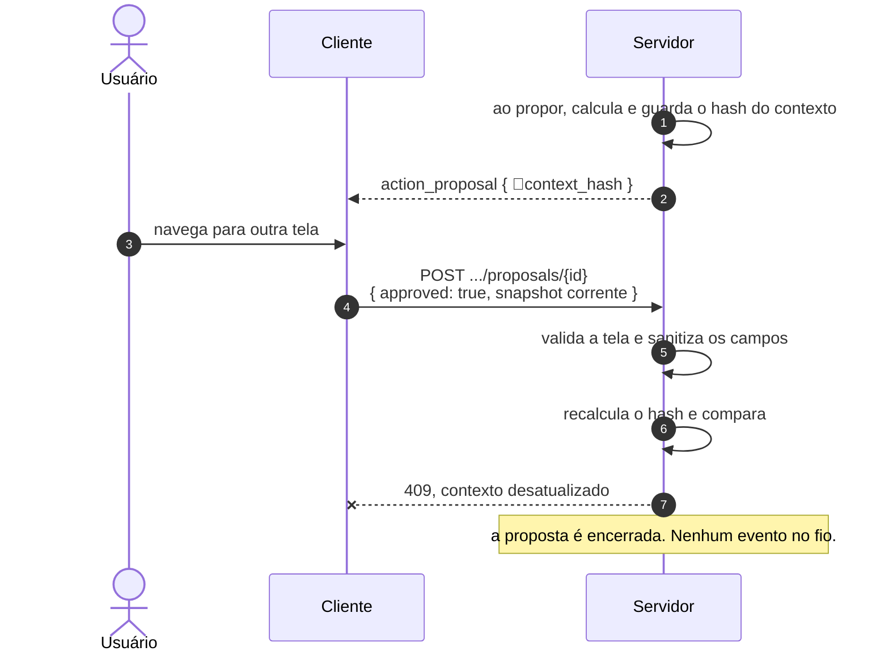
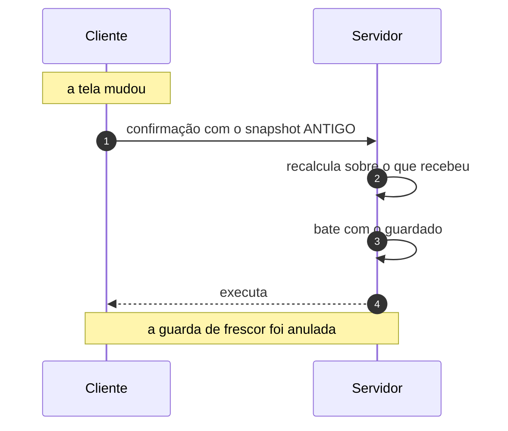

# Jornada J10 — A tela mudou entre propor e confirmar: frescor não é autorização

> **Fio capturado em 2026-08** · última revisão 2026-08-13 · [histórico e registro de expiração](../HISTORICO.md)

**Capítulos**: [04 — Contexto de tela](../capitulos/04-contexto-de-tela.md) · [05 — Ações governadas](../capitulos/05-acoes-governadas.md)
**Norma**: APH-5.4 · 3.4🧪 · 5.8🧪 · [Anexo A §A.4, §A.6, §A.7, §A.8](https://github.com/GHDaru/protocolos/blob/main/padrao/anexo-a-wire-format.md)
**Laboratórios**: `ghdaru` compara e recusa · `nexxussai-monorepo` **não compara em lugar nenhum**: o requisito é inexistente lá
**Maturidade do fio**: ✅ a substância, que é comparar e recusar. 🧪 o hash **no fio** (nenhum laboratório o emite), o estado dedicado e o nome canônico do erro
**Pressupõe**: [J09](j09-acao-mutadora.md) · **Fronteira com J14 e J15**: [ADR 0011](../../adr/0011-tres-recusas-tres-perguntas.md) · **Índice**: [jornadas](README.md)

## Em uma frase

Entre propor e confirmar passa tempo, e no meio desse tempo a tela pode ter mudado. Esta jornada mostra o controle que detecta isso — e, com o mesmo cuidado, mostra o que ele **não** detecta, porque tratá-lo como autorização é construir uma trava cuja chave está com quem se quer barrar.

## O que você vai conseguir explicar

- Por que a comparação acontece no servidor, e por que o cliente não pode ser a fonte do hash.
- Por que "frescor" e "autorização" são controles diferentes, e o que de fato barra o ataque.
- Por que uma recusa que termina no mesmo estado da recusa humana some da auditoria.

## Quem fala com quem

| No diagrama | O que é |
|---|---|
| **Usuário** | Quem confirma. Nesta jornada, quase sempre honesto — e é essa a premissa do controle |
| **Cliente** | A tela. É ela quem monta o snapshot que acompanha a confirmação |
| **Servidor** | Quem guarda o hash da proposta, recalcula o da confirmação e compara |

## O fio

> **Figura J10-F1** — a proposta é feita numa tela, a confirmação chega noutra, e o servidor recusa sem executar.

| # | De → Para | Troca | Carga |
|---|---|---|---|
| 1 | Servidor → si | cálculo | hash sobre a tela validada, os campos sanitizados e os parâmetros da ação |
| 2 | Servidor → Cliente | proposta | o campo 🧪`context_hash` existe na norma e **nenhum laboratório o emite** |
| 3 | Usuário → Cliente | mudança | outra tela, ou outro valor de campo |
| 4 | Cliente → Servidor | confirmação | no laboratório A, o **snapshot inteiro**, e não um hash |
| 5–6 | Servidor → si | validação e comparação | mesma função, mesmas entradas, resultado diferente |
| 7 | Servidor → Cliente | recusa | `409`, sem execução, **sem evento no fio** |

### 1. O cliente manda o contexto, e não o veredito

O detalhe que mais define este desenho está no passo 4: **a confirmação não carrega um hash, carrega o contexto**. O servidor recalcula.

A alternativa parece equivalente e não é. Se o cliente enviasse o hash já calculado, o servidor estaria comparando dois números que a mesma parte produziu, e a verificação viraria cerimônia. Um hash calculado no cliente é indício, nunca fonte de verdade — e a norma chegou a essa formulação depois de uma divergência tripla documentada, em que três lugares diferentes calculavam o mesmo hash de três jeitos.

Aqui, porém, a norma e a implementação divergem. O Anexo A descreve a confirmação carregando o hash do snapshot corrente, o que é exatamente o desenho que o requisito de contexto condena. A única implementação existente recusa esse desenho e manda o snapshot para recomputar. Está registrado nas lacunas, e vale dizer qual dos dois lados está certo: o do laboratório.

O que entra no hash também merece atenção, porque a norma não fecha. No laboratório A entram três coisas: o identificador da tela **validado contra o registro**, os campos **já sanitizados**, e os **parâmetros da ação proposta**. A terceira não está na definição canônica, e é uma boa ideia: incluir os parâmetros amarra o hash àquela proposta, e impede que o hash de uma sirva para outra. Mas, como a norma não diz se eles entram, duas implementações conformes produzem hashes incomparáveis — o que torna o `context_hash` inútil como campo interoperável, que é justamente o que ele é no Anexo A.

### 2. O que este controle não faz

> **Figura J10-F2** — o mesmo mecanismo, visto por um cliente que não colabora.

Aqui está a tese desta jornada, e ela é sobre limite, não sobre garantia.

Quem monta o corpo da confirmação é o cliente. Um cliente que não colabore pode, em vez de mandar o contexto corrente, **reenviar o antigo**. O servidor recalcula sobre o que recebeu, encontra o valor guardado, e a guarda passa. O controle de frescor foi anulado por quem ele nunca teve como barrar.

Repare no que o atacante ganha e no que não ganha. Ele ganha exatamente uma coisa: passar por esta guarda. Ele **não** escolhe o que executa — os parâmetros da ação vêm do estado do servidor, e nunca da requisição — e, na submissão governada, os valores gravados são reconstruídos no servidor a partir da tela validada, com recusa fechada quando isso não é possível.

Ou seja: o que barra esse ataque não é o hash. É a autorização fora do modelo, é o catálogo como única superfície executável derivada das permissões reais, e são os valores reconstruídos no servidor. **O hash não aparece nessa lista.** Quem o trata como controle de acesso construiu uma autorização que o próprio atacante escolhe.

Há um resíduo que vale nomear sem dramatizar, porque é contra-intuitivo. Como a guarda de frescor passou, os valores da submissão são reconstruídos sobre a tela e os campos do **snapshot reenviado**, e não sobre o snapshot guardado na proposta. O comentário no código assume que dá no mesmo, porque o hash bateu — verdade para cliente honesto, falso para cliente malicioso. A norma pede os valores do snapshot **da proposta**; o laboratório usa o da confirmação. O dano fica confinado ao que aquele mesmo usuário já podia submeter, então não é escalada de privilégio — é um desvio de redação normativa, e está nas lacunas.

Se a pergunta seguinte é "então o que autoriza?", a resposta é a [J14](README.md). Se é "por que os argumentos do modelo são suspeitos por origem?", é a [J15](README.md). Esta jornada responde a uma só: *este contexto ainda é o mesmo?*

### 3. A recusa que não deixa rastro

O laboratório encerra a proposta como `cancelled` e chama o erro pelo nome local, enquanto o estado canônico é `stale` e o nome canônico do erro é outro. O mapeamento está registrado no Anexo A, e a norma trata isso como diferença de nomenclatura: comprovada está a substância, que é comparar e recusar.

Essa leitura subestima o custo, e vale dizer por quê — em duas camadas, sendo a segunda a que importa.

A primeira é o **estado**. A recusa humana e a recusa por contexto obsoleto gravam o mesmo terminal. Consultando a proposta persistida, "o usuário disse não" e "o servidor barrou por contexto obsoleto" são indistinguíveis. São eventos de natureza oposta: um é governança funcionando por decisão de uma pessoa; o outro é uma **recusa de segurança do servidor**, que é justamente a que se quer contar, agregar e alertar.

A segunda é o **traço**, e é pior. A recusa humana escreve um resultado de ação no log de eventos. A recusa por contexto obsoleto **não escreve nada**: transiciona, salva e levanta o erro. O motivo existe só na resposta HTTP daquela requisição, para aquele chamador. No replay, o que sobra é uma proposta terminando em `cancelled` sem resultado correspondente — indistinguível de um cancelamento cujo evento se perdeu.

A consequência fecha o argumento da seção anterior: uma tentativa repetida de reenviar snapshot antigo é, na trilha durável, uma série de propostas canceladas. **Não há o que detectar.** E a norma exige traço também para as ações recusadas por política.

## Quando o fio quebra

| Desvio | Bifurca em | Código | Como termina |
|---|---|---|---|
| A tela mudou, e o cliente é honesto | passo 6 | `PROPOSAL_CONTEXT_STALE` (canônico) | recusa sem execução. É o caminho desta jornada |
| A tela mudou, e o cliente reenvia o snapshot antigo | passo 5 | — | executa. A guarda não foi feita para isto |
| A confirmação chega sem snapshot | passo 4 | — | a tela vira vazia na validação, o hash não bate, e recusa |
| Nenhuma comparação acontece | — | — | é o estado do laboratório B: o requisito não existe lá |
| O servidor aceita o hash calculado pelo cliente | passo 5 | — | **não-conforme** (APH-3.4): hash do cliente é indício, não fonte de verdade |

## Como reconhecer no seu sistema

- Procure quem calcula o hash comparado na confirmação. Se for o cliente, você tem cerimônia, não verificação.
- Procure a definição do hash. Se houver duas, elas já divergiram; se não houver teste de valor fixo, você não sabe qual é.
- Mude a tela entre propor e confirmar e confirme. Deve recusar sem executar.
- Depois disso, procure a recusa na sua trilha de auditoria. Se ela não estiver lá, o controle protege e não conta.
- Pergunte-se o que o hash barra contra um cliente que você não escreveu. A resposta honesta é: nada.

Da suíte de conformidade, nada disto é verificado de fora: o Nível 2 não tem perfil executável.

## Lacunas e derivas (2026-08-13)

| Lacuna | Onde | Estado | Gatilho |
|---|---|---|---|
| A recusa por contexto obsoleto **não é auditável**: sem estado dedicado e sem evento no fio, ela é indistinguível da recusa humana. E o APH-5.5 exige traço também para a recusa | APH-5.4, APH-5.5 | **aberta**, candidata a spec na norma | dizer na norma por qual mensagem a recusa por guarda atravessa o fio |
| A norma não diz se os **parâmetros da ação** entram no hash. O laboratório os inclui, e é uma boa ideia; mas duas implementações conformes produzem hashes incomparáveis | §A.4, APH-3.4 | **aberta**, candidata a spec na norma | fechar a definição, ou assumir que o hash é local |
| *Deriva*: o §A.6 descreve a confirmação carregando o hash do snapshot corrente — o desenho que o APH-3.4 condena — e atribui a exigência ao laboratório B, cujo contrato de confirmação exige outra coisa e não compara nada | §A.6 | **deriva**, reportada à norma | correção no repositório do padrão |
| *Deriva*: o §A.4 fixa o truncamento em 16 caracteres; um laboratório trunca em 32 e o outro em 16. Isso sozinho refuta o "uma definição só" do APH-3.4 | §A.4 | **deriva**, reportada à norma | correção, ou registro no mapeamento de nomes |
| O APH-3.4 exige teste de valor fixo para o hash, e **nenhum laboratório o tem** | APH-3.4 | aberta | primeiro teste de golden value |
| O `context_hash` do fio não é emitido por laboratório nenhum: existe como campo do Anexo A e vive só dentro do servidor | §A.3, §A.4 | aberta | primeira emissão real |
| O APH-5.8 pede os valores do snapshot **da proposta**; o laboratório usa os do snapshot **da confirmação**, apoiado na guarda de frescor que a seção 2 mostra não bastar | APH-5.8 | aberta | alinhar o código à redação, ou a redação ao código |
| O requisito é comprovado em **um** laboratório: o outro não compara nada | APH-5.4 | conhecida | segunda implementação |

**O que promoveria o estado `stale` e o nome canônico a ✅**: uma implementação que encerre a proposta em estado próprio e emita o código canônico — e, junto, um evento no fio, sem o qual a promoção resolve a nomenclatura e deixa o buraco de auditoria de pé.

## Verificação

1. Um arquiteto propõe simplificar: o cliente já sabe o hash da tela, então mande o hash em vez do snapshot inteiro, que é mais leve. Dê a razão técnica para recusar, e depois diga por que o argumento do peso é verdadeiro e ainda assim perde.
2. Descreva o ataque do snapshot reenviado em três frases, e diga exatamente o que ele consegue e o que não consegue. Depois nomeie os três controles que efetivamente o contêm.
3. Uma auditoria quer saber quantas ações foram barradas por contexto obsoleto no último mês. Explique por que a pergunta não tem resposta hoje, e o que precisaria mudar — são duas coisas, não uma.

---

## Apêndice — evidência por fonte

### `ghdaru`

Superfície capturada no commit `a02cb12`, que é o que a norma cita.

| Momento | Onde |
|---|---|
| Definição do hash: três entradas, truncamento em 32 | `apps/api/src/ghdaru_api/conversation/domain/context_hash.py:22-29`, com a limitação assumida em `:8-13` |
| Cálculo no momento de propor | `apps/api/src/ghdaru_api/conversation/application/agent_turn.py:67` |
| A confirmação carrega o **snapshot**, não o hash | `apps/api/src/ghdaru_api/http/chat_router.py:92-94` |
| Validação da tela e sanitização dos campos antes de comparar | `agent_turn.py:80-86` |
| Comparação e recusa, com encerramento como `cancelled` | `agent_turn.py:355-363` |
| Os valores da submissão vêm do snapshot **da confirmação** | `agent_turn.py:365-369` |
| Teste da recusa | `apps/api/tests/conversation/test_governed_action.py:106` e `test_ui_submit.py:132` |
| Teste de valor fixo do hash | **não existe** |

### `nexxussai-monorepo`

| Momento | Onde |
|---|---|
| Hash calculado no servidor, truncado em 16 | `apps/api/app/ai_chat/domain/entities/screen_context_snapshot.py:43-44` |
| Hash enviado pelo cliente na mensagem | **descartado** pelo servidor, que recalcula |
| Comparação na confirmação | **não existe**: o contrato de confirmação não tem o campo, e nada compara |

### Onde isto está na norma

| Momento | Requisito |
|---|---|
| 1. Quem calcula, e sobre o quê | APH-3.4 🧪, §A.4, §A.6 |
| 2. O limite do controle | APH-3.4 (refino da v0.4), APH-5.8 🧪 |
| 3. Estado, nome e traço da recusa | APH-5.4, APH-5.5, §A.7, §A.8 |
