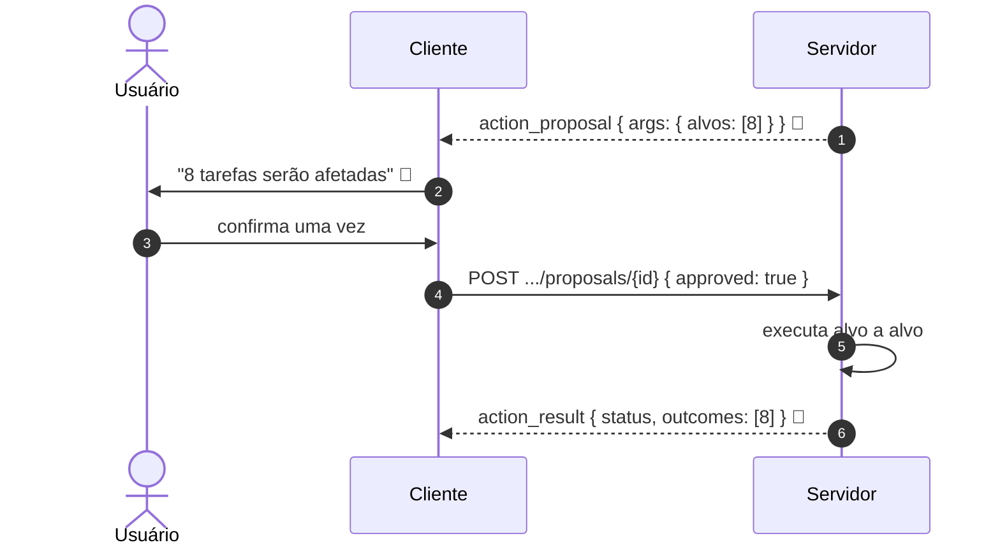

# Jornada J11 — Um lote, uma confirmação: N alvos, desfecho por alvo

> **Fio capturado em 2026-08** · última revisão 2026-08-13 · [histórico e registro de expiração](../HISTORICO.md)

> ⚠️ **Esta jornada é inteiramente experimental.** Nenhum laboratório implementa proposta em lote, e o fio desenhado aqui **nunca aconteceu**. As duas seções de laboratório do apêndice estão vazias de propósito: a ausência é o achado. O que sustenta a forma vem de fora, com peso declarado, e a seção final diz o que não tem lastro nenhum.

**Capítulos**: [05 — Ações governadas](../capitulos/05-acoes-governadas.md)
**Norma**: APH-5.9🧪 · 5.2 · 5.5 · [Anexo A §A.3 (`outcomes`), §A.5](https://github.com/GHDaru/protocolos/blob/main/padrao/anexo-a-wire-format.md)
**Laboratórios**: **nenhum**. Nos dois, o alvo único está implícito no schema de entrada de cada ação
**Maturidade do fio**: 🧪 do começo ao fim. Das quatro obrigações que o requisito acrescenta, **uma** tem duas fontes fora dos laboratórios, **duas têm zero**, e a quarta a própria norma declara desenho
**Pressupõe**: [J09](j09-acao-mutadora.md) · **Classes de evidência**: [ADR 0012](../../adr/0012-classes-de-evidencia-fora-dos-laboratorios.md) · **Índice**: [jornadas](README.md)

## Em uma frase

Uma ação que atinge oito coisas é **uma** decisão sobre oito objetos, e não oito decisões. Esta jornada mostra por que a diferença é de segurança e não de ergonomia: oito confirmações idênticas ensinam a pessoa a clicar sem ler, e é assim que uma tela de confirmação deixa de proteger.

## O que você vai conseguir explicar

- Por que N propostas descrevem uma coisa falsa, e o que se perde ao aceitá-las.
- Por que um estado terminal só não consegue contar o que aconteceu num lote.
- Quais das quatro obrigações do requisito têm lastro, e quais não têm nenhum.

## Quem fala com quem

| No diagrama | O que é |
|---|---|
| **Usuário** | Quem confirma **uma vez**, vendo os N |
| **Cliente** | Quem mostra a contagem antes da decisão |
| **Servidor** | Quem governa a proposta inteira pela máquina de estados, e reporta alvo a alvo |

## O caso, e ele é uma reconstituição

O requisito não nasceu de um desenho: nasceu de uma importação.

Uma aplicação importou a base real de um usuário, e oito tarefas foram recusadas. As oito tinham **causa única** — a mãe declarada não existia — e **mãe única**. A tela ofereceu "vincular as oito". Isso é uma decisão de uma pessoa sobre oito objetos, e o padrão não tinha como representá-la: o schema de entrada de cada ação valida **um** alvo, e oito propostas separadas descreveriam oito decisões, o que é falso.

Vale o rótulo, porque ele muda como se lê tudo o que vem abaixo: **este caso é real e o fio não é**. Nada disto atravessou fio nenhum. As jornadas anteriores tinham código atrás de cada passo; esta tem uma decisão registrada, um protótipo de interface e um caso de indústria — e é só isso que ela tem.

## O fio

> **Figura J11-F1** — o lote como a norma o desenha. **Todas as trocas são 🧪**: nenhuma foi emitida por implementação nenhuma.

| # | De → Para | Troca | Lastro |
|---|---|---|---|
| 1 | Servidor → Cliente | proposta única, com os alvos nos argumentos | 🧪 **o schema admite**: o schema de entrada da ação sempre aceitou array, e a norma não precisou criar campo |
| 2 | Cliente → Usuário | a contagem de alvos afetados | 🧪 **não existe no fio**: não há campo. Vive na interface |
| 3 | Usuário → Cliente | uma confirmação | ✅ o mecanismo é o da [J09](j09-acao-mutadora.md); o que é 🧪 é ela valer por N |
| 4 | Cliente → Servidor | confirmação | ⚠️ **o corpo é fechado**: nada nele diz que eram oito. A decisão de um lote é idêntica à de um alvo único |
| 5 | Servidor → si | execução alvo a alvo | 🧪 **não existe no fio**: se o lote é tudo-ou-nada ou item a item não tem campo em lugar nenhum |
| 6 | Servidor → Cliente | resultado único, com desfecho por alvo | 🧪 **o schema admite**: o campo existe, é opcional, e **nenhum produtor o emite** |

Duas coisas que o diagrama **não** desenha, e a omissão é deliberada: a declaração de atomicidade e a contagem de alvos. Nenhuma das duas tem campo em schema nenhum, e desenhá-las seria criar protocolo por acidente.

Das três peças do fio, **só uma tem lugar de direito**. A proposta cabe **por acaso**, porque o campo de argumentos é livre; o desfecho cabe **por desenho**, porque foi o campo que esta versão criou; e a confirmação **não cabe**. Vale desdobrar a terceira, porque ela é o achado desta jornada e não está dita em lugar nenhum da norma.

O corpo da confirmação é fechado, com exatamente três campos. Não há como acrescentar a contagem de alvos, nem a lista deles, sem ser rejeitado pelo schema. A consequência é que **a confirmação de um lote de oito é byte a byte idêntica à de um alvo único**: nada na decisão registra que oito estavam à mesa, nem quais eram. E, portanto, o servidor não tem como verificar que o que o usuário viu é o que ele confirmou — que é exatamente a garantia que a obrigação (c) existe para dar.

### 1. Uma proposta com N alvos, e não N propostas

A escolha entre as duas formas parece de arrumação e é de proteção.

Com N propostas, o sistema afirma que houve N decisões. Não houve: houve uma. A pessoa diagnosticou uma vez — "estas oito têm a mesma causa e a mesma mãe" — e a repetição da confirmação não acrescenta juízo nenhum. O que ela acrescenta é hábito: a partir da terceira ou quarta tela idêntica, o clique deixa de ser leitura e vira reflexo. **A confirmação de número oito é a menos lida de todas**, e a nona, que talvez fosse diferente, chega já dentro do reflexo.

Com uma proposta de N alvos, a máquina de estados governa a proposta inteira, o traço registra um evento, e a decisão no registro corresponde à decisão que a pessoa tomou.

E o padrão não precisou de campo novo para isso: os alvos viajam nos argumentos, no formato do schema de entrada da própria ação, que sempre admitiu array. Foi uma decisão consciente de não inventar.

### 2. As quatro obrigações, e o lastro de cada uma

O lote não é só "a mesma coisa, com uma lista". Ele acrescenta quatro obrigações, cada uma existindo por causa de um dano concreto que a ausência produz. Esta tabela é a espinha da jornada, e a coluna da direita é o que impede lê-la com otimismo.

| # | Obrigação | O dano que ela evita | Lastro real |
|---|---|---|---|
| **a** | **Atomicidade declarada**: a ação diz no catálogo se o lote é tudo-ou-nada ou item a item | sem isso, quem confirma não sabe se a falha no sétimo desfaz os seis anteriores | **nenhum, e pior**: o schema do catálogo é fechado e **rejeita** um campo dedicado. Quem obedecer reprova no gate |
| **b** | **Traço por alvo**: o traço discrimina o desfecho de cada alvo, não só o do lote | sem isso, "o que aconteceu com o item 7" não tem resposta | **campo existe** e nenhum produtor o emite. A fonte externa faz o **contrário** |
| **c** | **Contagem antes da decisão**: quantos alvos serão afetados aparece **antes** da confirmação | é a única defesa contra confirmar um lote maior do que se imagina | **duas fontes**, ambas fora dos laboratórios — e o fio não a carrega nem na proposta nem na decisão |
| **d** | **Risco do lote**: a classe do lote é ao menos a mais alta entre as dos itens | dez ações reversíveis podem compor um lote que ninguém desfaz à mão | **nenhum**: a norma o declara desenho, e a derivação é **inobservável** no fio |

Três dessas linhas merecem uma frase a mais, porque a formulação curta esconde o tamanho do problema.

**(a) não é um campo que falta: é um campo proibido.** O schema da ação de catálogo é fechado, com oito propriedades e nenhuma delas sobre agrupamento. Uma implementação que obedeça à letra do requisito, declarando atomicidade num campo próprio, **reprova no gate de wire da própria norma**. O que sobra é enterrar a convenção dentro do schema de argumentos — que é o schema de outra coisa — ou codificá-la na string de risco. As duas são gambiarras, não declaração. E o campo de reversibilidade não serve: ele é sobre a ação, não sobre o agrupamento.

**(c) depende de conhecimento que não está no fio.** Os alvos viajam dentro do campo de argumentos, que é um objeto, e o nome do array é escolhido por cada ação. Não existe posição canônica para "os alvos". Um cliente genérico — uma fila de aprovação, exatamente o que a norma pede noutro requisito — **não consegue mostrar "8 alvos"** sem carregar o schema de entrada de cada ação e adivinhar qual propriedade é a lista. É a única das quatro obrigações cuja verificação depende de saber coisas de fora do fio.

**(d) é inobservável.** Não existe risco por alvo em lugar nenhum: há uma classe por proposta e uma por ação. Quem lê o fio vê a classe do lote e não tem como saber se ela veio do máximo dos itens, do primeiro item, ou de uma constante. Nenhum auditor consegue falsificar essa obrigação a partir das mensagens.

A obrigação (b) merece a nota mais dura desta jornada. A fonte de indústria que a norma cita como evidência do lote — uma fila de aprovação de edição de arquivo, que carrega os caminhos afetados numa aprovação só — apoia (c) e **contradiz** (b): lá a decisão é um booleano para a aprovação inteira, sem desfecho por alvo. Ela é evidência de que uma confirmação pode valer por muitos alvos; não é evidência de que o desfecho volta discriminado.

### 3. Um estado terminal não consegue contar um lote

Aqui está o buraco que o campo de desfecho por alvo existe para tapar, e ele é aritmético antes de ser de protocolo.

O resultado de ação carrega **um** estado terminal. Num lote em que seis alvos executam e dois falham, esse campo não cabe: dizer "executado" mente sobre dois, e dizer "falhou" mente sobre seis. Qualquer valor único que se escolha é falso para parte do lote.

Por isso o campo de desfecho por alvo, aditivo e opcional, com um estado por alvo — inclusive `skipped`, que é o que acontece com o que nem chegou a ser tentado num lote tudo-ou-nada. Ele entrou como campo novo opcional, ou seja, subiu o fio numa versão compatível, e quem consome a versão anterior continua funcionando porque ignora o que não conhece ([J06](j06-o-fio-evolui.md)).

O que a norma **não** diz é qual valor vai no estado do lote quando os alvos divergem. Esta é a única pergunta desta jornada cuja resposta na norma é **ausência total**, e não campo faltante: o requisito nunca menciona o estado terminal, e o Anexo A lista os seis valores possíveis sem dizer como escolher entre eles.

O que existe é convenção por exemplo. O caso de referência publicado usa "falhou" num lote misto, e "executado" num lote todo bem-sucedido. Quem só ler o exemplo conclui que qualquer falha contamina o lote — o que é defensável, e não está escrito em lugar nenhum do texto normativo.

E o gate não sustenta a convenção. Um resultado com estado "executado" e um alvo com desfecho de falha **passa**; o inverso também passa; uma lista de desfechos vazia passa. Não há verificação cruzada nenhuma entre o estado do lote e os desfechos dos alvos. Duas implementações conformes podem reportar o mesmo lote de seis-e-dois como executado e como falho, e as duas passam.

Some-se a isso a regra de evolução: quem consome a versão anterior do fio **ignora o campo que não conhece**, e portanto vê só o estado do lote. A compatibilidade prometida entrega a esse consumidor exatamente a mentira que o campo novo existe para admitir — e a norma não diz de que lado mentir.

O estado terminal novo, que resolveria isso de frente, foi considerado e recusado com fundamento: seria mudança incompatível no vocabulário, quebraria consumidores, e ainda assim não diria **quais** alvos falharam. A recusa está certa. O que ficou faltando foi pôr uma regra de escolha no lugar dela.

Vale notar por que este caso **não** virou jornada própria: a régua da série manda um caminho de erro virar documento quando tem fio distinto, decisor distinto e terminal distinto. O lote parcial tem os três iguais — o que muda é o conteúdo de um campo. Separá-lo romperia o par que sustenta a jornada: contagem antes da decisão, desfecho por alvo depois dela.

## Quando o fio quebra

| Desvio | Bifurca em | Como termina |
|---|---|---|
| O sistema emite N propostas em vez de uma | passo 1 | funciona, e treina a pessoa a confirmar sem ler. É o dano que o requisito existe para evitar |
| Seis alvos executam e dois falham, e o resultado traz só o estado do lote | passo 6 | "o que aconteceu com o item 7" não tem resposta |
| O lote é tudo-ou-nada e ninguém disse | passo 1 | quem confirmou não sabia que a falha no sétimo desfazia os seis anteriores |
| O risco do lote é o do item, e não o mais alto | passo 1 | dez reversíveis compõem um irreversível, sem gate proporcional |
| A contagem aparece depois da confirmação | passo 2 | a defesa contra "o lote é maior do que eu pensava" foi para depois da decisão |

## Como reconhecer no seu sistema

- Procure uma ação de lista que atinja vários itens. Conte quantas confirmações ela pede. Se pede uma por item, você já tem a dívida.
- Procure onde está escrito se o lote é tudo-ou-nada. Se não estiver escrito em lugar nenhum, ele é o que o código fizer naquele dia.
- Depois de um lote com falha parcial, pergunte ao seu traço o que aconteceu com o item 7. Se a resposta for o estado do lote, o traço não discrimina.
- Veja se a contagem de afetados aparece **antes** dos botões, e não depois da ação.
- Some as classes de risco dos itens de um lote grande. Compare com a classe declarada do lote.

Da suíte de conformidade, nada disto é verificado: não há perfil executável de Nível 2, e o campo de desfecho por alvo é verificado apenas como **forma**, no exemplo de referência, sem nenhum produtor real por trás.

## Lacunas e derivas (2026-08-13)

| Lacuna | Onde | Estado | Gatilho |
|---|---|---|---|
| **O schema da ação de catálogo é fechado e rejeita um campo de atomicidade**: quem obedecer à obrigação (a) reprova no gate de wire da própria norma | §A.5, APH-5.9 | **aberta**, candidata a spec na norma | abrir o schema para o campo, ou reconhecer que a obrigação vive fora do contrato |
| **A confirmação é fechada em três campos**: a decisão de um lote de oito é idêntica à de um alvo único, e o servidor não tem como verificar que o confirmado é o que foi mostrado | §A.6, APH-5.9 | **aberta**, candidata a spec na norma | um campo de contagem ou de alvos na confirmação |
| A contagem de alvos não tem campo, e os alvos viajam com **nome escolhido por cada ação**: um cliente genérico não consegue mostrá-la sem conhecer a ação | §A.3, §A.5 | aberta | fixar posição canônica para os alvos, ou aceitar que a fila de aprovação é específica |
| A norma **não diz** qual estado terminal vai no resultado de um lote parcialmente executado, e o gate não cruza estado com desfechos: duas implementações conformes podem reportar o mesmo lote de formas opostas | §A.3, APH-5.9 | **aberta**, candidata a spec na norma | fixar a regra, ou declarar que é escolha da implementação |
| O risco do lote é **inobservável** no fio: não há risco por alvo, então nenhum auditor consegue falsificar a obrigação (d) a partir das mensagens | §A.3, §A.5 | aberta | evidência de demanda |
| O campo de desfecho por alvo **não tem produtor**, e nos dois laboratórios o objeto de resultado o rejeitaria | §A.3, APH-5.9 | aberta | primeira emissão real |
| Não existe check executável para o requisito: a suíte de conformidade não toca em lote, e o gate cobre **só o desfecho**, sem nenhum exemplo de proposta em lote | conformidade | aberta | primeiro check de Nível 2 |
| Ficam fora, por falta de evidência: seleção parcial dentro do lote, retomada de lote parcialmente executado, e lote que atravessa aplicações federadas | APH-5.9 | **declarada** pela norma | evidência de demanda |

**O que promoveria cada obrigação a ✅** — uma linha por obrigação, porque uma frase única esconderia que duas têm zero fontes:

- **(a)** um campo no schema do catálogo, e uma ação que o declare.
- **(b)** um produtor que emita o desfecho por alvo, em qualquer laboratório, com teste.
- **(c)** uma implementação em laboratório — hoje as duas fontes estão fora deles, e uma é protótipo.
- **(d)** qualquer evidência: hoje é desenho puro, e a norma o diz.

## Verificação

1. Uma equipe implementa "arquivar selecionados" como oito propostas separadas, argumentando que reusa todo o código existente e não muda o padrão. O argumento técnico está certo. Diga o que ele custa, e por que o custo é de segurança e não de ergonomia.
2. Um lote de oito executa seis e falha em dois. Sua implementação emite só o estado do lote. Um auditor pergunta quantos alvos falharam. Explique por que a pergunta não tem resposta, e por que nenhum dos dois valores possíveis seria honesto.
3. Das quatro obrigações do lote, duas não têm nenhuma fonte. Diga quais são, e para cada uma descreva o incidente concreto que a ausência dela permite.

---

## Apêndice — evidência por fonte

### `ghdaru` — laboratório

| Momento | Onde |
|---|---|
| Proposta em lote | **não existe** |
| Desfecho por alvo | **rejeitado em tempo de execução**: o objeto de resultado tem três campos e proíbe extras, e a validação roda a cada gravação de evento, não só em teste. Emitir o campo levantaria erro em produção |
| A trava tem teste | um teste parametrizado exige que acrescentar campo a qualquer tipo de evento seja rejeitado |
| Estado do desfecho | binário por construção: uma heurística sobre um texto de resultado decide entre executado e falho |
| Alvo único implícito | no schema de entrada de cada ação do catálogo |

### `nexxussai-monorepo` — laboratório

| Momento | Onde |
|---|---|
| Proposta em lote | **não existe** |
| Evento de resultado no fio | **não existe no vocabulário**: o desfecho só chega ao banco, por uma rota que o cliente preencheria |
| Desfecho por alvo | o objeto de resultado é congelado e projetado campo a campo; não há por onde passar |
| Onde declarar um array de alvos | **não há**: a definição de ação de tela não tem sequer schema de entrada |

A ausência nas duas seções é o achado, e é por isso que elas ficam. A norma diz que nos dois o alvo único está implícito no schema de entrada; a leitura de código permite ser mais preciso: num deles o lote está **travado por schema fechado validado em runtime**, e no outro **não há evento de resultado no fio para carregá-lo**.

### Fora dos laboratórios — o que sustenta o desenho

Nada nesta seção promove maturidade. Ela está aqui para dizer de onde veio a forma, e o que cada fonte **não** prova. As classes estão fixadas no [ADR 0012](../../adr/0012-classes-de-evidencia-fora-dos-laboratorios.md).

#### `gestaodeprioridades` — primeira aplicação federada; protótipo descartável, mesmo autor

Interface executável sobre dados de fixture derivados da base real, com teste de navegador e capturas do build. **Sem servidor, sem máquina de estados, sem fio.** O código é declarado descartável pelo próprio repositório.

| Momento | Onde | Obrigação que toca |
|---|---|---|
| Uma superfície de confirmação para N alterações | `prototipo/app.js` | (c) |
| Contagem de afetados antes da decisão, no subtítulo | mesmo arquivo | **(c)** |
| Origem do pedido como dado exibido, nunca como desvio de fluxo | mesmo arquivo | — |
| Traço nos dois desfechos, confirmar e recusar | mesmo arquivo | — |
| Teste que clica confirmar e recusar num lote real | `scripts/testar-prototipo.mjs` | (c) |
| Traço **por alvo** | **não existe**: o traço é agregado | (b), não cumprida |
| A decisão registrada, e a lacuna levantada | `docs/adr/0009-uma-so-tela-de-confirmacao.md`; `mensagens/002-...` §L9 | (a), (b), (c) |

#### Traycer — autor externo, em produção, host fechado

| Momento | Onde | Obrigação que toca |
|---|---|---|
| Fila de aprovação de edição de arquivo, com os caminhos afetados numa aprovação só | `protocol/src/host/agent/gui/subscribe.ts` | **(c)** |
| A decisão é um booleano para a aprovação inteira, sem desfecho por alvo | `protocol/src/host/agent/gui/agent-runtime.ts` | **contraevidência de (b)** |

### Onde isto está na norma

| Momento | Requisito |
|---|---|
| Uma proposta, N alvos | APH-5.9 🧪, §A.5 |
| As quatro obrigações | APH-5.9 🧪 |
| Desfecho por alvo | §A.3, `evento.schema.json` |
| Confirmação proporcional ao risco, e traço | APH-5.2, APH-5.5 |

### O que não tem lastro nenhum

Esta seção existe porque, numa jornada em que a maioria dos momentos não tem path, os silêncios deixam de denunciar sozinhos.

- **(a) atomicidade declarada** — nenhuma fonte, e **nenhum campo** no schema do catálogo para expressá-la.
- **(b) traço por alvo** — o campo existe no schema do evento e nenhum produtor o emite; a única fonte externa relevante faz o contrário.
- **(d) risco do lote** — desenho declarado pela própria norma.
- **Seleção parcial, retomada de lote parcial e lote entre aplicações federadas** — fora de escopo por falta de evidência, e a norma diz isso.
