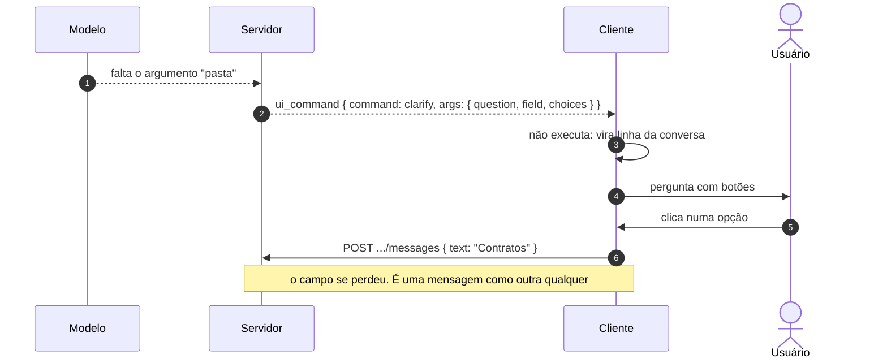
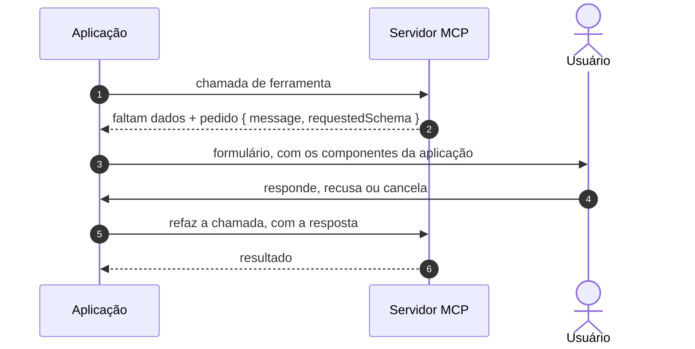

# Jornada J12 — Falta um dado: slot filling estruturado

> **Fio capturado em 2026-08** · última revisão 2026-08-13 · [histórico e registro de expiração](../HISTORICO.md)

> ⚠️ **O mecanismo desta jornada não existe no fio.** O vocabulário de eventos não tem tipo para pedido estruturado de dados, e — o que é pior — **não há corpo capaz de carregar uma resposta estruturada de volta**. O que se desenha aqui é o que acontece hoje na ausência dele, e o gabarito externo que a norma aponta.

**Capítulos**: [06 — Comandos de UI](../capitulos/06-comandos-de-ui.md)
**Norma**: APH-6.4🧪 · 6.1, 6.2, 6.5 · [Anexo A §A.2, §A.3](https://github.com/GHDaru/protocolos/blob/main/padrao/anexo-a-wire-format.md)
**Laboratórios**: `ghdaru` tem um `clarify` que **nasce de um adaptador falso** e cuja resposta volta como texto livre · `nexxussai-monorepo` tem `clarify` como valor de enum **inalcançável**
**Maturidade do fio**: ✅ a proibição de interface serializada (APH-6.5) e o vocabulário declarativo (APH-6.1). 🧪 o slot filling inteiro
**Pressupõe**: [J08](j08-acao-de-leitura.md) · **Classes de evidência**: [ADR 0012](../../adr/0012-classes-de-evidencia-fora-dos-laboratorios.md) · **Índice**: [jornadas](README.md)

## Em uma frase

O modelo entendeu o que fazer e falta um dado — para qual pasta mover, qual data usar, qual dos três projetos. Esta jornada mostra que o padrão sabe **como** esse dado deveria ser pedido, e que o fio não tem por onde pedi-lo nem por onde recebê-lo de volta.

## O que você vai conseguir explicar

- Por que "pedir com schema" e "pedir com texto" produzem sistemas diferentes, e não só telas diferentes.
- Por que a resposta a um formulário precisa voltar **correlacionada** ao pedido.
- Por que o pedido carrega um schema e nunca o formulário pronto.

## Quem fala com quem

| No diagrama | O que é |
|---|---|
| **Modelo** | Quem percebe que falta um argumento |
| **Servidor** | Quem transforma isso em pedido — ou não tem como |
| **Cliente** | Quem renderiza o formulário com **os seus próprios componentes** |
| **Usuário** | Quem responde |

## O fio

> **Figura J12-F1** — o que acontece hoje. O pedido vira uma linha de conversa, e a resposta volta como texto livre.

| # | De → Para | Troca | Lastro |
|---|---|---|---|
| 1 | Modelo → Servidor | falta de argumento | interno, sem forma no fio |
| 2 | Servidor → Cliente | comando de esclarecimento | ⚠️ o verbo é **citado uma vez** na norma e **nunca definido**: não tem payload normativo |
| 3–4 | Cliente → Usuário | pergunta renderizada | 🧪 no laboratório A existe, e é alimentado por um **adaptador falso** de demonstração |
| 5 | Usuário → Cliente | escolha | — |
| 6 | Cliente → Servidor | **texto livre** | ✅ o canal existe, e é o único: o campo, o schema e a correlação se perdem |

### 1. Um nome sem forma

O verbo de esclarecimento aparece **uma vez** em toda a norma, numa lista exemplificativa de comandos de interface, e nunca é definido. Não tem payload declarado, não tem schema, e o que ele faz na tela não está especificado em lugar nenhum.

É importante não confundi-lo com o requisito de slot filling, e a norma não os confunde: o verbo é um item do vocabulário de comandos; o slot filling é um mecanismo de coleta, que exige três coisas que o verbo não tem — **pedido com schema, formulário renderizado pelos componentes da aplicação, e resposta validada**. A seção da norma se chama "comandos de interface **e** slot filling": é conjunção, não identidade.

Nos laboratórios, o placar é o que se esperaria de um nome sem forma. Num deles o verbo só é emitido por um adaptador de demonstração, declarado no próprio arquivo como sendo para capturas e pré-visualização — não há emissor no servidor. No outro, ele é um valor de enum validado, rotulado na interface e **inalcançável**: nada em produção, e nada nos testes, constrói uma proposta com esse tipo.

E o verbo não está no catálogo de nenhum dos dois. Sem entrada no catálogo, ele não tem schema de entrada, não tem classe de risco e não deixa traço — ou seja, está fora de tudo o que a [J07](j07-catalogo.md) estabeleceu como condição para existir.

### 2. A resposta degrada para texto, e a degradação é previsível

O achado mais instrutivo está no caminho de volta.

No laboratório que implementou o verbo, o executor no host explicitamente **não o executa**: ele o transforma numa linha da transcrição, com botões para cada opção. E o botão faz uma coisa só: manda a escolha como **mensagem de texto comum**.

O identificador do campo, que veio no pedido, é descartado. Não há schema, não há validação, não há correlação entre a resposta e a pergunta. Do ponto de vista do servidor, chegou uma mensagem dizendo "Contratos" — indistinguível de o usuário ter digitado isso por conta própria.

Isso não é desleixo de implementação: é o comportamento previsível quando o único canal de retorno disponível é texto livre. E aqui está a metade menos óbvia da lacuna. A superfície do padrão tem exatamente **dois** corpos da aplicação para a inteligência artificial: a mensagem, com texto e snapshot, e a confirmação de proposta, com um booleano. Não existe terceira porta.

Ou seja: mesmo que amanhã o vocabulário ganhasse um nono tipo de evento para pedir dados, **a resposta continuaria sem forma**. A lacuna são duas peças, e a segunda é a mais grave.

### 3. O gabarito: pedido tipado, resposta correlacionada, três desfechos

> **Figura J12-F2** — a elicitation do Model Context Protocol, que a norma aponta como gabarito. **Não é fio APH**: é outro protocolo, desenhado ao lado para contraste.

O gabarito tem exatamente as três peças que faltam ao fio.

**Pedido tipado.** O que viaja é uma mensagem explicando por que a interação é necessária, mais um schema dos dados pedidos. E o schema é **deliberadamente restrito**: objetos planos, propriedades primitivas, sem aninhamento nem arrays de objetos. A restrição existe para que o cliente consiga gerar o formulário sozinho — o que só faz sentido se é o cliente quem renderiza.

**Resposta correlacionada.** Na versão que a norma cita, o pedido não fica pendurado: o servidor devolve um resultado dizendo que faltam dados, e o cliente **refaz a chamada original** carregando a resposta. É literalmente o que a norma descreve como "uma chamada à qual faltam argumentos", e o mecanismo é apátrida por desenho.

**Três desfechos, não dois.** A resposta distingue **aceitar**, **recusar** e **cancelar**. O fio do padrão hoje colapsa os três em "o usuário mandou uma mensagem", e a diferença entre "não quero responder" e "fechei a caixa sem querer" some.

Há ainda um detalhe que vale roubar: o gabarito tem um modo em que o dado **não passa pelo cliente**, para credenciais e pagamento, e proíbe pedir informação sensível pelo formulário. É a mesma disciplina de camadas de confiança que a [J15](README.md) trata, aplicada ao pedido.

### 4. A terceira implementação independente, e o que ela ensina

A norma registra uma fonte externa como terceira implementação independente do mesmo desenho: uma *entrevista* que normaliza o pedido estruturado entre harnesses distintos, separada da aprovação. A separação é literal no código: a aprovação carrega um **booleano**; a entrevista carrega um **array de valores escolhidos**. Filas diferentes, tipos diferentes, mensagens diferentes.

A afirmação da norma se confirma, com uma precisão que vale registrar. A normalização é real — um único formato de bloco recebe as ferramentas de dois fornecedores diferentes, e o cliente renderiza um card só. Mas o produto suporta dezoito harnesses, e a detecção cobre **dois** deles, por lista de nomes de ferramenta. E a normalização é imperfeita por baixo: um comentário no acumulador registra que a saída de um dos fornecedores é uma frase em inglês impossível de analisar, o que obriga o código a proteger as respostas já gravadas.

**É normalização por adaptação na borda, não por contrato compartilhado.** E essa é exatamente a diferença que o requisito propõe corrigir, e que o gabarito resolve com um schema declarado.

Uma nota de proveniência, para não citar em círculo: a frase "aprovação é sim ou não; entrevista é resposta com opções" é formulação **deste livro**, no estudo do caso, e não citação da fonte externa. A norma a herdou daqui.

### 5. Por que o pedido carrega schema, e não o formulário pronto

A resposta está num requisito ✅ que nem fala de slot filling: **não deve haver interface serializada gerada pelo modelo em produção**; o que trafega são dados estruturados para componentes pré-declarados.

Como é uma proibição sobre tudo o que trafega, ela decide a forma do slot filling antes de o slot filling ser escrito. Um pedido que carregasse marcação a violaria de frente; um que carregasse uma árvore de interface genérica a violaria pela porta dos fundos — interface serializada, só que em outro formato.

Três razões independentes sustentam a regra:

1. **Schema é verificável, marcação não.** O gabarito manda os dois lados validarem a resposta contra o schema. Marcação não valida nada; ela apenas se parece com um formulário.
2. **Marcação vinda do modelo é superfície de injeção.** É o mesmo argumento das camadas de confiança, e é por isso que o próprio gabarito proíbe pedir segredo pelo formulário e criou um modo em que o dado sensível não passa pelo cliente.
3. **A fonte externa segue a regra sem precisar dela.** Lá, a entrada e a saída cruas da ferramenta **não são persistidas**: o card renderiza só as perguntas, as respostas e os títulos. O que atravessa é descrição de campo, não componente.

A formulação que fecha o argumento: o pedido carrega o schema porque **o schema é a única parte do formulário que o modelo tem autoridade para determinar**. *Que dados faltam* é conhecimento do turno; *como se pede um dado nesta aplicação* é decisão da aplicação, tomada antes da conversa — a mesma linha que a [J08](j08-acao-de-leitura.md) traça para a confirmação.

## Quando o fio quebra

| Desvio | Bifurca em | Como termina |
|---|---|---|
| O modelo pergunta em texto corrido, sem estrutura | passo 2 | funciona, e a resposta é texto que alguém terá de interpretar de novo |
| O pedido carrega o formulário pronto | passo 2 | **não-conforme** (APH-6.5): é interface serializada pelo modelo |
| O comando é emitido e não há executor | passo 3 | nada acontece; o comando não conta para conformidade |
| A resposta volta como texto livre | passo 6 | é o que acontece hoje: o campo se perde, e não há como validar |
| O pedido pede senha ou credencial pelo formulário | passo 2 | o gabarito proíbe; a norma ainda não diz nada |

## Como reconhecer no seu sistema

- Quando falta um dado, veja o que sai. Se for uma pergunta em prosa, você não tem slot filling: tem conversa.
- Se houver um pedido estruturado, procure o **schema**. Sem ele, não há o que validar na volta.
- Siga a resposta do usuário. Se ela reentra pelo mesmo canal de uma mensagem qualquer, a correlação com o pedido se perdeu, e o servidor vai reinterpretar o que já sabia.
- Veja se o seu sistema distingue "respondi", "não quero responder" e "fechei a caixa". Se os três chegam iguais, você perdeu informação que existia.
- Procure marcação vinda do modelo. Se houver, a fronteira do requisito de interface já foi cruzada.

Da suíte de conformidade, nada disto é verificado: o requisito é 🧪 e não há check.

## Lacunas e derivas (2026-08-13)

| Lacuna | Onde | Estado | Gatilho |
|---|---|---|---|
| **Não existe tipo de evento para pedido estruturado de dados**: o vocabulário fechado tem oito, e o mais próximo é o verbo de esclarecimento, que é nome sem forma | §A.3, APH-6.4 | **aberta**, candidata a spec na norma | acrescentar o tipo, com payload declarado |
| **E não existe corpo capaz de carregar a resposta**: a superfície tem dois corpos da aplicação para a IA — mensagem com texto, e confirmação com booleano. Um nono tipo de evento sozinho **não resolveria** | §A.2, APH-6.4 | **aberta**, candidata a spec na norma, e é a metade mais grave | um terceiro corpo, correlacionado ao pedido |
| O verbo de esclarecimento é citado uma vez e **nunca definido**: sem payload, sem executor especificado, e sem entrada de catálogo em laboratório nenhum | APH-6.1 | aberta | definir, ou remover da lista |
| A norma não distingue os desfechos "respondeu", "recusou" e "cancelou", que o gabarito distingue | §A.2, APH-6.4 | aberta | quando o canal de resposta existir |
| A norma não diz nada sobre pedir dado sensível por formulário; o gabarito proíbe, e criou um modo em que o dado não passa pelo cliente | APH-6.4, APH-7.1 | aberta | primeira implementação que peça credencial |

**O que promoveria o APH-6.4 a ✅**: um laboratório que emita um pedido com schema, renderize o formulário com os próprios componentes e receba a resposta **validada e correlacionada** — o que hoje exige, antes, que a norma crie as duas peças que faltam.

## Verificação

1. Uma equipe implementa o pedido de dado faltante como pergunta em texto e resposta em texto, e argumenta que funciona porque o modelo entende a resposta. Diga o que se perde, e por que o argumento "o modelo entende" é o problema e não a solução.
2. Alguém propõe resolver a lacuna acrescentando um nono tipo de evento ao vocabulário. Explique por que isso resolve metade do problema, e qual metade fica de pé.
3. Por que o pedido carrega o schema e não o formulário pronto? Dê a razão de verificação, a de segurança, e a de autoridade — são três, e só uma é sobre ataque.

---

## Apêndice — evidência por fonte

### `ghdaru` — laboratório

| Momento | Onde |
|---|---|
| Verbo de esclarecimento emitido | `apps/web/src/features/conversation/adapters/fake-chat.ts` — **adaptador de demonstração**, declarado no próprio arquivo como sendo para capturas e pré-visualização |
| Emissor no servidor | **não existe**: nenhum arquivo do backend o emite |
| Executor | `apps/web/src/features/conversation/domain/ui-commands.ts` — devolve nulo, com o comentário "não é executado aqui" |
| A resposta do usuário | `apps/web/src/features/conversation/ui/ChatPanel.tsx` — o botão chama o envio de **texto**; o campo é descartado |
| Entrada no catálogo | **não existe**: sem schema de entrada, sem classe de risco, sem traço |
| Slot filling estruturado | **não existe**: os nomes aparecem só em documentação, sem código |

### `nexxussai-monorepo` — laboratório

| Momento | Onde |
|---|---|
| Valor de enum, validado e rotulado | `apps/api/app/ai_chat/domain/value_objects/action_kind.py`; validação em `domain/entities/action_proposal.py`; rótulo em `apps/web/src/components/chat/lateral/ActionCard.tsx` |
| Alcançabilidade | **nenhuma**: nada em produção constrói proposta, e nenhum teste constrói uma com este tipo |

### Fora dos laboratórios — o que sustenta o desenho

Nada aqui promove maturidade; está aqui para dizer de onde veio a forma, e o que cada fonte não prova ([ADR 0012](../../adr/0012-classes-de-evidencia-fora-dos-laboratorios.md)).

#### Model Context Protocol — especificação pública, o gabarito

Pedido com schema restrito a primitivos planos; resposta com três desfechos; e, na versão que a norma cita, a chamada original é **refeita** com a resposta, em vez de ficar pendurada. Proíbe pedir informação sensível pelo formulário, e tem um modo em que o dado não passa pelo cliente.

#### Traycer — autor externo, em produção, host fechado

| Momento | Onde | O que prova |
|---|---|---|
| Pergunta estruturada, com opções e seleção múltipla | `protocol/src/persistence/epic/content-blocks.ts` | pedido tipado existe em produção |
| Resposta com valores escolhidos, correlacionada por identificador | mesmo arquivo | a resposta correlacionada é implementável |
| Fila própria, separada da de aprovação | `protocol/src/host/agent/gui/subscribe.ts` | aprovação e entrevista são decisões de tipos incompatíveis |
| Normalização entre fornecedores | `protocol/src/host/agent/gui/interview-tools.ts` | **dois** fornecedores, por lista de nomes — de dezoito harnesses suportados |
| Entrada e saída cruas **não persistidas** | `protocol/src/persistence/epic/content-blocks.ts` | a disciplina do APH-6.5, seguida sem precisar dela |
| A conversão de volta em resultado para o agente | **não legível**: é do host fechado | por isso o grau externo não observável |

### Onde isto está na norma

| Momento | Requisito |
|---|---|
| 1. O verbo sem forma | APH-6.1, APH-6.2 |
| 2. A resposta que degrada | §A.2 |
| 3. O gabarito | APH-6.4 🧪 |
| 5. Nada de interface serializada | APH-6.5 |

### O que não tem lastro nenhum

- **O pedido estruturado no fio do padrão** — não há tipo de evento, e nenhum laboratório o emite.
- **A resposta estruturada no fio do padrão** — não há corpo, e é a metade mais grave.
- **O payload do verbo de esclarecimento** — a norma o nomeia e nunca o define.
