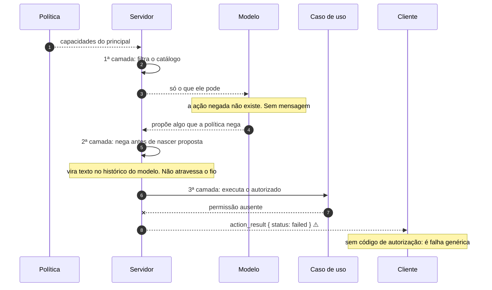

# Jornada J14 — Recusa por autoridade: três camadas, e só uma delas aparece no fio

> **Fio capturado em 2026-08** · última revisão 2026-08-13 · [histórico e registro de expiração](../HISTORICO.md)

**Capítulos**: [05 — Ações governadas](../capitulos/05-acoes-governadas.md) · [07 — Segurança](../capitulos/07-seguranca.md)
**Norma**: APH-4.1, 4.3 · 7.2, 7.4 · 5.5 · [Anexo A §A.7](https://github.com/GHDaru/protocolos/blob/main/padrao/anexo-a-wire-format.md)
**Laboratórios**: `ghdaru` autorização real, por política pura verificada nos casos de uso · `nexxussai-monorepo` porta de permissão em stub, **nunca chamada**
**Maturidade do fio**: ✅ a autorização fora do modelo e a filtragem na composição. O que **não** é comprovado é o **traço da recusa**, e é o assunto desta jornada
**Pressupõe**: [J07](j07-catalogo.md), [J09](j09-acao-mutadora.md) · **Fronteira com J10 e J15**: [ADR 0011](../../adr/0011-tres-recusas-tres-perguntas.md) · **Índice**: [jornadas](README.md)

## Em uma frase

Esta jornada responde a uma pergunta só: **esta pessoa pode?** E mostra que a resposta "não" tem três formas diferentes no padrão, com garantias muito diferentes — a melhor delas não produz nenhuma mensagem, e a pior produz uma que o cliente não consegue distinguir de uma falha qualquer.

## O que você vai conseguir explicar

- Por que a melhor recusa é a que não acontece, e o que isso exige da composição.
- Por que a confirmação humana não é autorização, e a política pode negar depois dela.
- Por que uma recusa que volta como texto é uma recusa que ninguém consegue contar.

## Quem fala com quem

| No diagrama | O que é |
|---|---|
| **Modelo** | Quem propõe, e nunca decide permissão |
| **Servidor** | Quem compõe o catálogo, verifica a permissão e escreve o traço |
| **Política** | A derivação pura: perfil e inquilino viram capacidades |
| **Caso de uso** | Onde a permissão é **realmente** verificada |

## O fio

> **Figura J14-F1** — as três camadas de recusa, na ordem em que o padrão as prefere. Só a terceira produz mensagem.

| # | De → Para | Troca | Lastro |
|---|---|---|---|
| 1–3 | Política → Servidor → Modelo | catálogo filtrado | ✅ e é a recusa preferida: **não há mensagem** |
| 4–5 | Modelo → Servidor | proposta negada pela política | ⚠️ o resultado **não atravessa o fio**: não há identificador de proposta, nem estado, nem evento |
| 6–8 | Servidor → Caso de uso → Cliente | recusa na execução | ⚠️ chega como **falha genérica**, e não com o código de autorização |

### 1. A melhor recusa é a que não acontece

A primeira camada é a da [J07](j07-catalogo.md), e vale repetir a consequência aqui porque é dela que tudo depende: a ação cuja capacidade o principal não tem **não entra no catálogo que o modelo vê**.

Não há mensagem, não há recusa, não há erro. O modelo não pode propor o que não conhece, e a pessoa não vê uma oferta que será negada.

A conformidade desta camada é uma **ausência**, e por isso ela não é desenhável diretamente: só por contraste. É o que a figura acima faz nos três primeiros passos — o interessante é a mensagem que não existe.

Um exemplo concreto do laboratório: uma ação de reconciliação só entra no catálogo se o principal tiver a capacidade de administração do inquilino. Quem não a tem não recebe uma recusa; recebe um catálogo menor, e nunca soube da diferença.

### 2. A autorização mora nos casos de uso, e auditá-la na rota devolve resposta errada

A segunda e a terceira camadas dependem de onde a permissão é verificada, e aqui há uma armadilha de auditoria que três equipes independentes já pisaram numa mesma investigação — inclusive sobre o próprio código.

A rota faz três coisas, e **nenhuma delas é verificação de permissão**: autentica quem chama, confere a posse da sessão, e compõe o catálogo executável. Quem auditar por ali conclui que não há autorização.

A verificação está três camadas para dentro. As capacidades têm a forma `recurso:verbo` e são derivadas por **política pura** — sem entrada e saída, sem tocar no modelo — a partir do papel do usuário e dos módulos habilitados do inquilino. Cada caso de uso exige a sua na entrada, e a ausência levanta uma exceção de permissão. A decisão fina de acesso a itens é igualmente pura, decidindo por visibilidade.

O efeito composto é o que importa para o raio de dano: o agente só invoca o que o catálogo declara, e cada invocação só passa se **o usuário em cujo nome o agente age** já tinha aquela permissão. Um modelo capturado não escala privilégio — ele esbarra na mesma parede que o próprio usuário.

E há um detalhe que a [J09](j09-acao-mutadora.md) já registrou e que pertence a esta jornada: **confirmação humana não é autorização**. A política pode negar depois de a pessoa ter confirmado, e um dos laboratórios tem essa aresta explícita na máquina de estados. A ordem é essa de propósito: quem decide se pode não é quem decide se quer.

### 3. A recusa que ninguém consegue contar

Aqui está o achado desta jornada, e ele é uma não-conformidade com a própria norma.

A norma diz que **também as ações recusadas por política** devem deixar traço visível na conversa e auditável no servidor, e que ação sem traço é ação não governada. Nas duas camadas em que a recusa acontece de fato, isso não se cumpre.

Na **segunda camada**, quando a política nega antes de a proposta nascer, o resultado vira texto no histórico do modelo e um registro na trilha interna — e **não atravessa o fio**. Não há identificador de proposta, não há máquina de estados, não há evento. Uma ação negada por política é invisível para quem lê a conversa.

Na **terceira camada**, quando a permissão falta durante a execução, a exceção é capturada dentro do executor e devolvida como **texto**. O servidor então a classifica por uma heurística sobre o prefixo da mensagem, e o que chega ao cliente é um resultado de ação com estado de falha — igual ao de um erro de rede, um dado inválido ou um bug.

O código canônico de negação por política existe. Ele está no vocabulário de erros do laboratório, e é emitido literalmente — **para falha de autenticação**. Negação de permissão em ação governada nunca o produz. Isto é uma deriva do Anexo A, que afirma o contrário, e está registrada.

A consequência prática fecha o argumento, e é a mesma da [J10](j10-tela-mudou.md) por outro caminho: uma auditoria que queira contar quantas ações foram negadas por política no último mês **não tem de onde tirar o número**. As da segunda camada não estão no fio; as da terceira são indistinguíveis de falhas comuns. O controle funciona e não conta.

### 4. O contraexemplo, lido com precisão

O outro laboratório é o contraexemplo que a própria norma cita, e vale lê-lo pelo que é — nem mais nem menos.

A porta de permissão existe, e a implementação registrada devolve verdadeiro incondicionalmente. Mas a leitura de código obriga a ser mais duro do que o capítulo: ela **nunca é instanciada nem chamada**. A única autorização efetiva no caminho de confirmação de lá é o filtro do repositório por usuário e cliente, que é posse e inquilino — não capacidade.

Isso invalida a categoria? Não, e a distinção importa: a arquitetura **reservou o ponto de decisão**, o nome sinaliza provisório, e a política real é dívida declarada. A diferença entre esse stub e a ausência de desenho é a diferença entre faltar apertar um parafuso e não haver onde apertá-lo. O anti-padrão verdadeiro não é o stub — é a autorização implícita espalhada, em que ninguém sabe dizer *onde* a decisão deveria morar.

O que não se pode dizer é que os casos de uso a consultam.

## Quando o fio quebra

| Desvio | Bifurca em | Código | Como termina |
|---|---|---|---|
| A ação sem capacidade entra no catálogo e é recusada depois | passo 2 | — | funciona, e é pior por três motivos ([J07](j07-catalogo.md)) |
| A política nega antes da proposta | passo 5 | — | **invisível no fio**: contra o APH-5.5 |
| A permissão falta na execução | passo 7 | — | falha genérica, sem código de autorização. Contra o §A.7 |
| A política devolve verdadeiro para tudo | passo 1 | — | **não-conforme** (APH-7.2), e passa em todos os testes de caminho feliz |
| O modelo decide a permissão | passo 2 | — | **não-conforme** (APH-7.2): a decisão é de código puro, fora dele |

## Como reconhecer no seu sistema

- Peça a duas pessoas de perfis diferentes o mesmo catálogo. Se vier igual, a filtragem não está na composição, e a recusa é o seu único controle.
- Procure onde a permissão é verificada. Se a resposta for "na rota", audite de novo: a rota autentica, e autenticar não é autorizar.
- Provoque uma recusa por permissão e olhe o que chega ao cliente. Se for indistinguível de um erro qualquer, você não vai conseguir contá-las.
- Pergunte ao seu traço quantas ações foram negadas por política no último mês. Se não houver resposta, o controle funciona e não conta.
- Procure a implementação da sua política. Se ela devolve verdadeiro, isso precisa estar declarado como dívida — e é preciso conferir se ela é sequer chamada.

Da suíte de conformidade, a autorização não é verificada de fora: o Nível 2 não tem perfil executável.

## Lacunas e derivas (2026-08-13)

| Lacuna | Onde | Estado | Gatilho |
|---|---|---|---|
| **A recusa por política não atravessa o fio** quando acontece antes da proposta: sem identificador, sem estado e sem evento. O APH-5.5 exige traço também para as recusadas | APH-5.5, §A.3 | **aberta**, candidata a spec na norma | dizer por qual mensagem a recusa por política atravessa |
| A recusa por permissão na execução chega como **falha genérica**, classificada por heurística de texto, e não com o código de autorização | §A.7, APH-7.2 | **aberta** | emitir o código canônico |
| *Deriva*: o §A.7 diz que o laboratório A emite o código de negação por política literalmente. Ele o emite para **falha de autenticação**; negação de capacidade nunca o produz | §A.7 | **deriva**, reportada à norma | correção no repositório do padrão |
| A permissão usada na confirmação é a **congelada** no momento de propor: revogar acesso entre propor e confirmar não fecha o gate ([J09](j09-acao-mutadora.md)) | APH-7.2 | aberta | decidir de quando é a autoridade |
| A porta de permissão do outro laboratório devolve verdadeiro e **nunca é chamada** | APH-7.2 | **conhecida e declarada** | trocar o stub, e ligá-lo ao caminho |

**O que fecharia estas lacunas**: emitir o código canônico na recusa por capacidade, e dar forma no fio à recusa que hoje acontece antes da proposta. As duas são de norma antes de serem de código.

## Verificação

1. Um sistema entrega o catálogo completo ao modelo e recusa na execução, com uma mensagem clara. Cite as três consequências, diga qual é a de segurança, e explique por que "a mensagem é clara" não resolve nenhuma delas.
2. Uma auditoria pergunta quantas ações foram negadas por política no último mês. Percorra as três camadas e diga, para cada uma, por que o número não existe.
3. Um desenvolvedor audita a autorização olhando as rotas e conclui que não há nenhuma. Diga o que ele deixou de olhar, e por que esse erro é sistemático e não descuido.
4. Por que a política pode negar **depois** de o humano ter confirmado? Diga o que essa ordem afirma sobre a natureza dos dois controles.

---

## Apêndice — evidência por fonte

### `ghdaru` — laboratório

| Momento | Onde |
|---|---|
| Capacidades derivadas por política pura | `apps/api/src/ghdaru_api/identity/domain/capabilities.py` |
| Exigência da capacidade dentro do caso de uso | `apps/api/src/ghdaru_api/knowledge/domain/authz.py`, usado em `knowledge/application/query_knowledge.py` e `ingest_text.py` |
| Acesso fino por visibilidade, também puro | `apps/api/src/ghdaru_api/knowledge/domain/access.py` |
| Filtragem na composição do catálogo | `apps/api/src/ghdaru_api/http/agent_tools.py`, na condição que exige capacidade de administração |
| A rota **não** verifica permissão | `apps/api/src/ghdaru_api/http/chat_router.py`: autenticação, posse da sessão e composição |
| A recusa vira texto, e é classificada por heurística | `http/agent_tools.py` captura a exceção; `conversation/application/agent_turn.py` classifica pelo prefixo |
| O código canônico é emitido só para falha de autenticação | `apps/api/src/ghdaru_api/main.py` |
| A negação antes da proposta não atravessa o fio | `harness/application/loop.py` decide; `conversation/application/agent_turn.py` devolve nulo para o evento de permissão |

### `nexxussai-monorepo` — laboratório

| Momento | Onde |
|---|---|
| Porta de permissão, e o stub que devolve verdadeiro | `apps/api/app/ai_chat/infrastructure/http/lateral_chat_router.py` — **nunca instanciado nem chamado** |
| A autorização efetiva no caminho de confirmação | filtro do repositório por usuário e cliente: posse e inquilino, não capacidade |

### Onde isto está na norma

| Momento | Requisito |
|---|---|
| 1. Ausência é melhor fronteira que recusa | APH-4.1, APH-4.3 |
| 2. Autorização fora do modelo, nos casos de uso | APH-7.2 |
| 3. Traço da recusa | APH-5.5, APH-7.4, §A.7 |
| 4. O contraexemplo documentado | APH-7.2 |
