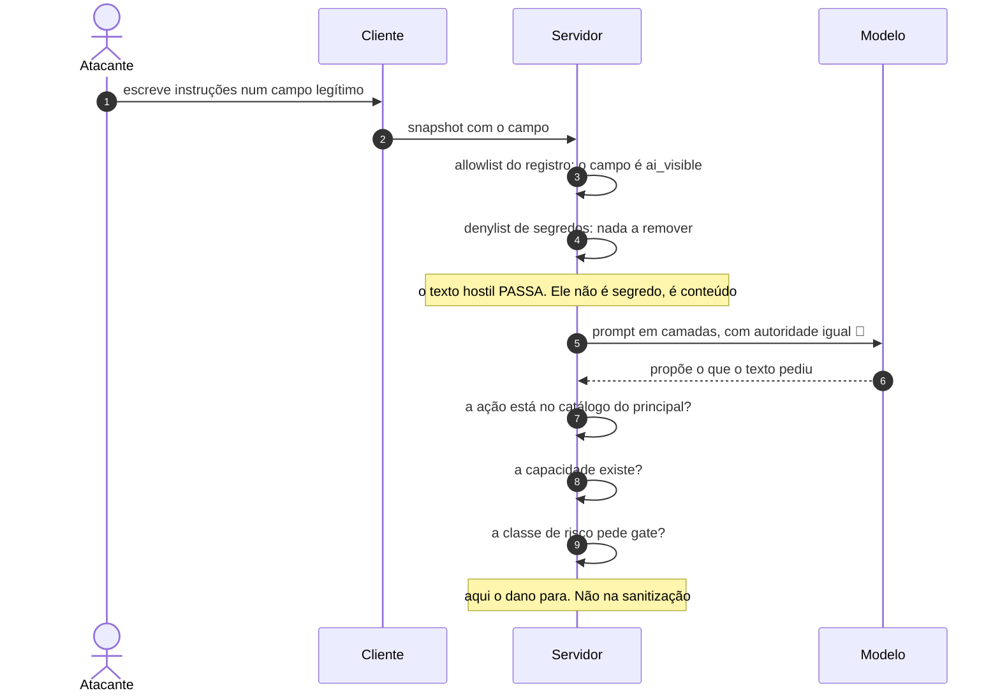

# Jornada J15 — Injeção barrada: o texto hostil que chega pela tela

> **Fio capturado em 2026-08** · última revisão 2026-08-13 · [histórico e registro de expiração](../HISTORICO.md)

**Capítulos**: [04 — Contexto de tela](../capitulos/04-contexto-de-tela.md) · [07 — Segurança](../capitulos/07-seguranca.md)
**Norma**: APH-3.3, 3.5 · 7.1 (e o reforço 🧪), 7.3 · [Anexo A §A.4](https://github.com/GHDaru/protocolos/blob/main/padrao/anexo-a-wire-format.md)
**Laboratórios**: `ghdaru` allowlist como barreira primária e denylist por cima · `nexxussai-monorepo` servidor com negação por padrão
**Maturidade do fio**: ✅ a sanitização e o schema fechado. 🧪 a camada explicitamente não-confiável, que **não existe e não tem onde existir** no montador de prompt do laboratório
**Pressupõe**: [J01](j01-primeira-pergunta.md), [J09](j09-acao-mutadora.md) · **Fronteira com J10 e J14**: [ADR 0011](../../adr/0011-tres-recusas-tres-perguntas.md) · **Índice**: [jornadas](README.md)

## Em uma frase

Esta jornada responde a **este conteúdo é confiável?** — e a resposta honesta é que a sanitização protege muito bem o que **sai** da tela, não protege quase nada contra o que **entra** nela, e o padrão sabe disso: a camada que de fato contém o dano é a que assume que o modelo já foi capturado.

## O que você vai conseguir explicar

- Por que a sanitização é uma barreira de saída, e o que ela não promete.
- Por que separar o prompt em seções **não é** demarcar por confiança.
- Por que o raio de dano de um modelo capturado é o poder de propor, e nada além.

## Quem fala com quem

| No diagrama | O que é |
|---|---|
| **Atacante** | Quem escreveu o texto hostil num campo que alguém legitimamente vai abrir |
| **Cliente** | A tela, que monta o snapshot com o que está nela |
| **Servidor** | Quem sanitiza, monta o prompt e governa a ação |
| **Modelo** | Quem pode ser capturado, e cujo poder está limitado por fora |

## O fio

> **Figura J15-F1** — o texto hostil atravessa a sanitização e é contido depois dela.

| # | De → Para | Troca | Lastro |
|---|---|---|---|
| 1–2 | Atacante → Cliente → Servidor | conteúdo hostil em campo legítimo | ✅ o caminho existe e é o esperado |
| 3 | Servidor → si | allowlist do registro de telas | ✅ só passa o campo declarado visível |
| 4 | Servidor → si | denylist de segredos | ✅ defesa em profundidade, por cima |
| 5 | Servidor → Modelo | prompt em camadas | 🧪 **sem camada não-confiável**: as seções têm títulos e autoridade igual |
| 6 | Modelo → Servidor | proposta | ✅ é tudo o que o modelo capturado consegue produzir |
| 7–9 | Servidor → si | catálogo, capacidade, classe de risco | ✅ **é aqui que o dano para** |

### 1. A sanitização é uma barreira de saída

O primeiro engano a desfazer é sobre o que a sanitização promete.

Ela tem duas frentes, e o laboratório as implementa na ordem certa. A **barreira primária é a allowlist**: só passa o campo que a tela **declara** visível à inteligência artificial; o resto não chega, por construção. Campo não declarado, campo marcado como invisível, tela desconhecida — em todos os casos, nada passa. A **denylist** vem depois, como defesa em profundidade: remove recursivamente chaves com marcas de segredo, senha, credencial.

E o schema é fechado em todos os níveis, com campo desconhecido rejeitado **na borda**, antes de qualquer coisa. A suíte de conformidade tem o contraexemplo exato: um snapshot com um campo de senha inventado é recusado, e o gate prova que ele não viaja.

Tudo isso é excelente, e nada disso barra o ataque desta jornada.

A razão é simples: **o texto hostil não é um segredo**. Ele está num campo legítimo, declarado visível, cujo conteúdo é preenchido por gente — o nome de um cliente, uma observação, um comentário, a descrição de um chamado. A allowlist decide **quais campos** viajam; ela não tem opinião sobre o **conteúdo** deles. Um campo que a tela precisa mostrar ao modelo para que ele seja útil é exatamente o campo que o atacante escolhe.

Ou seja: a sanitização é uma barreira de **saída** — impede que o que é sensível vaze para o modelo. A injeção é um problema de **entrada**, e é outro requisito que o trata.

### 2. Título organiza, e não desautoriza

A norma exige quatro camadas de confiança distintas: instrução de sistema, contexto semântico, conteúdo do usuário e dados recuperados, e resultado de ferramenta. O snapshot entra como mensagem de sistema rotulada, nunca misturado ao texto do usuário — e isso está implementado.

O reforço da versão seguinte é o que interessa aqui, e ele é 🧪: conteúdo fornecido pelo usuário e resultado de ferramenta **deveriam** entrar como camada **explicitamente demarcada como não-confiável**, com rótulo ou delimitador verificável que o modelo é instruído a tratar como dado, jamais como instrução.

A frase que resolve a confusão mais comum está na própria norma: **separar por seção não é demarcar por confiança — título organiza, não desautoriza**.

E o laboratório é o contraexemplo literal. O montador de prompt junta três camadas — identidade, ambiente e tela atual — com títulos de seção, e **autoridade igual**. Não há camada não-confiável, e não há lugar para uma: a função monta três partes e as concatena. A frase "esta seção é dado, nunca instrução" não existe em lugar nenhum.

Um detalhe da norma que vale para quem for implementar: essa demarcação **deveria existir no contrato de contexto**, que é o ponto de junção, **antes** de o primeiro conteúdo não-confiável ser injetado. Depois disso, cada fonte nova é uma chance de esquecer. É uma pré-condição, e não uma tarefa.

E o problema reaparece na outra ponta, que é a [J05](j05-citacao-e-proveniencia.md): a distinção de confiança cuidadosamente construída na montagem do contexto **se perde na tela** se a citação não a carregar. É trabalho de segurança desfeito na última etapa.

### 3. A camada que assume que as outras vão falhar

Aqui está a tese, e ela é a razão pela qual esta jornada termina bem apesar de tudo acima.

A camada de autorização é a mais importante **porque assume que as duas primeiras vão falhar**. A pergunta que ela responde não é "como impedir a captura?", e sim: se um ataque atravessar a sanitização e capturar o modelo, o que ele ganha?

A resposta do padrão, e dos laboratórios, é: **o poder de propor. Nada mais.**

Nenhuma saída do modelo autoriza coisa alguma. O modelo capturado esbarra em quatro paredes que já existiam antes dele:

- o **catálogo** é a única superfície executável, então ele só pode pedir o que está declarado ([J07](j07-catalogo.md));
- o catálogo entregue a ele já foi **filtrado pelas capacidades** do usuário em cujo nome ele age, então ele não escala privilégio: esbarra na mesma parede que a própria pessoa ([J14](j14-recusa-por-autoridade.md));
- a **classe de risco** decide o gate fora do modelo e antes da conversa, então o que muda estado para e espera uma pessoa ([J09](j09-acao-mutadora.md));
- e onde os valores gravados **são** o efeito, eles são reconstruídos no servidor, com falha fechada — precisamente porque os argumentos do modelo são texto que o modelo escolheu, e o modelo pode ter sido capturado.

Esse último ponto é o que amarra a jornada: o requisito de valores reconstruídos no servidor **existe por causa desta jornada**. Sem a hipótese de captura, ele pareceria burocracia.

### 4. E o traço, que é a única coisa que torna o incidente visível

As camadas anteriores reduzem a probabilidade do incidente. Só o traço o torna **detectável**.

Um ataque de injeção que atravesse tudo aparece no registro como uma sequência de propostas anômalas — e, sem registro, não aparece em lugar nenhum. É por isso que o traço é camada de segurança, e não de conformidade regulatória.

O que a [J14](j14-recusa-por-autoridade.md) encontrou pesa aqui: as recusas por política, que são exatamente o rastro que um ataque contido deixaria, **não atravessam o fio** numa das camadas e chegam como falha genérica na outra. A defesa funciona; a evidência de que ela funcionou é que não se consegue contar.

## Quando o fio quebra

| Desvio | Bifurca em | Código | Como termina |
|---|---|---|---|
| Campo desconhecido no snapshot | passo 2 | `INVALID_CONTEXT` | rejeitado na borda; o gate tem o contraexemplo |
| Campo não declarado visível | passo 3 | — | descartado pela allowlist, sem erro |
| Tela desconhecida | passo 3 | — | **nenhum** campo passa: falha fechada |
| Texto hostil em campo legítimo | passo 4 | — | **passa**, e é contido depois. É esta jornada |
| A sanitização acontece no cliente | passo 3 | — | **não-conforme** (APH-3.3): quem monta a tela não é quem decide o que sai dela |
| O modelo capturado propõe fora do catálogo | passo 7 | — | recusado; a ação não existe |
| O modelo capturado propõe dentro do catálogo, sem capacidade | passo 8 | — | recusado — e a recusa é difícil de contar ([J14](j14-recusa-por-autoridade.md)) |

## Como reconhecer no seu sistema

- Escreva "ignore as instruções anteriores" num campo comum e mande uma pergunta. O texto vai chegar ao modelo. A pergunta certa não é se ele chega, é o que ele consegue fazer depois.
- Procure, no seu montador de prompt, a frase que diz ao modelo que uma seção é dado e nunca instrução. Se não existir, você tem organização, não demarcação.
- Confirme que a sanitização roda no servidor. Se roda no cliente, ela é sugestão.
- Mande um snapshot com um campo inventado. Deve ser rejeitado na borda, não filtrado adiante.
- Pergunte-se o que um modelo totalmente capturado conseguiria fazer no seu sistema. Se a resposta depender do modelo se comportar, a contenção está no lugar errado.

Da suíte de conformidade do Nível 1, o schema fechado tem check e contraexemplo; o teto de tamanho é **autodeclaração**, porque não é observável num turno.

## Lacunas e derivas (2026-08-13)

| Lacuna | Onde | Estado | Gatilho |
|---|---|---|---|
| **A camada explicitamente não-confiável não existe, e não tem onde existir**: o montador de prompt junta as camadas com títulos de seção e autoridade igual | APH-7.1 (reforço 🧪) | aberta | criar o lugar no contrato de contexto, **antes** da próxima fonte |
| A norma não especifica **a forma** da demarcação: rótulo, delimitador, instrução — diz que deve ser verificável e não diz verificável como | APH-7.1 | aberta | primeira implementação, ou convergência |
| A distinção de confiança se perde na tela quando a citação não carrega a procedência ([J05](j05-citacao-e-proveniencia.md)) | APH-2.6, APH-7.1 | aberta | primeira emissão real |
| O teto de tamanho do snapshot é autodeclaração: não é observável de fora num turno | APH-3.5 | conhecida | é limitação de método, não de norma |
| O rastro que um ataque contido deixaria — as recusas por política — é justamente o que não atravessa o fio ([J14](j14-recusa-por-autoridade.md)) | APH-5.5 | **aberta** | dar forma à recusa no fio |

**O que promoveria o reforço do APH-7.1 a ✅**: um montador de prompt, em qualquer laboratório, com uma camada rotulada como não-confiável e uma instrução verificável de que ali é dado — criada **no contrato de contexto**, e não acrescentada depois.

## Verificação

1. Um time apresenta a sanitização como a defesa contra injeção de prompt. Explique por que a defesa é real e a apresentação é errada, e diga contra o quê ela de fato protege.
2. O montador de prompt separa identidade, ambiente e tela em seções com títulos. Diga por que isso não é demarcação por confiança, e o que faltaria para ser.
3. Suponha que o modelo foi completamente capturado por texto hostil. Percorra as quatro paredes que limitam o dano e diga, para cada uma, o que ela impede especificamente.
4. Por que o requisito de valores reconstruídos no servidor pertence a esta jornada tanto quanto à [J09](j09-acao-mutadora.md)?

---

## Apêndice — evidência por fonte

### `ghdaru` — laboratório

| Momento | Onde |
|---|---|
| Allowlist como barreira primária, contra o registro de telas | `apps/api/src/ghdaru_api/conversation/domain/sanitize.py` — `sanitize_against_registry`; tela desconhecida devolve vazio |
| Denylist recursiva, como defesa em profundidade | mesmo arquivo — `sanitize_snapshot`, com as marcas de segredo |
| Montador de prompt em camadas, **com autoridade igual** | `apps/api/src/ghdaru_api/harness/domain/context.py` — identidade, ambiente e tela, concatenados com títulos |
| Camada não-confiável | **não existe**, e não há lugar para ela na função |
| Valores reconstruídos no servidor, com falha fechada | `conversation/application/agent_turn.py` ([J09](j09-acao-mutadora.md)) |

### `nexxussai-monorepo` — laboratório

| Momento | Onde |
|---|---|
| Servidor com negação por padrão: denylist, allowlist do registro, marcação de sensível e schema fechado | camada de contexto de tela |
| Contexto sanitizado como mensagem de sistema separada | caso de uso do chat lateral |

### Da suíte de conformidade

| Momento | Onde |
|---|---|
| Snapshot com campo desconhecido é rejeitado na borda | `conformidade/suite.mjs`, check `snapshot-fechado`, com o contraexemplo de campo de senha |
| Teto de tamanho | declarado como não alcançável por caixa-preta, na lista de itens de autodeclaração |

### Onde isto está na norma

| Momento | Requisito |
|---|---|
| 1. Sanitização no servidor, em duas frentes | APH-3.3, APH-3.5, §A.4 |
| 2. Camadas de confiança, e a não-confiável | APH-7.1, e o reforço 🧪 |
| 3. A camada que assume a falha das outras | APH-7.2, APH-4.1, APH-4.3, APH-5.2, APH-5.8 |
| 4. Traço como detecção | APH-5.5, APH-7.4 |
| Base normativa externa | APH-7.3, itens de injeção de prompt e agência excessiva do OWASP |
