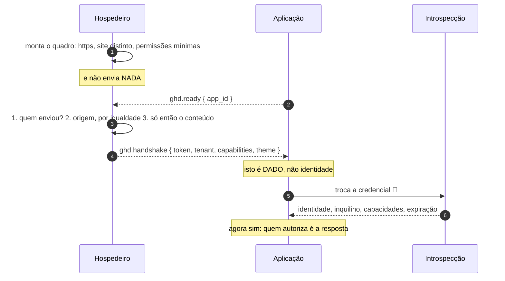

# Jornada J17 — Embarque e handshake: quem fala primeiro, e por que a credencial não é a sessão

> **Fio capturado em 2026-08** · última revisão 2026-08-13 · [histórico e registro de expiração](../HISTORICO.md)

> ⚠️ **Bloco experimental, e a junta não fecharia hoje.** Os dois primeiros implementadores, cada um lendo o requisito, escreveram envelopes **incompatíveis**: um exige quatro campos e descarta o resto; o outro emite dois nomes diferentes. Ligados hoje, o sinal de vida cairia no descarte e o handshake nunca sairia. Não é hipótese de risco — é o estado medido, e o próprio anexo o registra.

**Capítulos**: [09 — Federação e composição](../capitulos/09-federacao-composicao.md) · [07 — Segurança](../capitulos/07-seguranca.md)
**Norma**: APH-9.2🧪, 9.4a, 9.5🧪 · [Anexo B §B.1–§B.3, §B.6, §B.8](https://github.com/GHDaru/protocolos/blob/main/padrao/anexo-b-federacao.md)
**Laboratórios**: hospedeiro com canal, guardas de origem e manifesto real · **lado da aplicação**: envelope divergente, endereço de mensagem aberto a qualquer origem, e a verificação de quem fala **não existe**
**Maturidade**: ✅ o vocabulário do canal e a forma do grant. 🧪 a autenticação da introspecção e a autoridade efetiva atenuada, que **nenhum laboratório implementa**
**Pressupõe**: [J16](j16-admissao.md) · **Forma**: [ADR 0013](../../adr/0013-jornada-sem-fio-e-o-bloco-federado.md) · **Índice**: [jornadas](README.md)

## Em uma frase

O momento em que uma aplicação de terceiro aparece dentro da sua: quem monta, quem fala primeiro, o que não se pode dizer antes da hora, e por que a credencial entregue no aperto de mão **não é a sessão do usuário** e não vale como senha em lugar nenhum.

## O que você vai conseguir explicar

- Por que a aplicação fala primeiro, e o que quebra se o hospedeiro falar antes.
- Por que a verificação de quem enviou vem **antes** da de origem, e as duas antes do conteúdo.
- Por que a aplicação não pode confiar no que recebeu no aperto de mão.

## Quem fala com quem

| No diagrama | O que é |
|---|---|
| **Hospedeiro** | A plataforma que monta o quadro e emite a credencial |
| **Aplicação** | O terceiro, dentro do quadro, em site distinto |
| **Introspecção** | O endereço do hospedeiro que troca a credencial por identidade |

## O fio

> **Figura J17-F1** — do embarque à identidade. A perna da introspecção está tracejada porque **só a resposta tem forma normativa**: a requisição não está no anexo.

| # | De → Para | Troca | Lastro |
|---|---|---|---|
| 1 | Hospedeiro → si | enquadramento | ✅ https, site distinto, permissões mínimas |
| 2 | Aplicação → Hospedeiro | sinal de vida | ✅ o payload é o identificador da aplicação, **sem segredo** |
| 3 | Hospedeiro → si | as três verificações, **nesta ordem** | ✅ e a ordem é o desenho |
| 4 | Hospedeiro → Aplicação | aperto de mão | ✅ credencial, inquilino, capacidades e tema |
| 5–6 | Aplicação → Introspecção | troca por identidade | 🧪 **só a resposta tem forma normativa**; a requisição não está no anexo |

### 1. Nove passos, e a cláusula de cada um

| # | Passo | O que a norma exige |
|---|---|---|
| 0 | Antes de tudo | os cinco parâmetros chegam por configuração; faltando um, a aplicação **recusa subir**, dizendo qual ([J16](j16-admissao.md)) |
| 0b | A aplicação sabe que está embarcada | por **sinal explícito** na URL de embarque, nunca por heurística de "tenho um pai" |
| 1 | O hospedeiro monta | quadro sobre https, com **no mínimo** as permissões de script e de origem própria; aplicação servida de **site distinto**; endereço dentro da origem declarada |
| 2 | A aplicação fala primeiro | emite o sinal de vida, endereçado à origem do hospedeiro — **nunca a qualquer origem** |
| 3 | O hospedeiro não fala antes | nada antes de um sinal de vida **válido** |
| 4 | Filtro de envelope | mensagem que não case no protocolo **e** na versão é ignorada, sem efeito e **sem resposta** |
| 5 | As três verificações, nesta ordem | quem enviou → origem por igualdade → conteúdo |
| 6 | A resposta | aperto de mão **ou nada**; nunca um erro que descreva o motivo interno |
| 7 | A credencial | audiência restrita àquela aplicação, vida curta, **uso único**, e **nunca** a sessão do usuário; consumo atômico |
| 8 | A identidade | vem da introspecção, não do aperto de mão |

### 2. A aplicação fala primeiro, e isso não é etiqueta

A regra é curta: **a aplicação emite o sinal de vida ao montar, e o hospedeiro não envia nada antes de recebê-lo**.

O motivo é preciso. A referência à janela do quadro existe **antes** de o documento carregar. Um hospedeiro que fale assim que monta está entregando no escuro a um documento cuja identidade ainda não foi verificada — e o que ele entrega, no passo seguinte, é uma credencial.

A regra tem um par que a completa: se o sinal de vida não vier dentro de uma janela declarada, isso é tratado como "aplicação sem canal" — um **estado honesto**, e não um erro fatal. Uma aplicação pode legitimamente não falar esse protocolo, e continuar sendo útil dentro do quadro.

### 3. A ordem das três verificações é o desenho

Ao receber mensagem, cada lado verifica, **nesta ordem**: primeiro **quem enviou** — a janela do próprio quadro, para o hospedeiro; a janela-pai, para a aplicação. Depois a **origem, por igualdade**, contra a origem admitida que vem de **configuração, nunca da mensagem**. E só então olha o conteúdo.

Inverter isso não é estilo. Verificar a origem antes de quem enviou aceita mensagem de qualquer janela que consiga forjar o campo de origem em contextos em que ele é frágil; olhar o conteúdo antes de qualquer uma das duas significa que a decisão já foi tomada com dado não confiável.

E quando não bate, o comportamento é o mais contraintuitivo do anexo: **descarta, registra, e não responde**. Nem com erro. Responder já confirma presença — e confirmar presença a quem não deveria falar com você é o primeiro passo de qualquer sondagem.

O mesmo vale para o endereçamento de saída: toda mensagem é dirigida à origem admitida da contraparte, **nos dois sentidos**, e mesmo quando não carrega segredo. Endereçar a qualquer origem revela a qualquer embarcador que a aplicação está ali e em que estado.

Aqui está a evidência que dói: o lado da aplicação, no laboratório, **endereça a qualquer origem** e **não verifica quem enviou** — só a origem. A trava dupla está implementada só no hospedeiro.

### 4. A credencial não é a sessão, e a aplicação não confia nela

Este é o requisito que mais economiza incidente, e ele tem duas metades.

A primeira é sobre **o que se entrega**: a credencial do aperto de mão é própria do embarque — audiência restrita àquela aplicação, vida curta, **uso único** — e **nunca** a credencial de sessão do usuário. E o consumo é atômico: validar e consumir num passo, nunca ler e depois apagar. Entregar a sessão do usuário a um terceiro é dar a ele tudo o que o usuário pode, para sempre; entregar uma credencial de embarque é dar a ele uma chance, curta, naquela audiência.

A segunda é sobre **o que se aceita**: a aplicação **não confia** na credencial. Ela a troca por identidade na introspecção, e **quem autoriza é a resposta da introspecção**, não o conteúdo do aperto de mão. E a credencial não vale como senha em rota nenhuma do hospedeiro.

Isso fecha a confiança nos dois sentidos: o hospedeiro não fala antes de verificar, e a aplicação não age antes de confirmar. O conteúdo do aperto de mão é **dado**.

Há um detalhe de higiene na resposta: ela **não deve conter papel**. Papel pleno entregue a terceiro convida autorização por papel fora do escopo concedido — a autorização da aplicação federada é **por capacidade**, e as capacidades não aceitam curinga, porque curinga transforma concessão em cheque em branco.

### 5. Dentro do quadro: estados, não mensagens

O modo embarcado é um conjunto de obrigações de apresentação, e nenhuma delas atravessa o fio — por isso aparecem aqui como **estados**, e não como setas.

Embarcada, a aplicação renderiza **apenas o conteúdo**: sem cabeçalho de navegação próprio, sem menu global, sem rodapé, sem seletor de inquilino. Quem navega é o hospedeiro, e dois menus na mesma janela é defeito de composição. O hospedeiro, do seu lado, mantém a moldura **neutra**: ela é da plataforma, e não a marca do inquilino, que viaja para dentro por tokens de tema.

E há uma obrigação de acessibilidade que costuma ser esquecida: ao montar a tela federada, o hospedeiro **deveria** levar o foco ao cabeçalho da moldura, anunciando a troca de contexto — e **não deve** prender o foco dentro do quadro.

### 6. O que a norma pede e ninguém faz

Duas obrigações do aperto de mão são 🧪, e não por acaso — as duas são de autoridade.

**A introspecção deve autenticar quem a chama.** Ela revela identidade, inquilino, capacidades e expiração; sem autenticação, vira um oráculo aberto para quem tiver exfiltrado uma credencial, e ainda impede atribuir chamadas e limitar taxa por aplicação. Nenhum laboratório o faz. Na suíte, esse check sai como **aviso**, e não como falha — exigir do primeiro adotante o que ninguém implementou seria cobrar conformidade a um desenho.

**As capacidades entregues deveriam ser a interseção** entre o que o usuário pode e o que foi concedido àquela aplicação naquele inquilino. Não são. O hospedeiro calcula o escopo como o pedido do manifesto cruzado com a concessão do administrador, **sem intersectar com o usuário**, por decisão explícita e documentada. A consequência está dita na própria norma, e é grave: **a aplicação pode exceder quem abriu o embarque**.

Por isso o diagrama acima não desenha as capacidades como atenuadas. Elas não são, e desenhá-las assim seria afirmar o contrário do que existe.

## Quando o fio quebra

| Desvio | Bifurca em | Como termina |
|---|---|---|
| O hospedeiro fala antes do sinal de vida | passo 3 | entrega credencial a documento não verificado |
| O sinal de vida não vem na janela declarada | passo 2 | "aplicação sem canal": estado honesto, não erro fatal |
| Origem ou remetente não batem | passo 3 | descarta, registra, **não responde**. É a [J19](j19-embarque-recusado.md) |
| A aplicação está em site irmão do hospedeiro | passo 1 | recusa de montagem. É a [J19](j19-embarque-recusado.md) |
| A credencial entregue é a sessão do usuário | passo 4 | **não-conforme**, e a suíte derruba |
| A aplicação age pelo conteúdo do aperto de mão | passo 5 | **não-conforme**: identidade só existe depois da introspecção |
| A credencial é aceita como senha numa rota | — | **não-conforme**, e a suíte derruba |

## Como reconhecer no seu sistema

- Veja quem manda a primeira mensagem. Se for o hospedeiro, ele fala com um documento que ainda não se identificou.
- Procure a verificação de **quem enviou**. Se só houver verificação de origem, falta metade da trava — é o que falta no lado da aplicação do laboratório.
- Procure o endereço das suas mensagens de saída. Se for "qualquer origem", você está anunciando presença a quem embarcar.
- Pegue a credencial do aperto de mão e tente usá-la numa rota do hospedeiro. Se funcionar, ela virou senha.
- Use a mesma credencial duas vezes. A segunda deve falhar.
- Pergunte se as capacidades entregues consideram o usuário. Hoje, na única implementação, não consideram.

## Lacunas e derivas (2026-08-13)

| Lacuna | Onde | Estado | Gatilho |
|---|---|---|---|
| **A requisição de introspecção não tem forma normativa**: só a resposta tem. Rota, método e como o chamador se autentica não estão no anexo | §B.6.3, §B.6.6 | **aberta**, candidata a spec na norma | especificar a perna de ida |
| **A introspecção não autentica o chamador** em laboratório nenhum: é oráculo aberto para quem exfiltrar credencial | §B.6.6 🧪, APH-9.5 | aberta | primeira implementação |
| **As capacidades não são a interseção com o usuário**: a aplicação pode exceder quem abriu o embarque, por decisão documentada do hospedeiro | §B.6.7 🧪, APH-9.4b | **aberta**, e é a mais grave do bloco | quem fechar primeiro promove o requisito |
| Não há **revogação por aplicação**, nem a aplicação atuante no traço | APH-9.4b | aberta | primeira implementação |
| O lado da aplicação **não verifica quem enviou** e endereça a qualquer origem; e o envelope é divergente. Ligados hoje, a junta não fecha | §B.2.1, §B.2.3, §B.2.4 | **conhecida e medida** | alinhar o envelope |
| O lado da aplicação **não tem verificação executável nenhuma**, porque o canal exige navegador | §B.11.2, §B.12.2 | conhecida e declarada | é limitação de método |

**O que promoveria os dois requisitos 🧪 a ✅**: uma introspecção que autentique o chamador, e um hospedeiro que calcule o escopo do grant intersectando com as capacidades do usuário e o cobre nas próprias rotas, com recusa fechada. Quem fizer isso primeiro promove o requisito para todo mundo.

## Verificação

1. O hospedeiro monta o quadro e imediatamente envia o aperto de mão, "para economizar uma ida e volta". Diga exatamente o que ele acabou de entregar, e a quem.
2. Por que a verificação de quem enviou vem antes da de origem? Descreva o que a ordem inversa aceitaria.
3. Uma implementação responde com erro explicando por que recusou a mensagem, "para facilitar a depuração". Diga o que esse erro entrega ao remetente que a norma quer negar.
4. As capacidades do aperto de mão não intersectam com as do usuário. Descreva o cenário em que a aplicação federada faz algo que a própria pessoa que a abriu não poderia fazer.

---

## Apêndice — evidência por fonte

### Do lado do hospedeiro

| Momento | Onde |
|---|---|
| Canal com guardas de origem | `apps/web/src/features/federation/domain/frame.ts` — https, origem admitida, recusa da própria origem |
| Envelope e sequência, com a aplicação falando primeiro | `apps/web/src/features/federation/domain/handshake.ts` |
| Manifesto real, em uso | `docs/integration/manifest.schema.json` |
| Autenticação da introspecção | **não existe** |
| Interseção com as capacidades do usuário | **não existe**, por decisão documentada |

### Do lado da aplicação

| Momento | Onde |
|---|---|
| Verificação de origem | `prototipo/adaptadores.js` — verifica **só** a origem |
| Verificação de quem enviou | **não existe** |
| Endereçamento das mensagens | a qualquer origem |
| Envelope | **divergente** do normativo |

### Da suíte de federação

Derrubam: a credencial ser a sessão do usuário; credencial de vida longa; credencial aceita como senha; resposta de introspecção fora das três formas; papel na resposta; credencial aceita duas vezes. O check de introspecção autenticada sai como **aviso**, porque a cláusula é 🧪.

Não alcança: o navegador inteiro — sandbox real, envelope, sequência, verificação de origem e de remetente, endereçamento, modo embarcado.

### Onde isto está na norma

| Momento | Cláusula |
|---|---|
| 1. Canal e enquadramento | §B.1.1–§B.1.3; APH-9.2 🧪 |
| 2. Quem fala primeiro | §B.2.2, §B.3.1, §B.3.2 |
| 3. As três verificações e o endereçamento | §B.2.1, §B.2.3, §B.2.4 |
| 4. A credencial e a introspecção | §B.6.1–§B.6.4; APH-9.4a |
| 5. Modo embarcado | §B.8.1–§B.8.4 |
| 6. O que ninguém faz | §B.6.6 🧪, §B.6.7 🧪; APH-9.5 🧪, APH-9.4b 🧪 |
