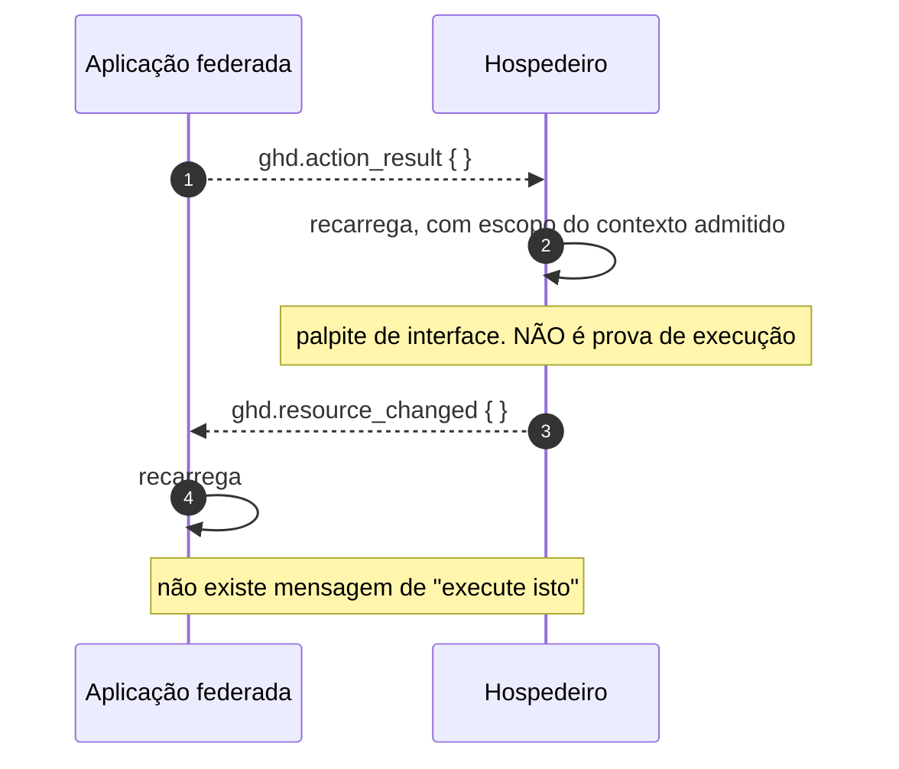

# Jornada J18 — A aplicação federada propõe, e nunca executa

> **Fio capturado em 2026-08** · última revisão 2026-08-13 · [histórico e registro de expiração](../HISTORICO.md)

> ⚠️ **Bloco experimental, e a junta não fecharia hoje.** Ver a advertência da [J17](j17-embarque-handshake.md). Nada nesta jornada foi exercitado ponta a ponta.

**Capítulos**: [09 — Federação e composição](../capitulos/09-federacao-composicao.md) · [05 — Ações governadas](../capitulos/05-acoes-governadas.md)
**Norma**: APH-9.4b🧪 · 4.1, 5.1 · [Anexo B §B.3.3, §B.7, §B.9](https://github.com/GHDaru/protocolos/blob/main/padrao/anexo-b-federacao.md)
**Laboratórios**: o canal existe do lado do hospedeiro; a **autoridade efetiva atenuada não existe em lado nenhum**
**Maturidade**: ✅ a ausência deliberada de mensagem de comando, e a regra de confiança assimétrica. 🧪 a autoridade efetiva e a aplicação atuante no traço
**Pressupõe**: [J09](j09-acao-mutadora.md), [J17](j17-embarque-handshake.md) · **Forma**: [ADR 0013](../../adr/0013-jornada-sem-fio-e-o-bloco-federado.md) · **Índice**: [jornadas](README.md)

## Em uma frase

O contrato que a inteligência artificial já tinha, reinstanciado para um terceiro: perante o hospedeiro, a aplicação federada ocupa **exatamente o papel do modelo** — ela propõe, e quem executa é o dono da casa.

## O que você vai conseguir explicar

- Por que o vocabulário do canal **não tem** mensagem de comando, e por que isso é uma decisão e não um esquecimento.
- Por que o resultado que a aplicação anuncia é palpite de interface, e nunca prova de execução.
- Por que nada vindo do quadro pode ser parâmetro de autorização.

## Quem fala com quem

| No diagrama | O que é |
|---|---|
| **Aplicação federada** | O terceiro embarcado. Perante o hospedeiro, é um proponente |
| **Hospedeiro** | Quem governa: catálogo, política, máquina de estados e traço |
| **Usuário** | Quem confirma, quando a classe de risco pede |

## O fio

> **Figura J18-F1** — as duas únicas mensagens que atravessam o canal depois do embarque, e o caminho por onde a ação de verdade passa.

| # | De → Para | Troca | Lastro |
|---|---|---|---|
| 1 | Aplicação → Hospedeiro | "mexi em algo" | ✅ payload vazio; é **palpite de interface** |
| 2 | Hospedeiro → si | recarregamento | ✅ escopo derivado do **contexto admitido**, nunca do payload, e limitado àquela aplicação |
| 3 | Hospedeiro → Aplicação | "algo que te interessa mudou" | ✅ payload vazio |
| — | Aplicação → Hospedeiro | "execute isto" | **não existe, de propósito** |

### 1. A ausência é o requisito

O vocabulário do canal tem **quatro** mensagens, e nenhuma delas é um comando. Não existe mensagem pela qual a aplicação federada mande o hospedeiro executar coisa alguma.

Isso não é lacuna: é a decisão central do bloco, e a norma diz por quê. Perante o hospedeiro, a aplicação ocupa o **papel de proponente**, o mesmo do modelo. O catálogo continua sendo a única superfície executável, e ação mutadora que ela peça **nasce proposta** e atravessa a máquina de estados — a mesma da [J09](j09-acao-mutadora.md), com classe de risco declarada, gate proporcional e traço.

Um comando direto pelo canal seria um segundo protocolo: sem risco declarado, sem confirmação e sem traço. É exatamente o que o requisito de federação proíbe.

A consequência prática é bonita: **não há nada novo a implementar** para a aplicação federada agir. O contrato é o que já existia. O que muda não é o vocabulário, é a **confiança** — e é disso que trata o resto desta jornada.

Três tipos estão reservados no roadmap do hospedeiro, e nenhum é válido para emitir enquanto o anexo não os admitir. Um deles é justamente o comando de interface, e no sentido aplicação para hospedeiro **ele não será admitido**.

### 2. O resultado anunciado é palpite, e não prova

A mensagem que a aplicação manda depois de fazer algo tem payload vazio e um significado deliberadamente fraco: "mexi em algo, talvez você queira recarregar".

Ela é **sinal de interface, nunca prova de execução**, e não deve entrar em auditoria nem alterar estado do hospedeiro. Quem prova execução é o traço no servidor — e o traço do que a aplicação fez é escrito por quem executou, não por quem anunciou.

A distinção parece sutil e não é. Se o anúncio contasse como prova, a auditoria do hospedeiro passaria a conter afirmações escritas por um terceiro sobre o próprio comportamento dele. É o mesmo defeito que a [J09](j09-acao-mutadora.md) encontrou num laboratório, em que o desfecho da ação só chegaria por uma rota que o **cliente** preencheria — e ali já era ruim com o cliente da própria casa.

E há uma segunda trava, sobre o **escopo** do recarregamento: ele é derivado do contexto admitido daquela aplicação, e limitado a ela. Nunca do payload. Sem isso, uma aplicação anunciaria mudanças que invalidam cache alheio — e a mensagem de payload vazio vira uma alavanca sobre o estado de outras.

### 3. Nada que venha do quadro autoriza

A regra é curta e cobre a família inteira de erros: **nada que venha do quadro deve ser usado como parâmetro de autorização** — nem identificador de aplicação, nem de inquilino, nem capacidade.

O motivo é que o hospedeiro **já tem** esses valores. Ele os fixou na admissão ([J16](j16-admissao.md)) e os emitiu no aperto de mão ([J17](j17-embarque-handshake.md)). Recebê-los de volta e usá-los para decidir é convite ao delegado confuso: o hospedeiro age com a sua autoridade sobre um alvo que outro escolheu.

A regra vale nos dois sentidos, e o lado da aplicação também não confia: o conteúdo do aperto de mão é **dado**, e a identidade só existe depois da introspecção.

E há um terceiro caso, que é o mais fácil de esquecer: snapshot que venha do quadro **deve ser re-sanitizado** pelo hospedeiro antes de entrar em contexto de modelo, e deve entrar na camada explicitamente não-confiável. Uma aplicação federada é uma fonte de injeção indireta como qualquer outra — é a [J15](j15-injecao-barrada.md) aplicada a um terceiro. Vale lembrar o que aquela jornada encontrou: **a camada não-confiável não existe** no montador de prompt do laboratório, e não tem onde existir. Ou seja, esta obrigação depende de uma que ainda não foi cumprida.

### 4. A autoridade que deveria ser interseção, e não é

Aqui está a lacuna mais grave do bloco, e a razão de o requisito ser parcial.

A autoridade efetiva de uma requisição originada na aplicação federada **deve** ser a interseção entre o que o usuário pode e o que foi concedido àquela aplicação naquele inquilino, calculada e verificada **no hospedeiro** — fora da aplicação e fora do modelo —, com recusa fechada em rota que não declare a capacidade exigida.

Para que essa interseção seja computável, o hospedeiro precisa **identificar qual aplicação** apresenta a credencial, e **verificá-la**: credencial de aplicação emitida e nunca verificada não atenua nada, e um token que prova apenas o usuário não sustenta atenuação alguma.

Nada disso existe. O hospedeiro calcula o escopo como o pedido do manifesto cruzado com a concessão do administrador, **sem o usuário**; a credencial de aplicação é emitida e nunca verificada em rota nenhuma; o registro de aplicações **não tem revogação**. A norma enuncia a consequência sem suavizar: **a aplicação pode exceder quem abriu o embarque**.

E falta a metade que tornaria o incidente investigável: o traço **deve** registrar a **aplicação atuante**. Sem isso, a pergunta "o que a aplicação X fez" não tem resposta.

Duas notas de forma que sustentam a honestidade desta seção. A capacidade tem a forma recurso-e-verbo e **não aceita curinga**, porque curinga transforma concessão em cheque em branco e torna a interseção incalculável. E a ação cuja capacidade o principal não tem **não entra no catálogo** que o modelo vê — ausência é melhor fronteira que recusa, exatamente como na [J07](j07-catalogo.md) e na [J14](j14-recusa-por-autoridade.md).

## Quando o fio quebra

| Desvio | Bifurca em | Como termina |
|---|---|---|
| A aplicação manda o hospedeiro executar | — | não há mensagem para isso; se houvesse, seria segundo protocolo sem risco, sem gate e sem traço |
| O anúncio de resultado entra na auditoria | passo 2 | **não-conforme**: o hospedeiro passa a auditar afirmação de terceiro sobre si |
| O escopo do recarregamento vem do payload | passo 2 | **não-conforme**: a aplicação invalida cache alheio |
| Identificador de inquilino vindo do quadro decide autorização | — | **não-conforme**: delegado confuso |
| Snapshot do quadro entra no contexto sem re-sanitização | — | **não-conforme**: injeção indireta pela porta de terceiro |
| A requisição excede a interseção | — | **deveria** ser recusada sem execução e com traço. Hoje não há interseção |

## Como reconhecer no seu sistema

- Procure, no seu canal, uma mensagem pela qual o embarcado mande o embarcador fazer algo. Se existir, você tem um segundo protocolo sem governança.
- Veja o que o seu hospedeiro registra quando o embarcado anuncia que mexeu em algo. Se registrar como execução, a auditoria tem ficção de terceiro.
- Veja de onde sai o escopo do recarregamento. Se sair da mensagem, uma aplicação mexe no cache das outras.
- Pergunte se a autoridade da aplicação federada é a interseção com a do usuário. Se a resposta for "é a concessão do administrador", ela pode exceder quem a abriu.
- Procure a aplicação atuante no seu traço. Sem ela, um incidente com terceiro não é investigável.

## Lacunas e derivas (2026-08-13)

| Lacuna | Onde | Estado | Gatilho |
|---|---|---|---|
| **A autoridade efetiva não é a interseção com o usuário** em lado nenhum: a aplicação pode exceder quem abriu o embarque | §B.6.7 🧪, APH-9.4b | **aberta**, a mais grave do bloco | quem fechar primeiro promove o requisito |
| A credencial de aplicação é **emitida e nunca verificada** em rota nenhuma; sem identificar qual aplicação apresenta a credencial, a interseção é incomputável | APH-9.4b | aberta | verificar a credencial por rota |
| **Não há revogação por aplicação** no registro do hospedeiro | APH-9.4b | aberta | primeira implementação |
| A **aplicação atuante não é registrada no traço**: "o que a aplicação X fez" não tem resposta | APH-9.4b, APH-5.5, APH-7.4 | aberta | acrescentar o campo ao traço |
| A obrigação de re-sanitizar o snapshot do quadro **depende** da camada não-confiável, que não existe ([J15](j15-injecao-barrada.md)) | §B.9.3, APH-7.1 | aberta | criar a camada primeiro |
| A **verificação executável do lado da aplicação não existe**, porque o canal exige navegador. Quase tudo o que esta jornada pede da aplicação é autodeclarado | §B.11.2, §B.12.2 | conhecida e declarada | é limitação de método |

**O que promoveria o requisito a ✅**: um hospedeiro que identifique e verifique qual aplicação apresenta a credencial, calcule a interseção com as capacidades do usuário, cobre isso por rota com recusa fechada, e registre a aplicação atuante no traço. São quatro coisas, e nenhuma existe hoje.

## Verificação

1. Alguém propõe acrescentar ao canal uma mensagem de comando, "porque a aplicação já é confiável — ela foi admitida". Diga o que essa mensagem contornaria, item por item.
2. O hospedeiro registra o anúncio de resultado da aplicação como execução no seu traço. Descreva o que a auditoria passa a conter, e por que isso é pior que não registrar nada.
3. A autoridade da aplicação é a concessão do administrador, sem intersectar com o usuário. Descreva o cenário concreto em que um usuário comum, ao abrir a tela federada, faz algo que ele próprio não poderia fazer.
4. Por que a obrigação de re-sanitizar o snapshot do quadro não pode ser cumprida hoje? (Dica: ela depende de outra jornada.)

---

## Apêndice — evidência por fonte

### Do lado do hospedeiro

| Momento | Onde |
|---|---|
| Canal e vocabulário de quatro mensagens | `apps/web/src/features/federation/domain/handshake.ts` |
| Escopo do grant sem interseção com o usuário | decisão documentada no ADR de handshake do laboratório, citada pela própria norma |
| Verificação da credencial de aplicação por rota | **não existe** |
| Revogação por aplicação | **não existe** |
| Aplicação atuante no traço | **não existe** |

### Do lado da aplicação

Nenhuma verificação executável. Das obrigações do anexo, oito são exclusivamente da aplicação, e todas são autodeclaradas.

### Onde isto está na norma

| Momento | Cláusula |
|---|---|
| 1. Sem mensagem de comando; a aplicação é proponente | §B.3.3; APH-4.1, APH-5.1 |
| 2. Palpite de interface, e o escopo do recarregamento | §B.9.1, §B.9.2 |
| 3. Nada do quadro autoriza; re-sanitização | §B.9.3, §B.9.4, §B.9.5 |
| 4. Autoridade efetiva e capacidade sem curinga | §B.6.7 🧪, §B.7.1–§B.7.3; APH-9.4b 🧪 |
