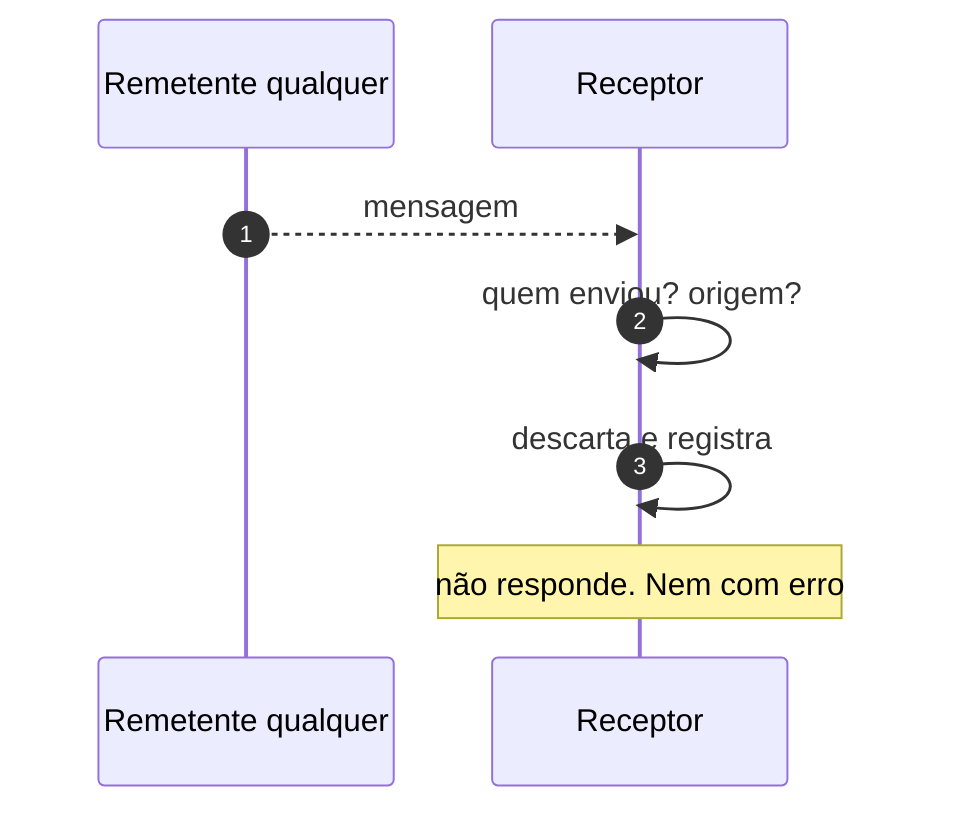
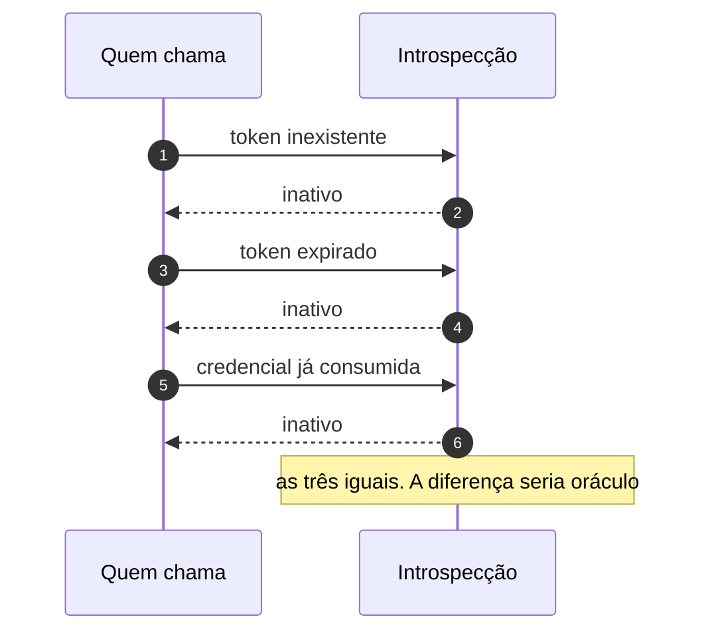

# Jornada J19 — O embarque é recusado: três decisores, uma tese

> **Fio capturado em 2026-08** · última revisão 2026-08-13 · [histórico e registro de expiração](../HISTORICO.md)

> ⚠️ **Bloco experimental.** Ver a advertência da [J17](j17-embarque-handshake.md). O primeiro momento desta jornada **não tem diagrama**, e a ausência é a decisão: ali não existe mensagem nenhuma, e não há a quem responder.

**Capítulos**: [09 — Federação e composição](../capitulos/09-federacao-composicao.md) · [07 — Segurança](../capitulos/07-seguranca.md)
**Norma**: APH-9.2🧪 · [Anexo B §B.1.2, §B.2.3, §B.3.1, §B.6.5](https://github.com/GHDaru/protocolos/blob/main/padrao/anexo-b-federacao.md)
**Laboratórios**: as três recusas existem do lado do hospedeiro; do lado da aplicação, a segunda é **meia recusa**
**Maturidade**: ✅ as três, do lado do hospedeiro, com checks na suíte para a primeira e a terceira
**Pressupõe**: [J16](j16-admissao.md), [J17](j17-embarque-handshake.md) · **Forma**: [ADR 0013](../../adr/0013-jornada-sem-fio-e-o-bloco-federado.md) · **Índice**: [jornadas](README.md)

## Em uma frase

Três recusas, em três momentos, com três decisores diferentes — e uma tese só, que as une: **a recusa não entrega oráculo**. O que se nega não é só o acesso; é a informação sobre por que foi negado.

## O que você vai conseguir explicar

- Por que um subdomínio irmão do hospedeiro é recusado, mesmo passando em qualquer verificação de origem.
- Por que responder a uma mensagem inválida — mesmo com erro — já é vazar.
- Por que uma resposta de "inativo" não pode dizer se o token não existe, expirou ou já foi usado.

## Os três momentos

| Momento | Decisor | Quando | Estado terminal |
|---|---|---|---|
| **1. Recusa de montagem** | o hospedeiro, **antes de qualquer mensagem** | ao montar o quadro | "aplicação indisponível" |
| **2. Descarte silencioso** | **o receptor**, seja qual for o lado | a cada mensagem | descarta, registra, não responde |
| **3. Resposta inativa** | o endereço de introspecção | ao trocar a credencial | resposta de inatividade, e só isso |

### 1. Recusa de montagem — e aqui não há diagrama

Não há mensagem, não há remetente e não há a quem responder: o documento **nunca carrega**. Por isso este momento não tem diagrama de sequência; desenhar um exigiria inventar uma troca.

O hospedeiro deve recusar embarcar três casos, e o terceiro é o contraintuitivo.

**Documento da própria origem, ou que a herde.** Um documento embutido a partir do próprio hospedeiro tem a origem dele, e não "nenhuma". Ele poderia remover as próprias restrições — e é por isso que essa forma não serve para terceiro.

**Esquema sem identidade verificável.** Um recurso de memória herda a origem de quem o criou; um endereço de dados tem origem opaca. Nenhum dos dois é verificável como identidade de aplicação.

**Origem do mesmo site.** Este é o que quase todo mundo erra. Origem diferente **não basta**: o domínio registrável tem de ser outro. Um subdomínio irmão — a plataforma em um endereço, a aplicação em outro sob o mesmo domínio — passa em qualquer verificação de origem, e ainda assim **lê e escreve os cookies de domínio do hospedeiro**, o que abre fixação de sessão. Onde o mecanismo antigo de relaxamento de domínio ainda funcione, ele consegue até virar da mesma origem que o hospedeiro.

A razão de fundo está no requisito, e é uma correção que a norma publicou: para aplicação genuinamente de outra origem, o quadro precisa da permissão de origem própria — sem ela, o documento recebe **origem opaca**, suas mensagens chegam como "nula", que não identifica ninguém, e só poderiam ser endereçadas a qualquer origem. Ou seja, a redação anterior tornava inimplementável a verificação que ela mesma exigia. É a permissão de origem própria que torna a verificação possível — e é justamente por ela que o site precisa ser distinto.

E a recusa tem forma exigida: um **estado honesto**, do tipo "aplicação indisponível". O anexo proíbe nominalmente a alternativa preguiçosa — **um quadro em branco com endereço suspeito**, que não diz nada a ninguém e deixa a pessoa olhando para o vazio.

### 2. Descarte silencioso — a recusa que não responde

> **Figura J19-F1** — a mensagem que não passa nas verificações. Repare no que **não** existe: uma seta de volta.

| # | De → Para | Troca | Lastro |
|---|---|---|---|
| 1 | Remetente → Receptor | mensagem | — |
| 2 | Receptor → si | as duas verificações | ✅ e a ordem é a da [J17](j17-embarque-handshake.md) |
| 3 | Receptor → si | descarte e registro | ✅ |
| — | Receptor → Remetente | resposta | **não existe, e é o requisito** |

Esta é a recusa mais fácil de implementar errado por boa intenção, porque a boa prática de interface manda dar retorno.

Aqui é o contrário: **responder já confirma presença**. Um erro dizendo "origem não admitida" conta ao remetente que existe alguém ali, que ele fala esse protocolo, e que a origem dele foi avaliada — três informações que ele não tinha. Uma sondagem se alimenta exatamente disso.

O mesmo vale para o filtro anterior, o do envelope: mensagem que não case no protocolo **e** na versão é ignorada, sem efeito e sem resposta, pelo mesmo motivo.

E a regra tem uma parceira que a completa no outro extremo do aperto de mão: o hospedeiro responde ao sinal de vida **com o aperto de mão ou com nada** — nunca com um erro que descreva o motivo interno da recusa. Quando a credencial não puder ser emitida, a aplicação deveria seguir em **modo anônimo**, sem dado do usuário, em vez de falhar: o embarque é da plataforma, e o conteúdo é da aplicação.

Aqui está a evidência incômoda, já registrada na [J17](j17-embarque-handshake.md): do lado da aplicação, no laboratório, **só a origem é verificada** — a verificação de quem enviou não existe. É meia recusa, e a trava dupla está implementada só de um lado.

### 3. Resposta inativa — a recusa que não distingue

> **Figura J19-F2** — três situações diferentes, uma resposta idêntica.

| # | De → Para | Troca | Lastro |
|---|---|---|---|
| 1–6 | Quem chama → Introspecção | as três situações | ✅ e as três respostas são **idênticas** |

A introspecção responde exatamente uma de três formas, e a de recusa é a mais curta: um sinal de inatividade, **e só isso**. O schema é fechado — motivo junto é rejeitado.

O requisito nomeia as três situações que **não devem** ser distinguíveis: token inexistente, token expirado, e credencial já consumida. A diferença entre elas é oráculo para quem testa tokens: distinguir "expirado" de "inexistente" confirma que aquele token existiu, o que num identificador estruturado já é informação.

A cláusula irmã, que dá sentido a esta, é o **uso único** da credencial ([J17](j17-embarque-handshake.md)): uma credencial já consumida responde inatividade como qualquer outra, e não "já usei essa".

Um detalhe de construção da suíte que vale como lição: o check correspondente também derruba **qualquer resposta fora da faixa de sucesso**. Isso decorre da exigência de "exatamente uma de três formas", e não está literal na cláusula da recusa — está registrado abaixo como deriva. A razão de ele existir é concreta: a suíte lia resposta fora da faixa como ausência de observação, e ausência de observação como conformidade. Um hospedeiro que respondia com erro e motivo junto — o oráculo que a norma proíbe nominalmente — recebia aprovação total.

### 4. Por que um documento, e não três

Pela letra da régua da série, um caminho de erro vira documento próprio quando tem fio distinto, decisor distinto e estado terminal distinto — e as três recusas se separam nos três: o fio é nenhum, o do navegador e o de rede; o decisor é quem monta, quem recebe e o endereço; o terminal é indisponível, descarte e inatividade.

Pelo **propósito** da régua, que é decidir se um erro sai de dentro do caminho feliz, os três já saíram — e a tese é uma só. Separá-los produziria três textos de um parágrafo com a mesma conclusão, que é a forma "uma jornada por requisito" já recusada quando a série foi desenhada.

A tese que os une, e que vale levar: **a recusa não entrega oráculo**. Em nenhum dos três momentos o recusado fica sabendo por que foi recusado. Não é falta de educação do protocolo — é o reconhecimento de que, numa junta entre organizações diferentes, a mensagem de erro é uma superfície.

## Quando o fio quebra

| Desvio | Momento | Como termina |
|---|---|---|
| A aplicação é servida de subdomínio irmão | 1 | passa em qualquer verificação de origem, e lê os cookies do hospedeiro |
| Recusa vira quadro em branco com endereço suspeito | 1 | **não-conforme**: a norma exige estado honesto |
| O receptor responde com erro explicando a recusa | 2 | **não-conforme**: confirma presença |
| Só a origem é verificada, e não quem enviou | 2 | meia recusa. É o estado do lado da aplicação no laboratório |
| A resposta de inatividade diz o motivo | 3 | **não-conforme**, e a suíte derruba |
| Token inexistente e credencial consumida respondem diferente | 3 | **não-conforme**: é oráculo |
| A introspecção responde fora da faixa de sucesso | 3 | a suíte derruba; a cláusula não é literal quanto a isso |

## Como reconhecer no seu sistema

- Confira o domínio registrável dos dois lados. Se for o mesmo, você tem origem diferente e site igual — e cookies compartilhados.
- Mande uma mensagem de origem errada ao seu hospedeiro. Se vier qualquer resposta, inclusive erro, ele acabou de confirmar que está ali.
- Peça introspecção de um token inventado, de um expirado e de um já usado. As três respostas devem ser **idênticas byte a byte**.
- Recuse uma montagem e olhe a tela. Se for um quadro vazio, ninguém sabe o que aconteceu.
- Do lado da aplicação, procure a verificação de quem enviou. É a metade que costuma faltar.

Da suíte de federação, o primeiro e o terceiro momentos têm check; o segundo **não tem**, porque exige navegador.

## Lacunas e derivas (2026-08-13)

| Lacuna | Onde | Estado | Gatilho |
|---|---|---|---|
| A verificação de quem enviou **não existe** do lado da aplicação: só a origem é verificada | §B.2.3 | **conhecida e medida** | implementar a outra metade |
| O descarte silencioso **não tem verificação executável**, e não terá enquanto o canal exigir navegador | §B.2.3, §B.11.2 | conhecida e declarada | é limitação de método |
| *Deriva*: o check da suíte também derruba resposta fora da faixa de sucesso, o que decorre da exigência das três formas mas **não está literal** na cláusula da recusa | §B.6.5, §B.6.3 | **deriva**, reportada à norma | tornar literal, ou mover a exigência de cláusula |
| A cláusula de site distinto só é avaliável quando se informa a origem do hospedeiro; sem isso o check sai indeterminado | §B.1.2 | conhecida e declarada | é honestidade de método, não defeito |

## Verificação

1. Uma plataforma embarca a aplicação de um parceiro num subdomínio do próprio domínio, e verifica a origem corretamente em todas as mensagens. Diga o que ela não protegeu, e por quê.
2. Um desenvolvedor acrescenta uma resposta de erro ao descarte de mensagem inválida, "para facilitar a integração dos parceiros". Liste as três informações que ele acabou de entregar a qualquer remetente.
3. Por que "token expirado" e "token inexistente" não podem ter respostas diferentes? Diga o que a distinção confirma, mesmo sem dizer mais nada.
4. As três recusas têm fio, decisor e terminal diferentes, e ainda assim são um documento só. Explique a régua que decidiu isso, e o que o corte alternativo teria produzido.

---

## Apêndice — evidência por fonte

### Do lado do hospedeiro

| Momento | Onde |
|---|---|
| Recusa de montagem: https, origem admitida, recusa da própria origem | `apps/web/src/features/federation/domain/frame.ts` |
| Envelope e verificações | `apps/web/src/features/federation/domain/handshake.ts` |
| Resposta de inatividade, schema fechado | `padrao/schemas/federacao-introspeccao.schema.json` |

### Do lado da aplicação

| Momento | Onde |
|---|---|
| Verificação de origem | `prototipo/adaptadores.js` |
| Verificação de quem enviou | **não existe** |

### Da suíte de federação

| Check | O que derruba |
|---|---|
| `manifesto-fronteiras` | embarque em claro; endereço fora da origem declarada; **aplicação no mesmo site do hospedeiro** — este último só com a origem informada |
| `inativo-nao-vaza` | resposta de inatividade com motivo junto; respostas **diferentes** para token inexistente e credencial já consumida; qualquer resposta fora da faixa de sucesso |

O descarte silencioso não tem check, e não terá enquanto o canal exigir navegador.

### Onde isto está na norma

| Momento | Cláusula |
|---|---|
| 1. Recusa de montagem, e o estado honesto | §B.1.2; APH-9.2 🧪 e a correção que ele publicou |
| 2. Descarte sem resposta; aperto de mão ou nada | §B.2.1, §B.2.3, §B.3.1 |
| 3. Resposta inativa que não distingue | §B.6.3, §B.6.5 |
